# CloudCommerce DevOps Platform

A production-grade DevOps platform built around Google's Online Boutique — a 12-microservice e-commerce application written in Go, Python, Java, C#, and Node.js. This project was built from scratch to demonstrate real-world DevOps engineering: architectural decisions, security design, infrastructure automation, CI/CD pipelines, Kubernetes orchestration, and full-stack observability.

> This is not a tutorial follow-along. Every decision in this project was made deliberately, with a specific reason, and is documented here alongside the evidence that it was implemented.

**Application source:** [Google Online Boutique](https://github.com/GoogleCloudPlatform/microservices-demo)

---

## Why This Project Exists

Most DevOps portfolios deploy a single containerised application to a managed Kubernetes service and call it done. This project takes a different approach: build the entire platform from scratch — networking, identity, compute, CI/CD, orchestration, and observability — making real engineering decisions along the way and documenting every one of them.

The goals are:
- Design and provision a complete AWS infrastructure using Infrastructure as Code
- Build a production-grade CI/CD pipeline that builds, scans, and deploys automatically
- Run a real 12-microservice application on Kubernetes under real traffic
- Demonstrate security practices that would be expected in a professional environment
- Keep costs under control through disciplined infrastructure management

---

## Architecture

```
Developer pushes code to GitHub
         │
         ▼ webhook
    ┌─────────────┐
    │   Jenkins   │  ← CI/CD on EC2 t2.micro (eu-central-1)
    │  Pipeline   │    Build → Scan → Push → Trigger
    └──────┬──────┘
           │ triggers ArgoCD sync
           ▼
    ┌─────────────┐         ┌──────────────────────────┐
    │   ArgoCD    │────────►│     k3s Kubernetes       │
    │  (GitOps)   │  sync   │     EC2 t3.medium        │
    └─────────────┘         │                          │
                            │  12 Microservices        │
                            │  Prometheus + Grafana    │
                            │  Loki + Promtail         │
                            │  k9s (terminal dashboard)│
                            └────────────┬─────────────┘
                                         │
                        ┌────────────────┼──────────────┐
                        ▼                ▼               ▼
                  ┌──────────┐   ┌────────────┐  ┌────────────┐
                  │ AWS ECR  │   │   AWS S3   │  │  Route53   │
                  │ 12 Repos │   │ TF State   │  │    DNS     │
                  └──────────┘   └────────────┘  └────────────┘

     All infrastructure provisioned with Terraform
     All server configuration managed with Ansible
```

---

## Key Architectural Decisions

### k3s over EKS
EKS (AWS managed Kubernetes) costs $0.10/hour for the control plane alone — $72/month before a single worker node is added. For a portfolio project, this is significant cost with no engineering benefit. k3s is a CNCF-certified, production-grade Kubernetes distribution that runs the complete Kubernetes API on a single EC2 instance. We get full Kubernetes features — HPA, RBAC, Ingress, persistent volumes, ArgoCD — at a fraction of the cost. In a real organisation, EKS would be the correct choice for its managed control plane, deep AWS integration, and enterprise support. For this project, k3s is the right engineering decision.

### Stop/Start over Destroy/Apply
Rather than destroying and recreating infrastructure every session, both EC2 servers are stopped between working sessions and started again when needed. AWS charges nothing for stopped EC2 instances (only a small EBS storage charge). Elastic IPs ensure the server addresses never change, so SSH config, Ansible inventory, and kubectl config all remain valid. This pattern preserves installed software between sessions while keeping running costs near zero.

### Modules and Environments separation
Terraform code is split into reusable modules (VPC, EC2, ECR, IAM) and environment-specific deployments (dev, prod). Modules define the *how* — how to build a VPC, how to create IAM roles. Environments define the *what and where* — which instance sizes, which region, which settings. This means fixing a bug in a module immediately benefits both environments, and adding a prod environment requires no module changes — only new variable values.

---

## Tech Stack

| Category | Tool | Rationale |
|----------|------|-----------|
| Cloud | AWS (eu-central-1) | Industry standard; Frankfurt region for GDPR compliance |
| IaC | Terraform 1.10+ | Declarative, version-controlled infrastructure; native S3 locking |
| Config Mgmt | Ansible | Agentless; SSH-based; idempotent server configuration |
| Containers | Docker | Standard container runtime; multi-stage builds for lean images |
| Orchestration | k3s | Full Kubernetes API at a fraction of EKS cost |
| CI/CD | Jenkins | Industry-standard; highly configurable pipeline-as-code |
| GitOps | ArgoCD | Git as the single source of truth for Kubernetes state |
| Registry | AWS ECR | Private; IAM-integrated; automatic image scanning |
| Metrics | Prometheus + Grafana | De facto Kubernetes observability stack |
| Logging | Loki + Promtail | Lightweight log aggregation; Grafana-native |
| Monitoring | k9s | Real-time terminal Kubernetes dashboard |
| Security | Trivy + Vault | Image vulnerability scanning + secrets management |
| Load Testing | k6 | Developer-friendly; JavaScript-based load scripts |
| Package Mgmt | Helm | Kubernetes application templating and versioning |

---

## Phase 1 — Foundation: Infrastructure as Code

Phase 1 covers everything required to have two production-ready servers running in AWS, fully provisioned and configured by code, with no manual console clicking.

### Step 1 — Repository and Git Discipline

The project starts with a Git repository before any infrastructure exists. This is intentional — infrastructure code needs the same version control discipline as application code.

The `.gitignore` is the first file created. It blocks:
- `.terraform/` — Terraform's local provider cache (can be hundreds of MB, regenerated by `init`)
- `*.tfstate` — Terraform state files (contain resource IDs and sometimes sensitive values)
- `*.pem`, `*.key`, `*.csv` — SSH private keys and credential export files
- `*accessKeys*`, `*credentials*` — AWS credential files
- `terraform/keys/cloudcommerce-dev-key` — the SSH private key path specifically

The rule applied throughout: if it contains a secret, a key, or can be regenerated — it belongs in `.gitignore` before a single `git add` is run. Credentials committed to a public GitHub repository are found by automated bots within minutes. The bots spin up thousands of EC2 instances for cryptocurrency mining. AWS bills accumulate until you notice — often thousands of dollars.

The repository was created on GitHub and the first commit was the `.gitignore`. Every meaningful change since has followed this discipline:

```
git add <specific files>    → stage intentionally, never git add -A blindly
git status                  → verify exactly what is staged
git commit -m "type: desc"  → conventional commit format
git push                    → make the work permanent
```

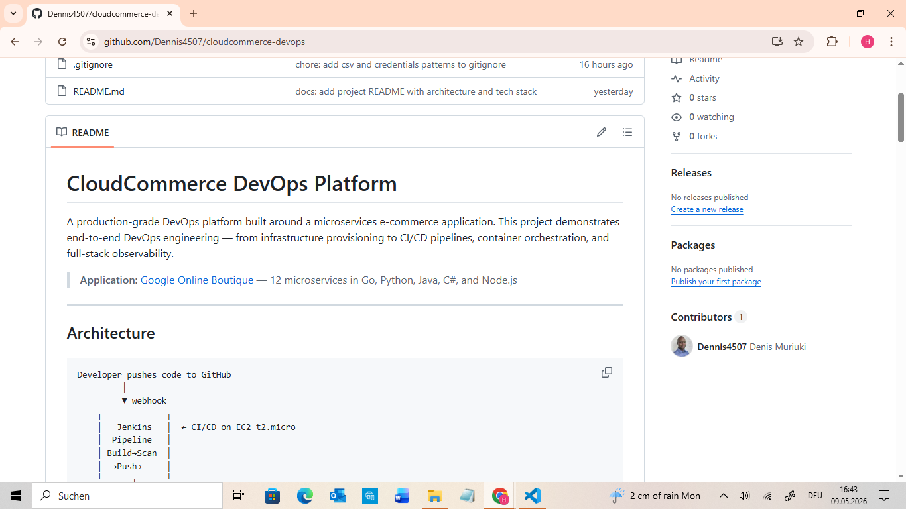
*The project repository on GitHub — README, structured Terraform code, and documented learnings all visible from the first visit*

---

### Step 2 — AWS Account Isolation

A dedicated IAM user (`cloudcommerce-devops`) was created for this project rather than using an existing account or root credentials.

**Why not root:** The root user is the master key to an AWS account. Root credentials cannot be scoped, cannot be rotated the same way as IAM keys, and if compromised give an attacker full control — including locking you out. Root is used only for initial account setup and never for daily work.

**Why a dedicated IAM user:** This project runs in an AWS account that also has other projects. Using a shared user would mix credentials and risk accidentally provisioning resources in the wrong project context. A dedicated `cloudcommerce-devops` user means its credentials are scoped to this project and can be rotated or deleted without affecting anything else.

**Why a user group:** The `cloudcommerce-devops` user is placed in a `cloudcommerce-admins` group. Permissions are attached to the group, not the user. When a team grows, adding a new engineer means adding them to the group — not manually re-configuring every permission for every person.

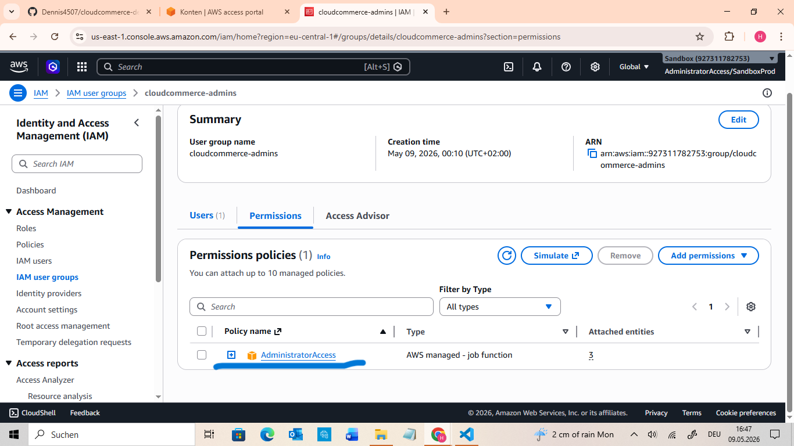
*cloudcommerce-admins group — permissions managed at the group level, not per user*

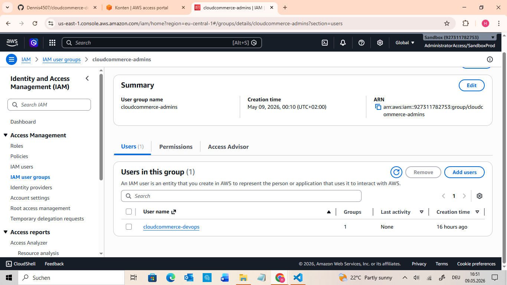
*cloudcommerce-devops user — isolated credentials for this project only*

The AWS CLI is configured with a named profile so every command is explicitly scoped to this project:

```bash
aws configure --profile cloudcommerce
aws sts get-caller-identity --profile cloudcommerce  # always verify before running anything
```

Named profiles prevent the most common and expensive infrastructure mistake: running `terraform apply` authenticated as the wrong account.

---

### Step 3 — Remote State

Terraform tracks everything it has created in a state file (`terraform.tfstate`). Without state, Terraform cannot tell what already exists and would attempt to recreate everything from scratch on every `apply`.

Local state works for a single engineer on a single machine. It breaks the moment:
- The laptop is lost or the disk fails
- A second engineer needs to run Terraform
- Two people run `apply` simultaneously and corrupt the state

State is stored in S3 (`cloudcommerce-tfstate-<account-id>`) with two critical settings enabled:

**Versioning** — S3 keeps every previous version of the state file. If a bad `apply` corrupts state, the previous version can be restored. Without versioning, a corrupted state file means manually reconciling what Terraform thinks exists against what actually exists in AWS — an extremely painful process.

**Native S3 locking (Terraform 1.10+)** — Prevents two simultaneous `terraform apply` runs from writing to the state file at the same time. A corrupted state file in a team environment can break the entire project.

**Encryption** — State files can contain resource IDs, ARNs, and occasionally sensitive values. SSE-S3 encryption ensures the file is encrypted at rest.

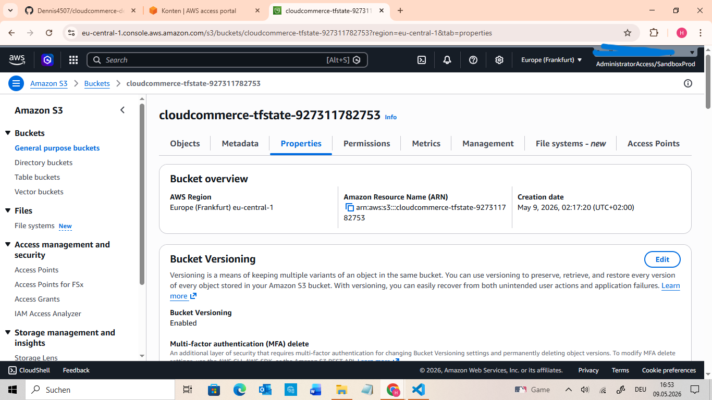
*Versioning enabled — every state change is preserved and recoverable*

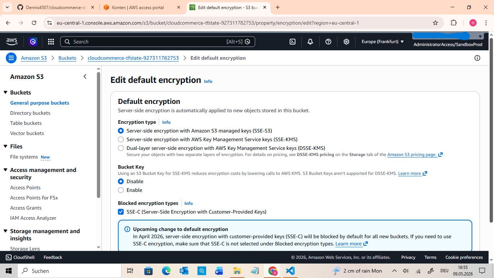
*SSE-S3 encryption — state file encrypted at rest*

---

### Step 4 — Terraform Architecture

The Terraform code is split into two layers:

```
terraform/
├── modules/          ← reusable blueprints (the HOW)
│   ├── vpc/          how to build a VPC
│   ├── ec2/          how to build EC2 instances
│   ├── ecr/          how to build container registries
│   └── iam/          how to build roles and policies
└── environments/
    └── dev/          ← deployments (the WHAT and WHERE)
        ├── providers.tf    which cloud, which region, which credentials
        ├── backend.tf      where to store state
        ├── variables.tf    what inputs this environment accepts
        ├── terraform.tfvars the actual values for those inputs
        ├── main.tf         calls all modules with those values
        └── outputs.tf      what to print after apply
```

Modules have no knowledge of which environment they run in. The VPC module knows how to build a VPC — the CIDR ranges, subnet sizes, and region are passed in as variables. The dev environment calls the VPC module with dev values; a prod environment would call the same module with different values. Fix a bug in a module once and every environment that uses it benefits.

The `providers.tf` separates AWS authentication from infrastructure logic:

```hcl
provider "aws" {
  region  = var.aws_region
  profile = "cloudcommerce"
  default_tags {
    tags = { Project = var.project, Environment = var.environment, ManagedBy = "terraform" }
  }
}
```

`default_tags` automatically applies consistent tags to every resource created. Every EC2 instance, security group, subnet, and IAM role in this project is tagged with `Project = cloudcommerce`, `Environment = dev`, and `ManagedBy = terraform`. In a large AWS account with hundreds of resources, this tagging discipline is what makes cost tracking and resource identification manageable.

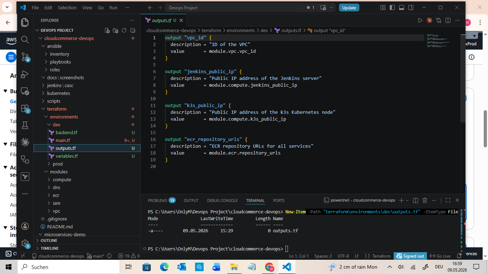
*Repository structure in VS Code — the modules/environments separation is visible in the Terraform directory*

---

### Step 5 — Network Design

The VPC (`cloudcommerce-dev-vpc`, CIDR `10.0.0.0/16`) is the private network boundary for the entire project. All resources live inside it.

```
VPC: 10.0.0.0/16  (65,536 addresses — large enough for future growth)
├── Public Subnet: 10.0.1.0/24   ← Jenkins + k3s (need internet access)
└── Private Subnet: 10.0.2.0/24  ← future databases (no internet access)
```

**Why a public/private split:** The principle of least exposure — only resources that genuinely need internet access are placed in the public subnet. Jenkins needs to be reachable for GitHub webhooks. k3s needs to serve application traffic. Databases do not. A database in the private subnet has no route to the internet gateway, so even if the application is compromised, an attacker cannot directly reach the database from outside — they would first need to compromise a server in the public subnet.

**Route tables vs security groups** — these operate at different layers and both must permit traffic for it to flow:
- Route tables operate at the **subnet level** — they decide *where* traffic is directed (e.g., all outbound traffic goes to the internet gateway)
- Security groups operate at the **instance level** — they decide *who* is allowed through (e.g., only port 80 is accepted)

A packet arriving at the VPC passes through the route table first (does a path to this destination exist?) and then through the security group (is this traffic type permitted?). Both must say yes.

Jenkins security group — ports 22 (SSH admin access) and 8080 (Jenkins web UI)
k3s security group — ports 22, 80, 443 (application traffic), 6443 (Kubernetes API for kubectl), 30080 (ArgoCD dashboard)

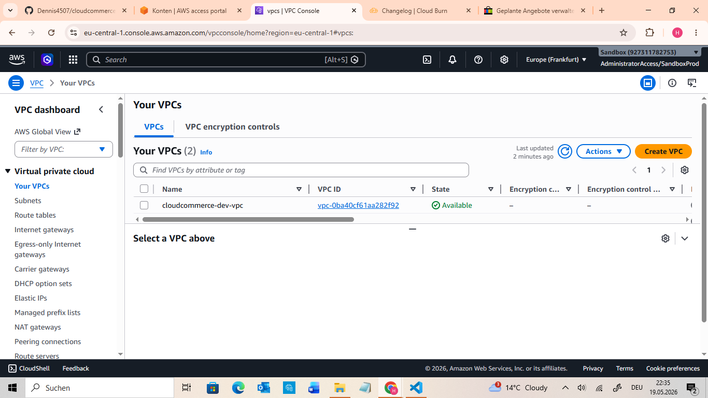
*cloudcommerce-dev-vpc — isolated network boundary for the project*

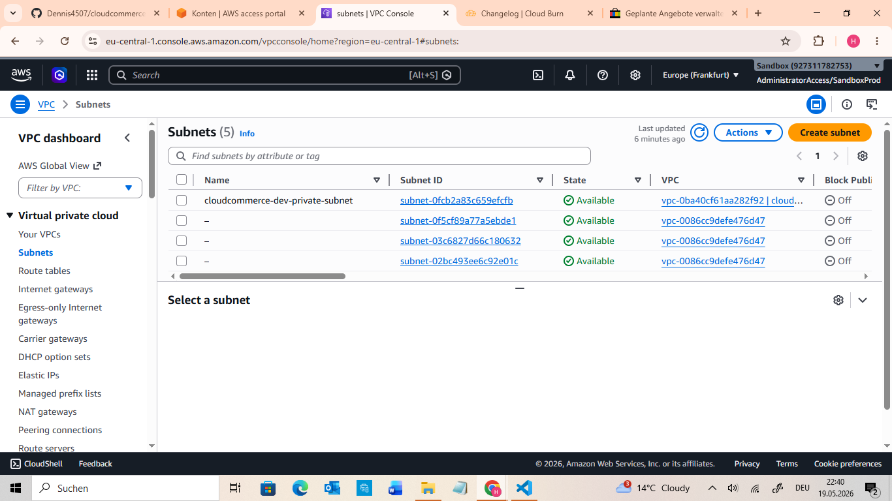
*Public and private subnets — only the public subnet has a route to the internet gateway*

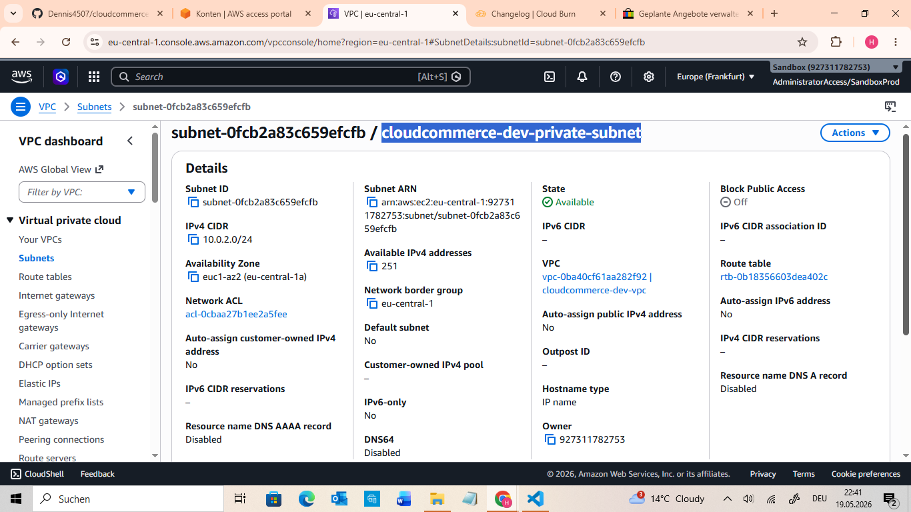
*Private subnet detail — no internet gateway route, databases will live here*

---

### Step 6 — Identity Design

By default, EC2 instances have zero AWS permissions. A Jenkins server that needs to push Docker images to ECR cannot do so without explicit permission. The wrong solution is putting AWS access keys on the server — if the server is ever compromised, those long-lived credentials are stolen. The correct solution is IAM roles.

IAM roles generate **temporary credentials** automatically, rotating every few hours. Nothing sensitive is stored on disk. If the server is compromised, the credentials expire on their own schedule and cannot be exfiltrated permanently.

Two roles were created with deliberately different permissions:

```
Jenkins Role → ECR push + pull
  Can: build images, push to ECR, pull from ECR, describe and list repositories

k3s Role → ECR pull only
  Can: pull images from ECR, describe and list repositories
  Cannot: push images, modify repositories
```

This separation matters. k3s only runs images — it never builds them. Giving k3s push permissions would mean a compromised k3s node could push malicious images to ECR, which Jenkins would then pull and deploy. By restricting k3s to pull-only, an attacker who compromises the k3s node cannot inject code into the build pipeline. The attack surface is limited by design.

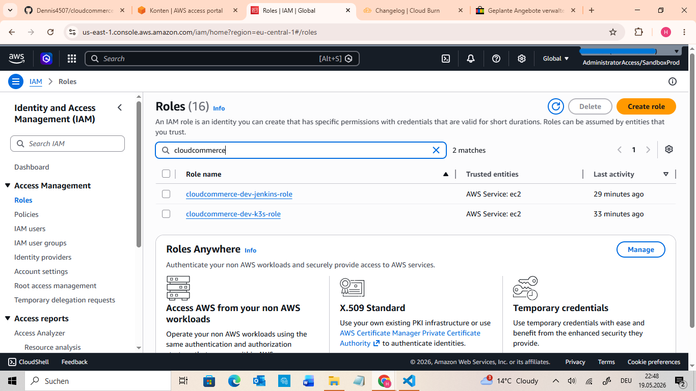
*Jenkins role (push+pull) and k3s role (pull-only) — least privilege enforced at the IAM level*

---

### Step 7 — Container Registry

ECR (Elastic Container Registry) provides 12 private repositories — one per microservice. The naming convention is `cloudcommerce/<service-name>` (e.g., `cloudcommerce/frontend`, `cloudcommerce/cartservice`).

Two settings are enabled on every repository:

**Scan on push** — every image is automatically scanned for known CVEs (Common Vulnerabilities and Exposures) when pushed. The scan results appear in the ECR console. This provides a baseline security gate without adding complexity to the pipeline.

**Lifecycle policy** — keeps the last 5 images per repository and automatically expires older ones. Without lifecycle policies, a CI/CD pipeline pushing multiple images per day will accumulate hundreds of gigabytes of stale images in ECR within weeks. Storage is cheap, but unchecked accumulation is wasteful and signals a lack of operational discipline.

The 12 repositories are created with a single Terraform `for_each` block rather than 12 identical resource blocks:

```hcl
resource "aws_ecr_repository" "services" {
  for_each = toset(var.services)
  name     = "${var.project}/${each.key}"
}
```

Adding a 13th service requires adding one name to a list. No module code changes.

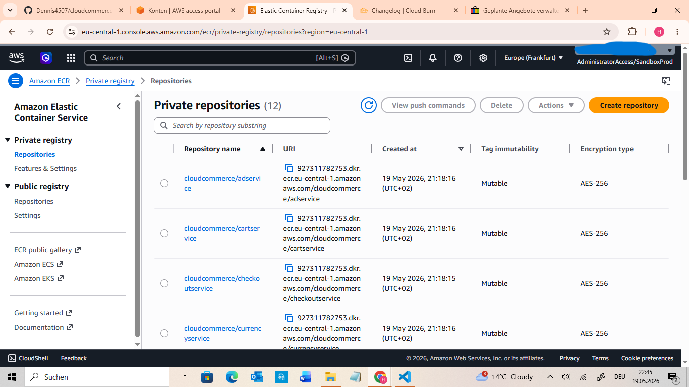
*12 container registries — one per microservice, scan on push enabled on all*

---

### Step 8 — Compute

Two EC2 instances are provisioned:

| Instance | Type | Disk | Purpose |
|----------|------|------|---------|
| Jenkins | t2.micro | 20GB gp3 | CI/CD pipeline — build, scan, push |
| k3s | t3.medium | 30GB gp3 | Kubernetes node — runs all 12 services |

**Why t3.medium for k3s:** Running 12 microservices simultaneously requires memory. A t2.micro (1GB RAM) would cause out-of-memory kills under normal load. A t3.medium (4GB RAM) provides enough headroom for the application, the Kubernetes system pods, Prometheus, Grafana, and Loki to coexist.

**SSH key pairs:** EC2 instances use public/private key authentication instead of passwords. A 4096-bit RSA key pair was generated locally. The public key was uploaded to AWS and attached to both instances at creation. The private key stays only on the engineer's machine and is gitignored. Knowing a server's IP address without the corresponding private key results in immediate `Permission denied` — there is no password to brute-force.

**user_data bootstrap:** Both instances run a shell script automatically on first boot via the `user_data` field in the Terraform resource. This script installs Docker CE, enables the Docker daemon, and starts it. The server is fully ready — Docker running, daemon enabled for automatic restart — before any engineer touches it. This is what "infrastructure as code" means in practice: the server configures itself.

**Elastic IPs:** Standard EC2 instances are assigned a dynamic public IP that changes every time the instance stops and starts. This would break SSH commands, Ansible inventory, and kubectl configuration every session. Elastic IPs are static public addresses that remain attached through stop/start cycles. They are free while the instance is running and cost ~$0.005/hour while stopped.

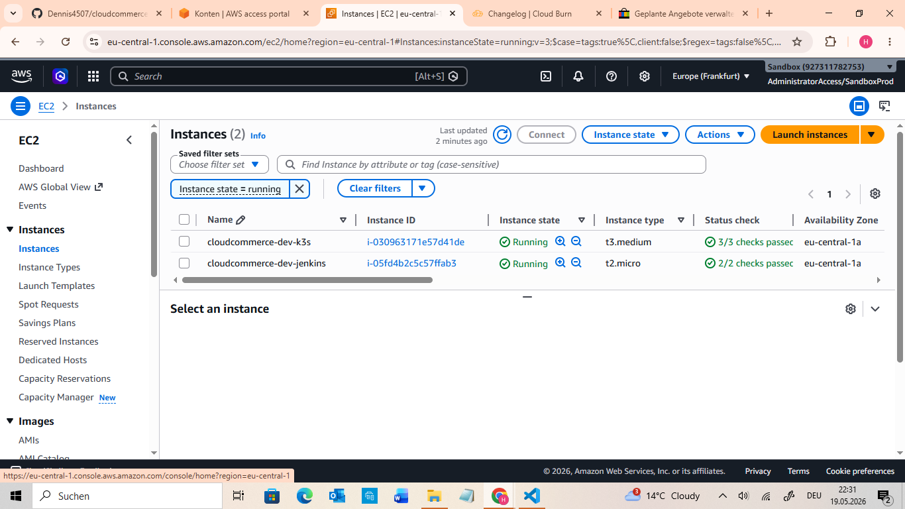
*Both instances running in eu-central-1a after terraform apply*

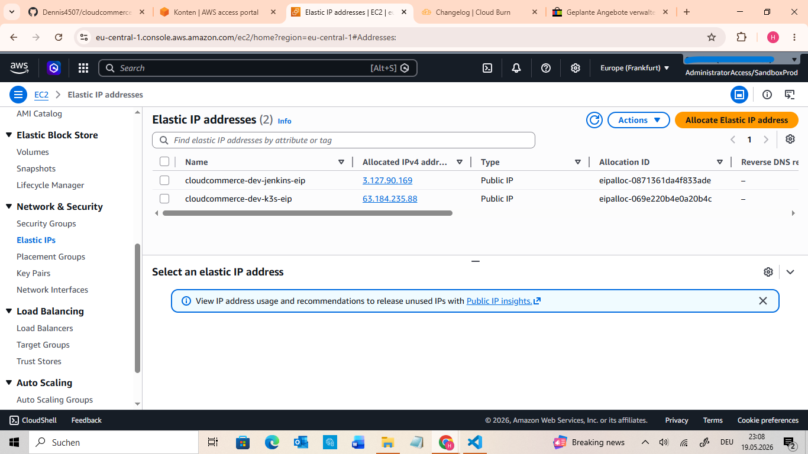
*Static Elastic IPs attached to both servers — addresses will not change between sessions*

---

### Step 9 — Provisioning

With all four modules complete (VPC, IAM, ECR, EC2), the infrastructure is provisioned with a single command:

```bash
terraform plan   # review exactly what will be created — always read this
terraform apply  # provision everything
```

The initial apply created **43 resources** in under 60 seconds:
- 1 VPC, 2 subnets, 1 internet gateway, 1 route table, 1 route table association
- 2 IAM roles, 2 IAM policies, 2 policy attachments, 2 instance profiles
- 12 ECR repositories, 12 ECR lifecycle policies
- 1 SSH key pair, 2 EC2 instances, 2 security groups

A second apply added 2 Elastic IPs — demonstrating Terraform's incremental apply behaviour. Existing resources were read from state and left completely untouched. Only the 2 new resources were created.

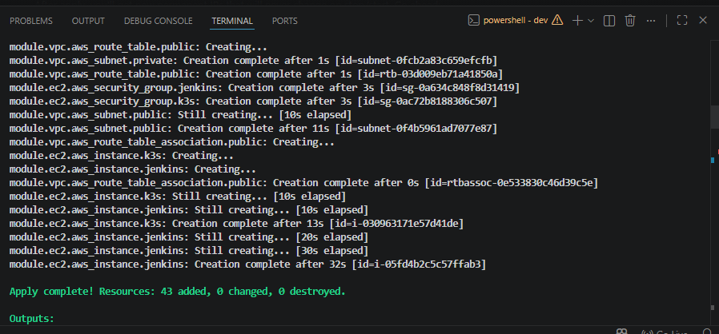
*Initial apply output — 43 resources created, 0 changed, 0 destroyed*

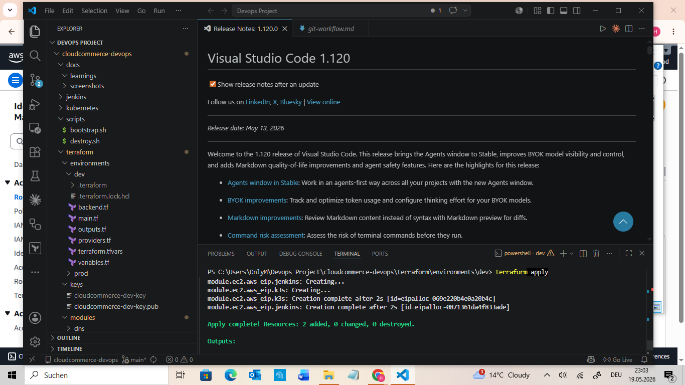
*Incremental apply — 2 resources added, 43 existing resources untouched*

---

### Step 10 — Verification

After provisioning, both servers were SSH'd into to confirm the user_data bootstrap ran successfully:

```bash
ssh -i terraform/keys/cloudcommerce-dev-key ubuntu@3.127.90.169
docker --version
sudo systemctl status docker --no-pager
```

Results on both servers:
- Ubuntu 22.04.5 LTS — correct AMI
- Docker 29.5.1 — installed by user_data
- `Active: active (running)` — daemon started and enabled

This verification step matters. `user_data` runs silently at boot with no visible output. Checking `docker --version` is the confirmation that the script ran to completion. Skipping this check and proceeding to Ansible without verifying Docker would mean debugging a failure several steps later with no indication of where it originated.

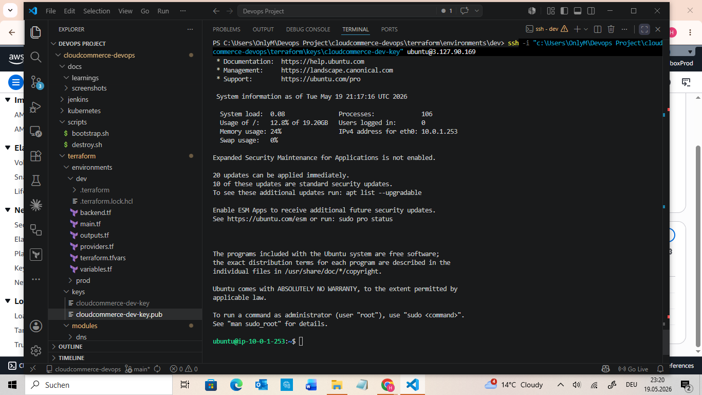
*SSH into Jenkins server — Ubuntu 22.04 booted, private IP 10.0.1.253 confirms VPC placement*

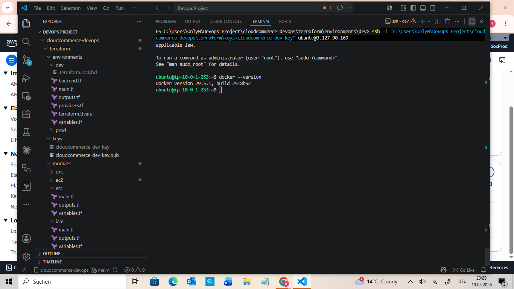
*Docker 29.5.1 installed automatically by user_data bootstrap script*

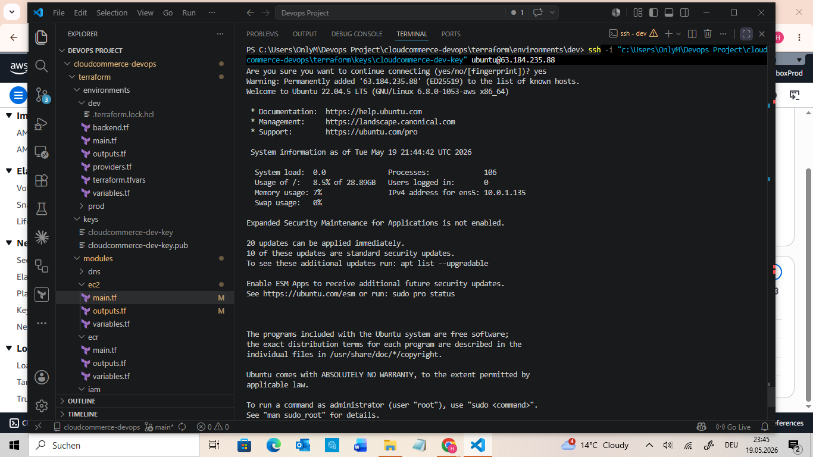
*Docker daemon active and running — enabled for automatic restart on reboot*

---

### Step 11 — Cost Management: The Stop/Start Pattern

Infrastructure is not left running between working sessions. Both EC2 instances are stopped via the AWS Console at the end of every session and started again at the beginning of the next.

**Starting a session:**
1. AWS Console → EC2 → Instances → select both → Instance State → Start
2. Wait ~30 seconds for Running state
3. Verify SSH: `ssh -i terraform/keys/cloudcommerce-dev-key ubuntu@3.127.90.169`
4. Elastic IPs ensure the same addresses — no configuration changes needed

**Ending a session:**
1. AWS Console → EC2 → Instances → select both → Instance State → Stop
2. Compute billing stops immediately
3. EBS disks and Elastic IPs persist — all installed software is preserved

This was tested: both instances were stopped overnight and restarted the following day. SSH connected immediately to the same IPs. All data and configuration on the EBS volumes was intact.

| State | Cost |
|-------|------|
| Both instances running | ~$0.065/hour |
| Both instances stopped | ~$0.27/day |
| Full project to completion | ~$15–25 total |

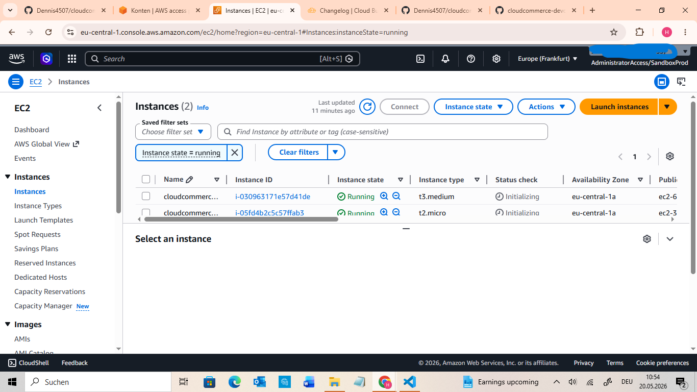
*Both instances Running after overnight stop — Elastic IPs confirmed unchanged*

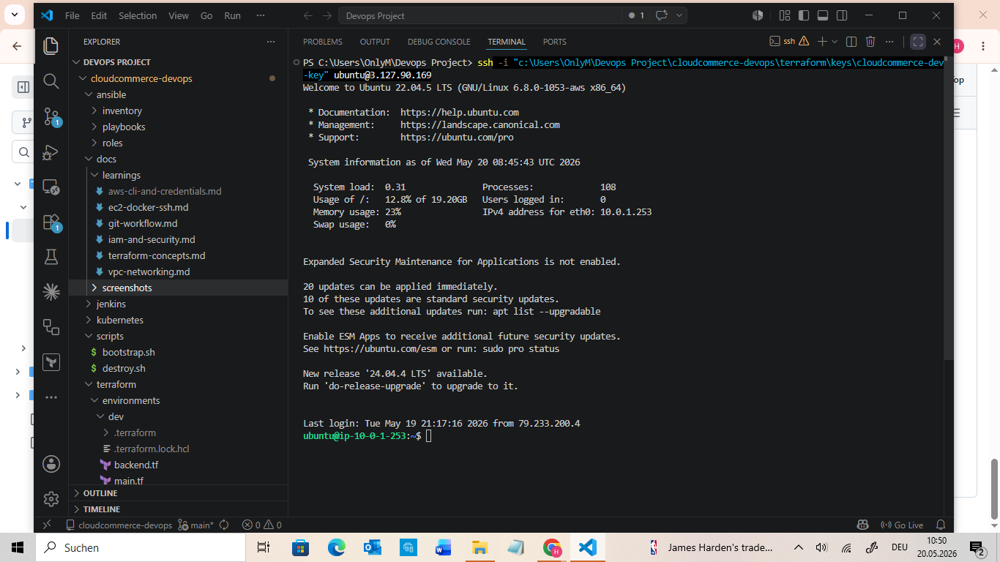
*Jenkins SSH after restart — same IP (3.127.90.169), same private address (10.0.1.253)*

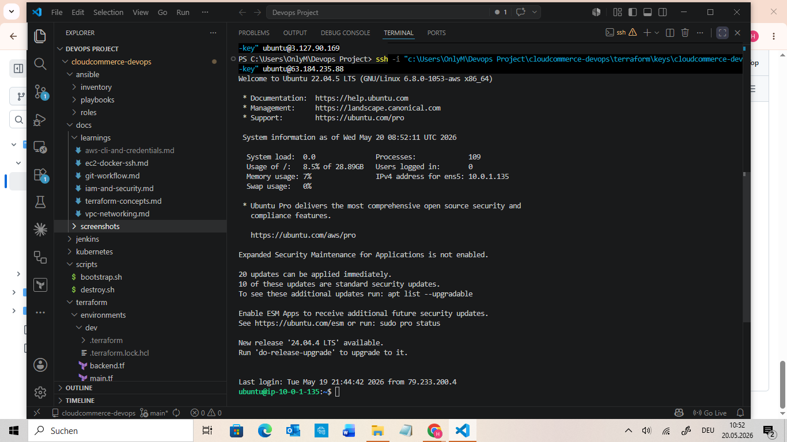
*k3s SSH after restart — same IP (63.184.235.88), stop/start pattern confirmed working*

---

## Phase 2 — CI/CD Pipeline *(in progress)*

### Ansible Setup — Configuring Servers Without Touching Them

Ansible is the configuration management layer. Where Terraform provisions infrastructure (what exists in AWS), Ansible configures what runs on those servers — installing packages, writing config files, starting services, managing users. It is agentless: there is nothing to install on the target servers. Ansible SSHes in from the control node, runs tasks, and disconnects. Every task is idempotent — running the same playbook twice produces the same result without duplicating work.

The control node for this project is WSL (Windows Subsystem for Linux) on the local machine, running Ubuntu 22.04. Ansible does not run natively on Windows, so WSL provides the Linux environment required.

#### Step 1 — Install Ansible on WSL

Ansible was installed via pip rather than Ubuntu's packaged version. The Ubuntu package is typically several versions behind; pip gives the current release.

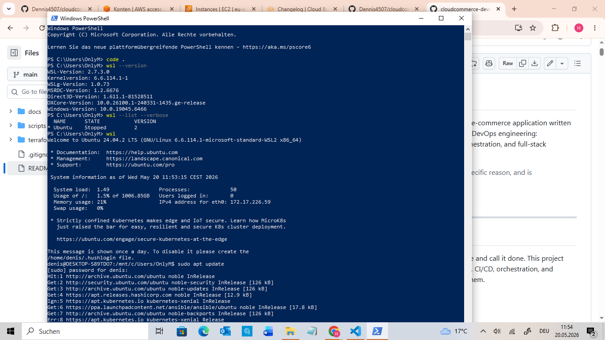
*WSL Ubuntu 22.04 — the Ansible control node for this project*

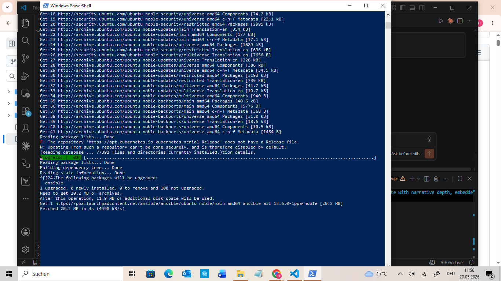
*Ansible installed via pip — current release, not Ubuntu's older packaged version*

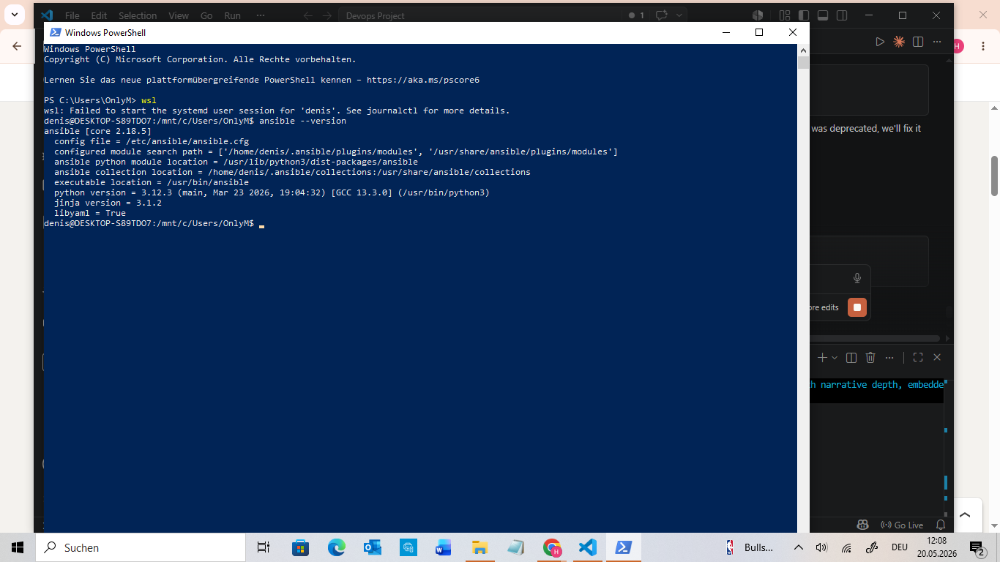
*ansible --version confirms installation and the Python interpreter being used*

#### Step 2 — SSH Key Setup

The SSH private key lives in `terraform/keys/` on the Windows filesystem. For Ansible to use it from WSL, it must be copied into the WSL home directory with restrictive permissions. SSH (and by extension Ansible) refuses to use private keys that are readable by other users — this is a hard security requirement, not a warning.

```bash
cp /mnt/c/Users/OnlyM/Devops\ Project/cloudcommerce-devops/terraform/keys/cloudcommerce-dev-key ~/.ssh/
chmod 600 ~/.ssh/cloudcommerce-dev-key
```

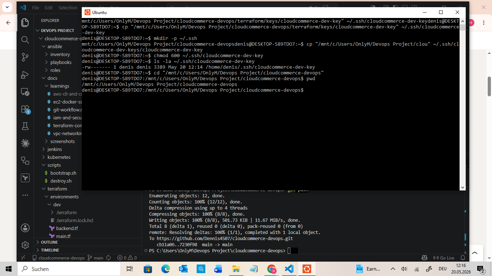
*Private key copied to WSL home directory with chmod 600 — SSH security requirement enforced*

---

#### Challenge: Ansible Refused to Load Config from the Windows Filesystem

The first ping attempt produced no hosts at all — not a connection failure, but Ansible silently ignoring its own configuration:

```
[WARNING]: Ansible is being run in a world writable directory, ignoring it as an ansible.cfg source.
[WARNING]: provided hosts list is empty, only localhost is available.
```

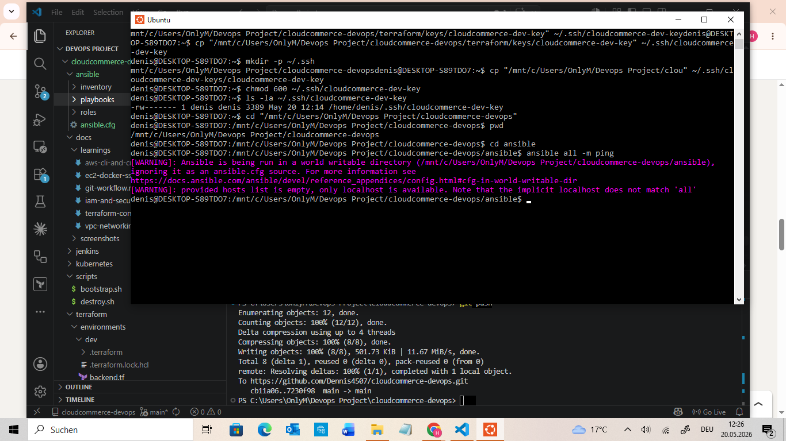
*Ansible ignores ansible.cfg from /mnt/c/ — world-writable filesystem is treated as untrusted*

**Root cause:** The Windows filesystem mounted in WSL at `/mnt/c/` has world-writable permissions by default. Ansible has a deliberate security rule that refuses to auto-load `ansible.cfg` from world-writable directories — on a shared system, a malicious `ansible.cfg` in a world-writable directory could inject configuration without the user knowing. Without the config file, Ansible found no inventory and no hosts.

**Solution:** Pass inventory and credentials explicitly on every command instead of relying on auto-loading:

```bash
ansible all -i inventory/hosts -m ping --private-key ~/.ssh/cloudcommerce-dev-key -u ubuntu
```

**What this teaches:** Understanding *why* a tool rejects configuration — not just that it does — is the difference between a real fix and a blind workaround. The restriction exists for a genuine security reason. The correct response is to work with it, not disable it.

---

Both servers responded immediately once the explicit flags were passed:

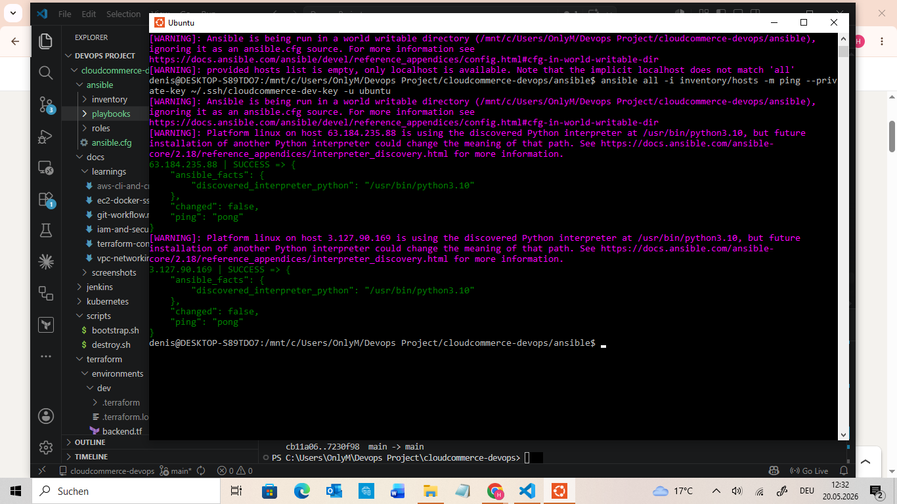
*Both servers respond with pong — Ansible SSH connectivity to Jenkins (3.127.90.169) and k3s (63.184.235.88) confirmed*

---

### Writing the Jenkins Playbook

With connectivity proven, the first playbook was written to install Jenkins. A single YAML file automates the complete setup: Java 17 (Jenkins runtime dependency), GPG key import, apt repository configuration, Jenkins installation and service management, Docker group membership for the jenkins user, and initial admin password retrieval.

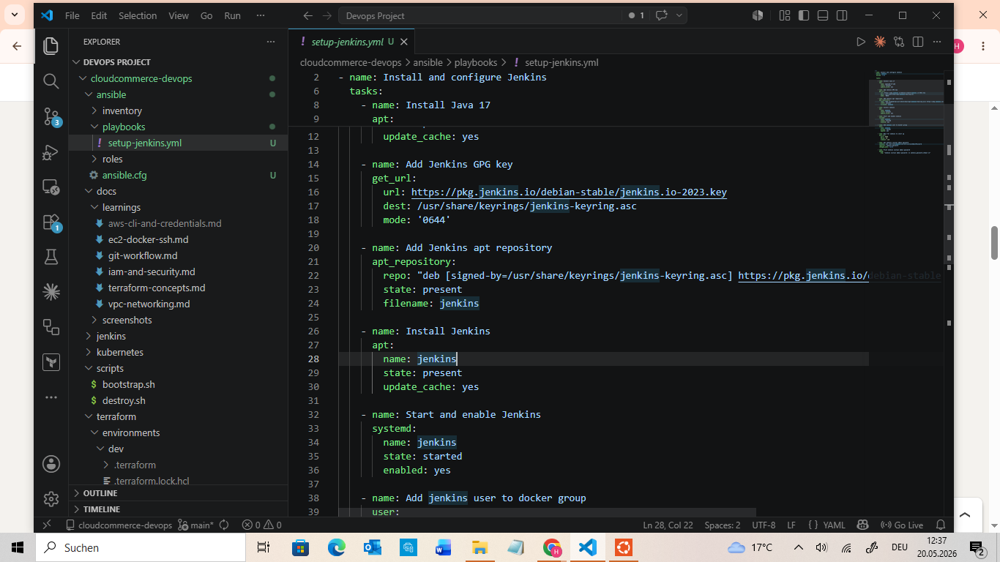
*setup-jenkins.yml in VS Code — initial version using Java 17, later upgraded to Java 21*

---

### Challenge: Jenkins GPG Key — Two Separate Problems

Installing Jenkins exposed two distinct GPG key problems encountered in sequence. Each required a different diagnosis technique.

#### Problem 1 — Key Format: `.asc` vs `.gpg`

The initial playbook used `get_url` to download Jenkins' GPG key as an ASCII-armored `.asc` file. Apt's `signed-by` mechanism requires keys in binary (dearmored) format. The mismatch caused every `apt-get update` to reject the repository as unsigned:

```
NO_PUBKEY 7198F4B714ABFC68
E: The repository 'https://pkg.jenkins.io/debian-stable binary/ Release' is not signed.
```

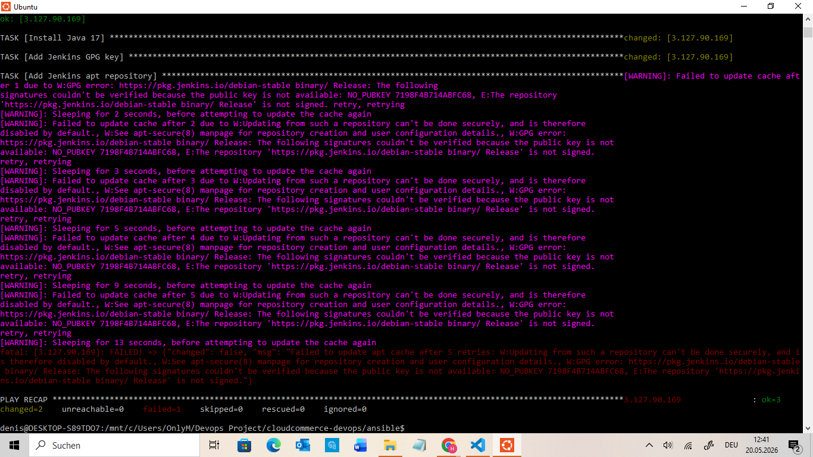
*First playbook run — FAILED at apt update, repository signature verification rejected*

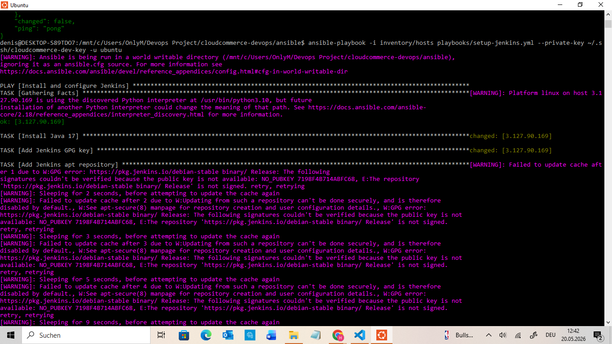
*Second run — same error after first attempted fix*

**Fix:** Pipe the downloaded key through `gpg --dearmor` to convert it from ASCII to binary format. The `apt_repository` Ansible module was also replaced with a `shell` task — the module auto-triggers a cache update internally before the key is fully in place, creating a race condition.

```bash
curl -fsSL https://pkg.jenkins.io/debian-stable/jenkins.io-2023.key | gpg --dearmor -o /usr/share/keyrings/jenkins-keyring.gpg
```

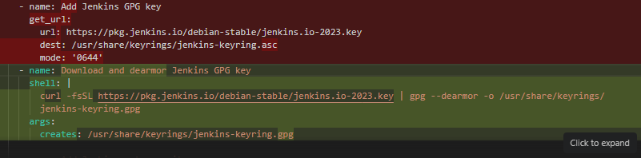
*Third run after dearmor fix — same error. The problem was not the format.*

---

#### Problem 2 — Expired Key at the Official URL

The dearmor fix resolved the format issue but the same signature error persisted. More Ansible runs with further adjustments all produced the same result:

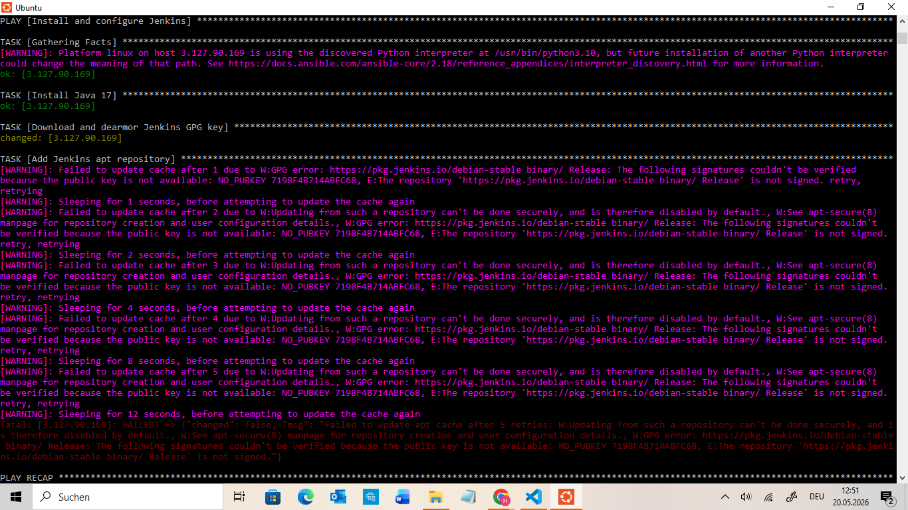
*Fourth run — dearmor applied, same NO_PUBKEY error. The problem is not the format.*

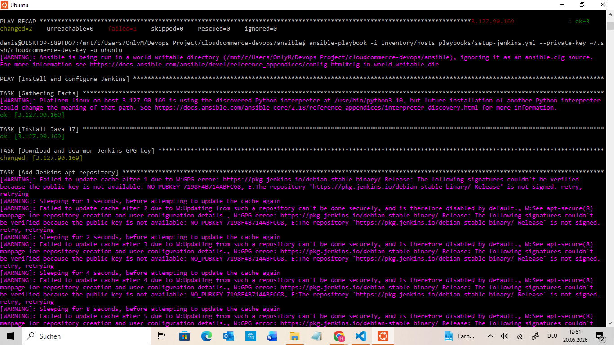
*Fifth run — all automated attempts exhausted. Root cause still unknown.*

After five failures with the same error, automated retries were stopped. The next step was SSH directly into the Jenkins server to inspect what was actually on disk:

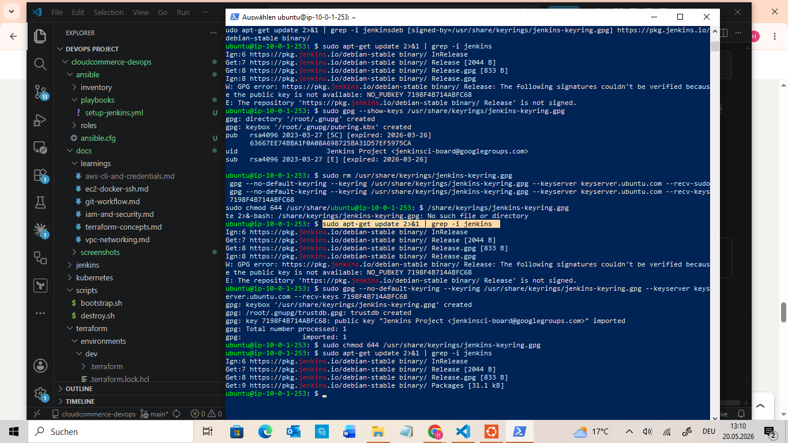
*Manual commands on the server — checking the key file and testing apt-get update directly*

```bash
gpg --show-keys /usr/share/keyrings/jenkins-keyring.gpg
```

Output:

```
pub   rsa4096 2023-03-27 [SC] [expired: 2026-03-26]
      63667EE74BBA1F0A08A698725BA31D57EF5975CA
```

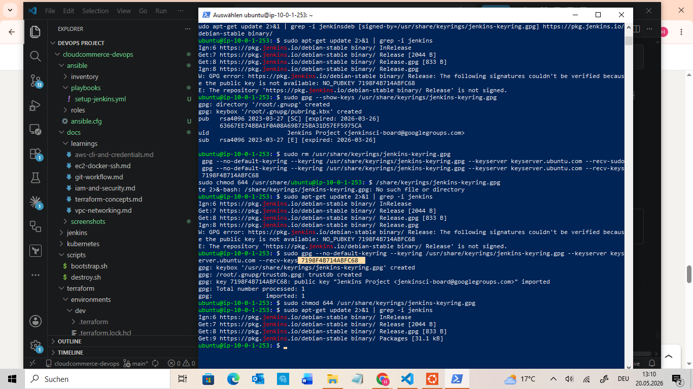
*gpg --show-keys reveals the key downloaded from jenkins.io-2023.key — fingerprint 5BA31D57EF5975CA, expired March 2026*

The key at `jenkins.io-2023.key` **expired in March 2026**. Its fingerprint (`5BA31D57EF5975CA`) does not match the key Jenkins is actually using to sign the repository (`7198F4B714ABFC68`). Jenkins rotated their signing key but the old URL continues to serve the expired key — a silent trap for anyone following documentation written before the rotation.

---

#### Resolution — Fetch the Current Key by ID from a Keyserver

Rather than downloading from a URL that serves whatever key the Jenkins team last published there, fetch the specific key by its ID from a dedicated key distribution server:

```bash
sudo gpg --no-default-keyring \
    --keyring /usr/share/keyrings/jenkins-keyring.gpg \
    --keyserver keyserver.ubuntu.com \
    --recv-keys 7198F4B714ABFC68
```

A keyserver lookup by ID always returns the current valid key for that ID. The playbook was rewritten with this approach, and `apt-get update` was run manually on the server first to confirm the fix before finalising the playbook.

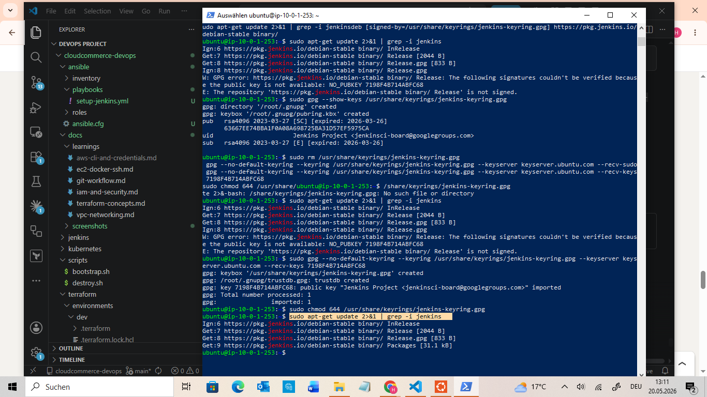
*apt-get update succeeds — Jenkins repository trusted, packages now available for installation*

**What this teaches:** Package signing keys expire and rotate. Hardcoding a key URL in automation is fragile — the URL may serve a stale or expired key indefinitely after rotation. Fetching by key ID from a keyserver always retrieves the current valid key. Manual server debugging (SSH in, run the failing command by hand, inspect the artefacts) is often the fastest path to the actual root cause when automated retries produce the same error.

---

### Challenge: Jenkins Installed but Service Failed to Start — Java Version

With the GPG key issue resolved, the playbook ran successfully — Jenkins installed — but failed at the final step: starting the service.

```
TASK [Start and enable Jenkins]
fatal: [3.127.90.169]: FAILED! => {"msg": "Unable to start service jenkins: Job for
jenkins.service failed because the control process exited with error code."}
```

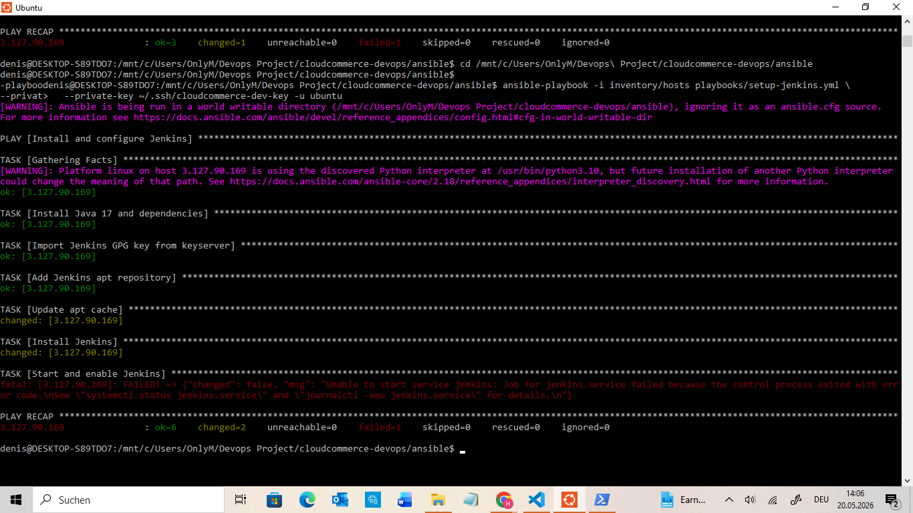
*Ansible output — ok=6, changed=2, failed=1. Jenkins installed successfully but service refused to start*

The systemctl and journalctl logs showed only that the process exited — not why. The fastest way to get the actual error was to run Jenkins directly:

```bash
sudo /usr/bin/jenkins
```

Output:

```
Running with Java 17 from /usr/lib/jvm/java-17-openjdk-amd64, which is older than
the minimum required version (Java 21).
Supported Java versions are: [21, 25]
```

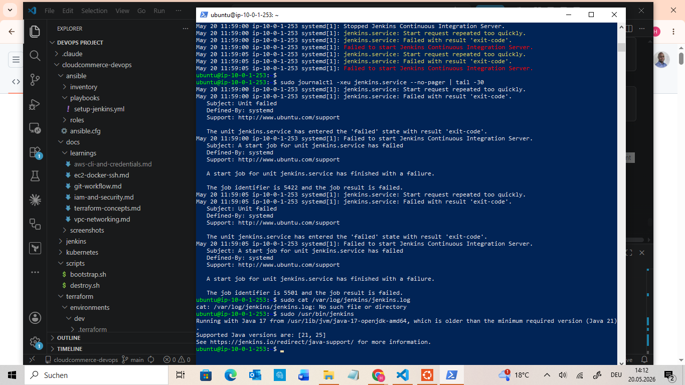
*Jenkins executed directly — Java 17 rejected, minimum requirement is now Java 21*

**Root cause:** Jenkins dropped Java 17 support in recent releases. The playbook was written against older documentation that listed Java 17 as the supported version. The current Jenkins LTS requires Java 21 minimum.

**Fix:** Update the playbook to remove Java 17 and install Java 21. Java 17 takes ~200MB — removing it also keeps disk usage clean on the 20GB t2.micro volume.

```yaml
- name: Remove Java 17 if present
  apt:
    name: openjdk-17-jdk
    state: absent

- name: Install Java 21 and dependencies
  apt:
    name:
      - openjdk-21-jdk
      - curl
      - gnupg
    state: present
```

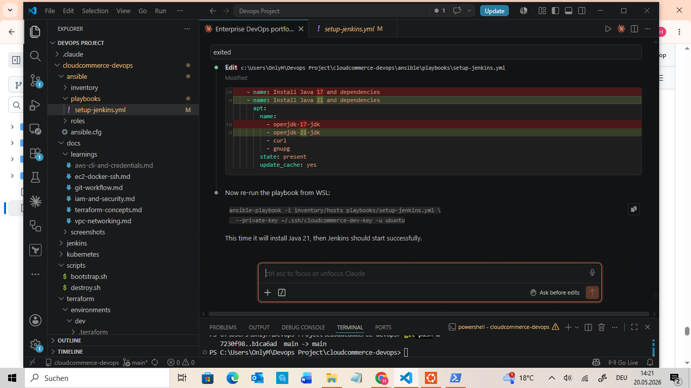
*Updated playbook — Java 17 removal task added before Java 21 install*

Re-running the playbook: Ansible removed Java 17, installed Java 21, and this time Jenkins started cleanly.

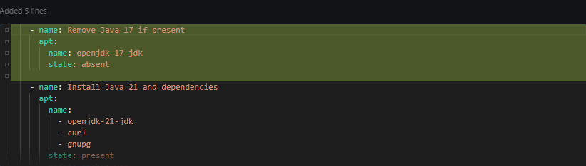
*Ansible run in progress — Java 17 removed (changed), Java 21 installed (changed)*

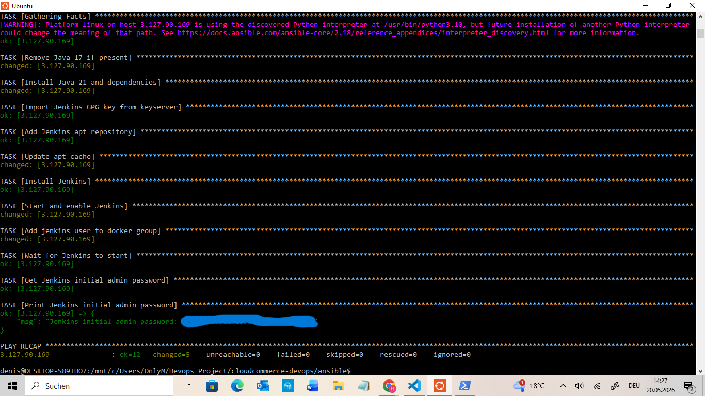
*Full successful run — 12 tasks ok, 5 changed, 0 failed. Jenkins started and initial password retrieved*

**What this teaches:** Software version requirements change. Locking to a specific version in automation and re-verifying after major releases is not optional — Jenkins silently accepted the wrong Java version at install time and only rejected it at runtime. Running the binary directly (`/usr/bin/jenkins`) is a fast diagnostic technique that bypasses systemd's wrapper and surfaces the real error immediately.

---

### Jenkins Initial Configuration

With Jenkins running, the web UI was opened at `http://3.127.90.169:8080`. The initial unlock screen requires the admin password that Ansible printed at the end of the playbook run.

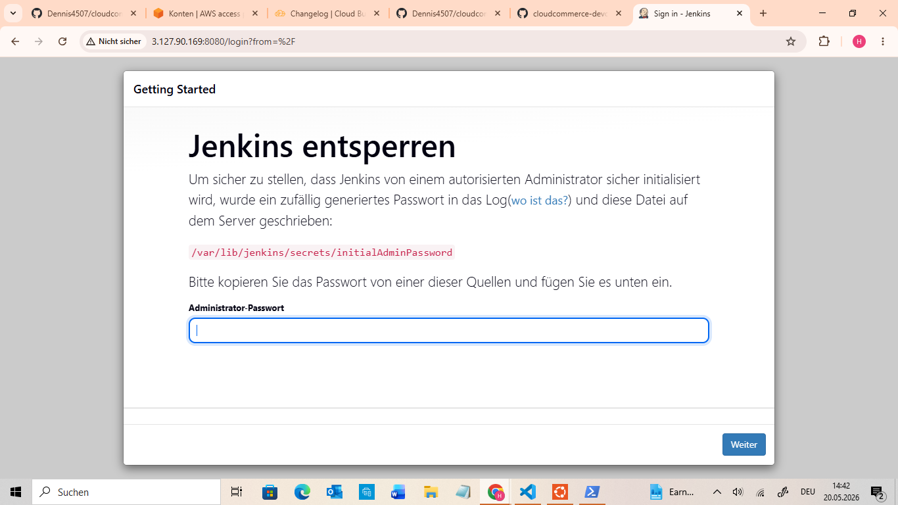
*Jenkins unlock screen — initial admin password retrieved from Ansible output*

**Suggested plugins** were selected — this installs the standard set Jenkins recommends: Git, Pipeline, Credentials, GitHub integration, and build tools. Selecting plugins manually at this stage adds risk of missing dependencies with no benefit.

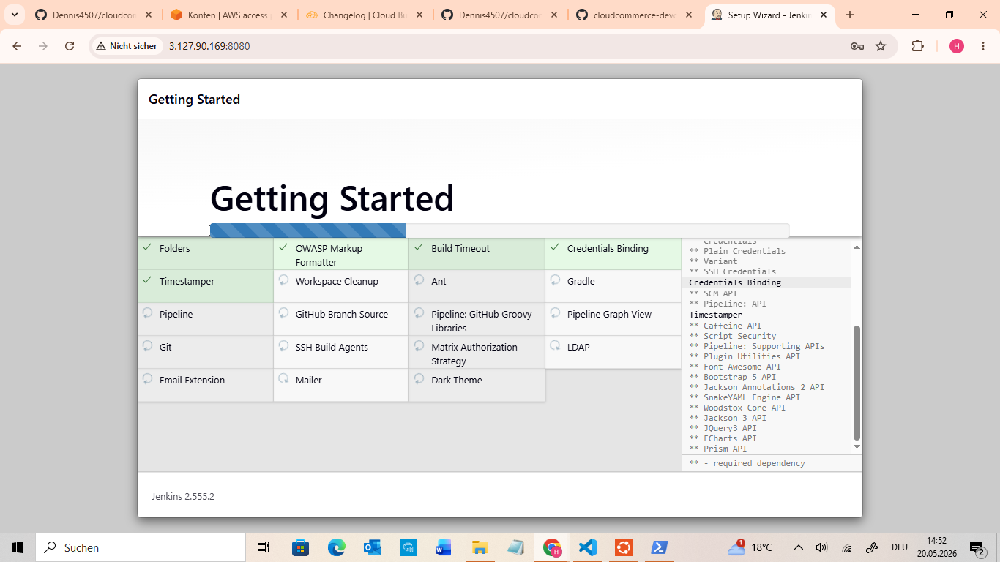
*Suggested plugins installing — Git, Pipeline, Credentials, GitHub, and supporting tools*

An admin account was created and Jenkins is now fully operational.

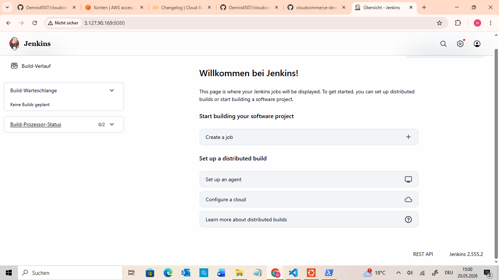
*Jenkins dashboard — CI/CD server live and accessible at http://3.127.90.169:8080*

---

### Progress
- [x] Ansible connectivity verified — both servers reachable (ping: pong)
- [x] Jenkins GPG key issue diagnosed and resolved — keyserver approach adopted
- [x] Jenkins installed via Ansible — Java 17→21 upgrade required and documented
- [x] Jenkins configured — admin account created, suggested plugins installed
- [ ] Add AWS credentials and GitHub token to Jenkins credential store
- [ ] Write Jenkinsfile — build, scan with Trivy, push to ECR
- [ ] Configure GitHub webhook → Jenkins trigger
- [ ] Set up ArgoCD for GitOps deployment

---

## Phase 3 — Kubernetes

### Why k3s

k3s is a CNCF-certified Kubernetes distribution built for resource-constrained environments. On an EC2 t3.medium with 20GB storage, full upstream Kubernetes would consume most available memory before any workloads run. k3s ships as a single binary (~100MB), uses less than 512MB RAM at idle, and includes everything needed for a production-grade cluster: containerd, CoreDNS, Traefik ingress, and persistent volume support. It is fully Kubernetes-compatible — every `kubectl` command, every Helm chart, every manifest written for upstream Kubernetes works identically on k3s.

The t3.medium running k3s has 2 vCPUs and 4GB RAM — sufficient for the 12-microservice Online Boutique application plus Prometheus, Grafana, and ArgoCD.

---

### Pre-flight Checks — Verifying the Server Before Installation

Before running the k3s playbook, Ansible connectivity to the k3s server was verified using the same `ansible ping` command used in Phase 2. The k3s server was also inspected to confirm Docker was running, disk had sufficient space, and memory was adequate.

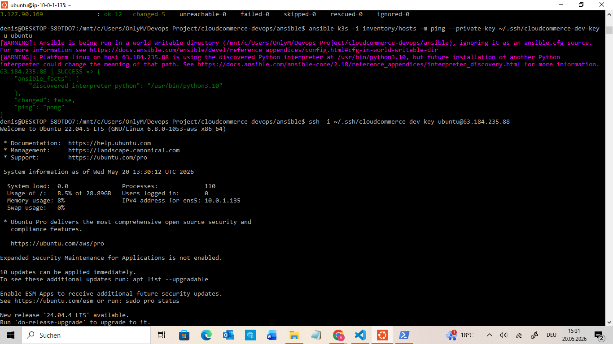
*Ansible ping to k3s server (63.184.235.88) succeeds — SSH connectivity confirmed before playbook run*

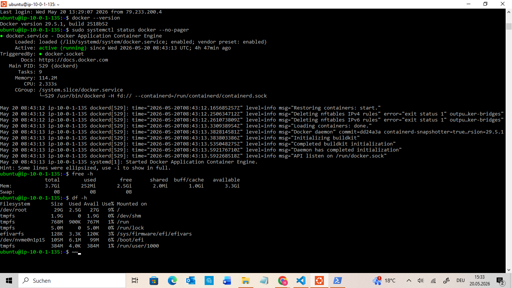
*Docker running, disk and RAM verified on the k3s EC2 instance — server ready for k3s installation*

---

### Installing k3s via Ansible

k3s is not available via apt. It is installed by piping a shell script from the official k3s distribution server directly into the shell — a single curl command that downloads and installs the binary, configures systemd, and starts the service in one step.

The Ansible playbook automates this:

```yaml
- name: Download and install k3s
  shell: curl -sfL https://get.k3s.io | sh -

- name: Wait for k3s API server to be available
  wait_for:
    port: 6443
    delay: 10
    timeout: 120

- name: Wait for node to reach Ready state
  shell: k3s kubectl get node | grep -v NotReady | grep Ready
  register: node_ready
  until: node_ready.rc == 0
  retries: 12
  delay: 10
  changed_when: false
```

The `wait_for` task pauses until port 6443 (the Kubernetes API server) is accepting connections. The follow-up task polls until the node reaches Ready state — k3s starts the API server before the node is fully initialised, so both checks are necessary.

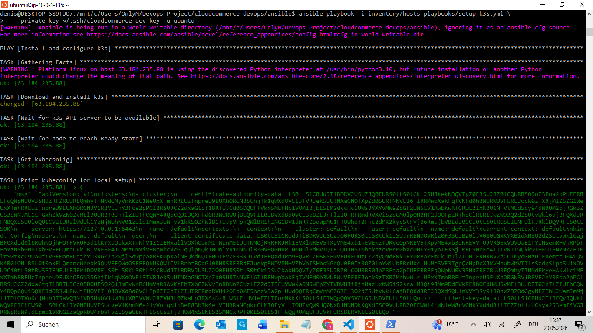
*k3s playbook first run — all tasks ok, cluster installed and node reached Ready state*

---

### Setting Up kubectl — Local Cluster Access

kubectl is the Kubernetes CLI — it runs locally, connects to the cluster API over HTTPS on port 6443, and sends commands to the cluster. To connect kubectl to the k3s cluster, the cluster's credentials file (kubeconfig) must be copied from the server to the local machine.

#### kubectl Installation — Four Failures Before Success

Getting kubectl onto Windows turned into a multi-step debugging exercise that required working around several issues in sequence.

**Attempt 1 — winget**

The first approach was the Windows package manager:

```powershell
winget install -e --id Kubernetes.kubectl
```

Winget reported success ("Erfolgreich installiert"). But `kubectl` could not be found anywhere on the system — `Get-Command kubectl` returned nothing, `where.exe kubectl` returned nothing. The installation completed without error but placed the binary somewhere outside the PATH with no indication of where.

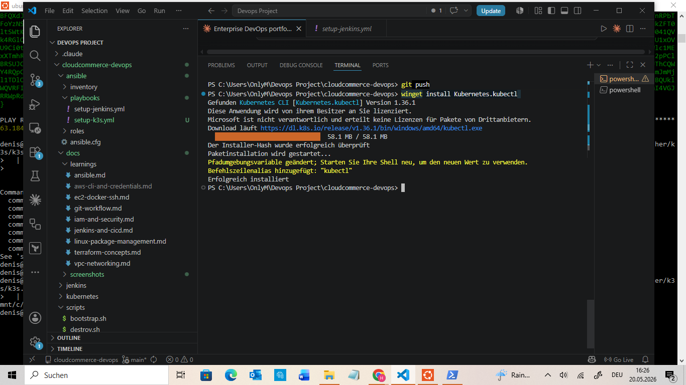
*winget reports success — but kubectl is not findable on the PATH after installation*

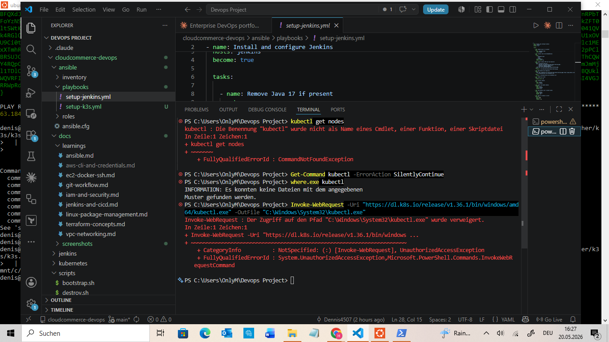
*Get-Command kubectl and where.exe kubectl both return nothing — winget installed somewhere inaccessible*

**Attempt 2 — PowerShell Invoke-WebRequest to System32**

```powershell
Invoke-WebRequest -Uri "https://dl.k8s.io/release/v1.36.1/bin/windows/amd64/kubectl.exe" `
  -OutFile "C:\Windows\System32\kubectl.exe"
```

Access denied — writing to System32 requires elevated permissions that were not available in the current terminal session.

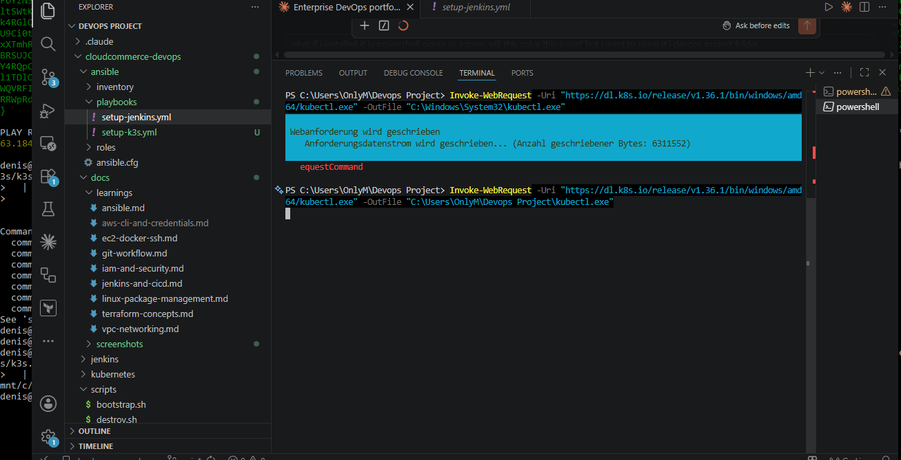
*PowerShell Invoke-WebRequest to System32 — access denied, insufficient permissions*

**Attempt 3 — PowerShell Invoke-WebRequest to Project Directory**

```powershell
Invoke-WebRequest -Uri "https://dl.k8s.io/release/v1.36.1/bin/windows/amd64/kubectl.exe" `
  -OutFile "C:\Users\OnlyM\Devops Project\kubectl.exe"
```

The download started but the connection broke mid-transfer. Network interruption, no partial file recovered.

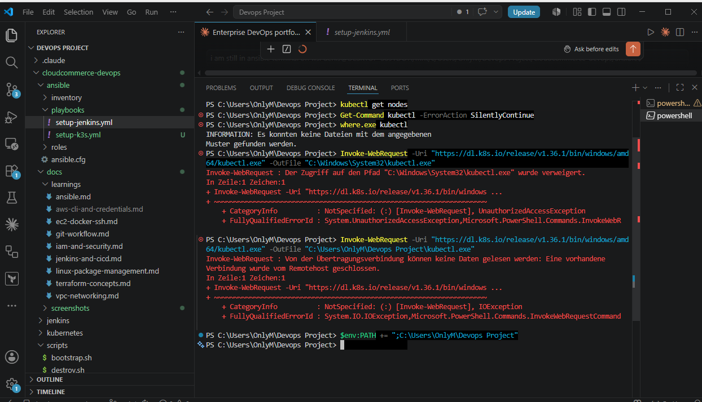
*PowerShell download failed with connection error — no binary recovered*

**Resolution — WSL curl**

PowerShell's Invoke-WebRequest has known TLS and connection handling issues. WSL curl is more reliable for large binary downloads. From inside WSL:

```bash
curl -LO "https://dl.k8s.io/release/v1.36.1/bin/windows/amd64/kubectl.exe"
```

This downloaded the binary successfully into the current WSL directory, which is accessible from Windows at `C:\Users\OnlyM\Devops Project\`.

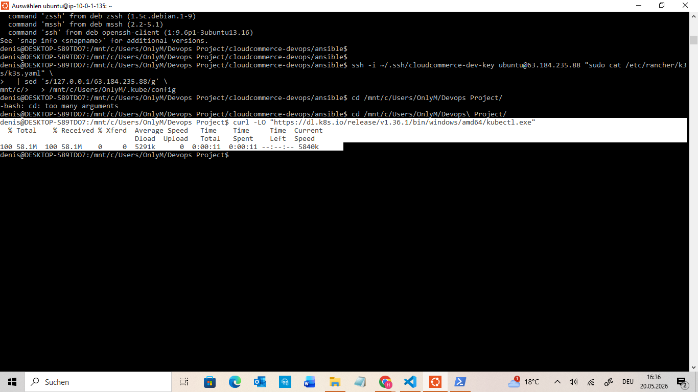
*kubeconfig copied from the server and kubectl.exe downloaded via WSL curl — binary available in the project directory*

---

### Challenge: TLS Certificate Error — Public IP Not in the Certificate

With kubectl available, the kubeconfig was copied from the k3s server and updated to point at the public Elastic IP:

```yaml
server: https://63.184.235.88:6443
```

Running `kubectl get nodes` produced a TLS certificate error:

```
tls: failed to verify certificate: x509: certificate is valid for
10.0.1.135, 10.43.0.1, 127.0.0.1, ::1, not 63.184.235.88
```

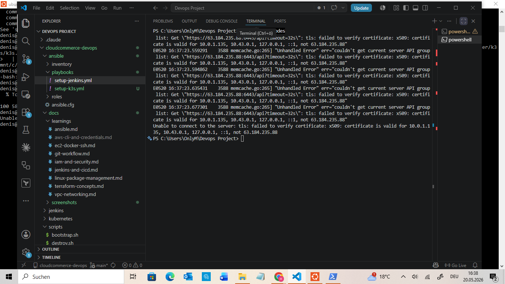
*kubectl get nodes fails — k3s self-signed certificate does not include the public Elastic IP*

**Root cause:** k3s generates a self-signed TLS certificate during installation and includes a list of IPs the certificate is valid for (Subject Alternative Names). By default, it only includes the node's private IP (`10.0.1.135`), the cluster service IP (`10.43.0.1`), and loopback addresses. The public Elastic IP (`63.184.235.88`) is not in the certificate — so TLS verification fails when connecting from outside the VPC.

This is a design constraint of how TLS works: a certificate must explicitly list every IP or hostname it is valid for. The certificate is generated at install time, so there is no way to add the public IP after the fact without reinstalling.

**Fix:** The k3s install command accepts an `INSTALL_K3S_EXEC` environment variable that passes flags to the k3s server. The `--tls-san` flag adds entries to the TLS certificate's Subject Alternative Names list:

```bash
curl -sfL https://get.k3s.io | INSTALL_K3S_EXEC="--tls-san 63.184.235.88" sh -
```

The Ansible playbook was updated:

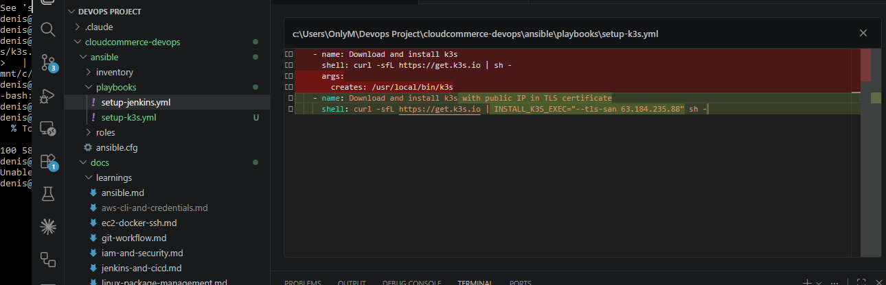
*setup-k3s.yml updated — INSTALL_K3S_EXEC="--tls-san 63.184.235.88" added to include the Elastic IP in the TLS certificate*

The `args.creates` guard that prevented re-running the install task was removed — k3s was already installed, but its certificate needed to be regenerated with the correct SANs.

#### k3s Reinstall

The updated playbook was run, triggering a clean reinstall of k3s with the correct TLS configuration:

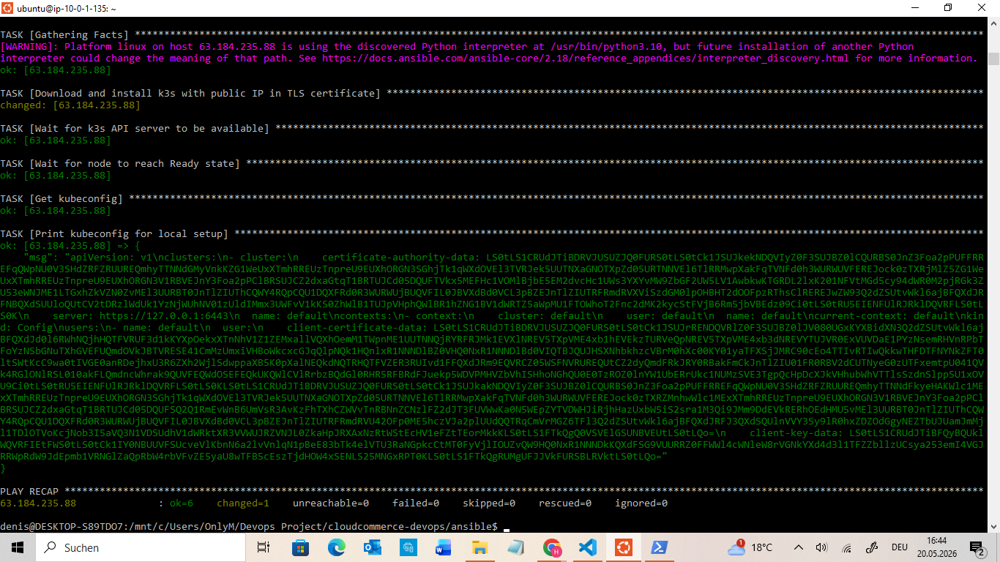
*Ansible playbook command with updated inventory and credentials — targeting the k3s reinstall*

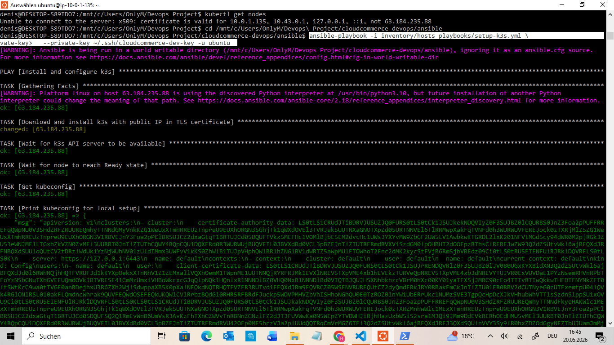
*k3s reinstalling — tasks running, node returning to Ready state with new TLS certificate*

---

### k3s Reinstall Success — TLS SAN Fixed

The second playbook run completed successfully with the updated certificate:

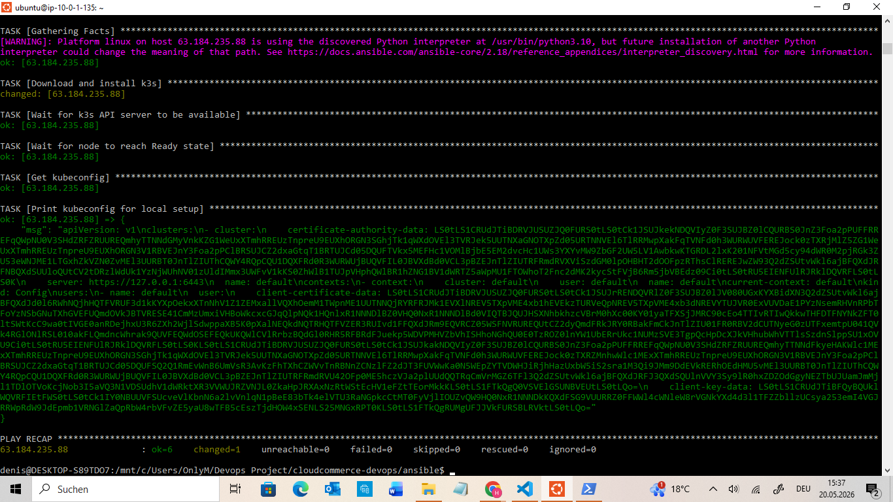
*k3s reinstall — all tasks complete, node Ready, new certificate includes 63.184.235.88 in SANs*

The kubeconfig was re-copied from the server (the first copy contained the old certificate's cluster authority data):

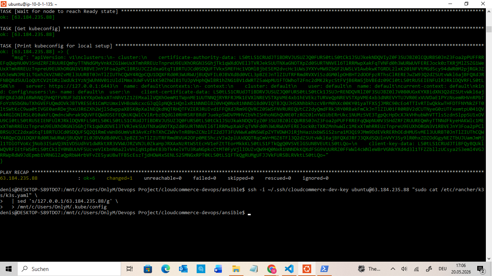
*Copying fresh kubeconfig from the server after reinstall — the cluster CA data has changed*

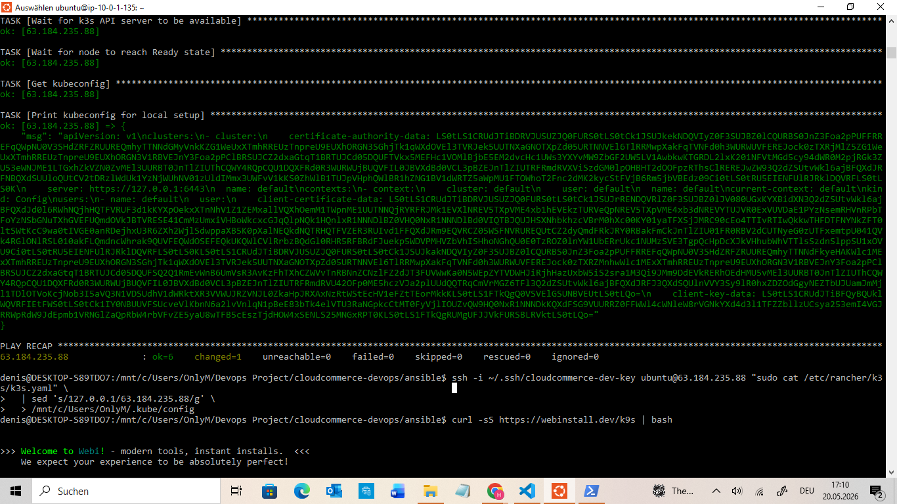
*kubeconfig content — server set to https://63.184.235.88:6443, certificate-authority-data updated*

With the fresh kubeconfig in place, `kubectl get nodes` succeeded:

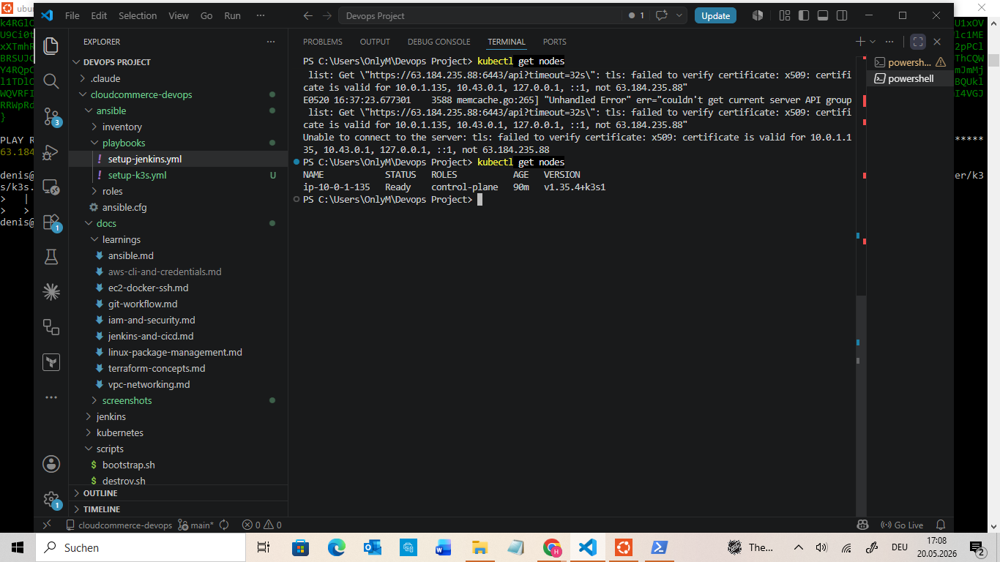
*kubectl get nodes — node ip-10-0-1-135 status Ready, control-plane role confirmed. Remote kubectl access to the cluster is working.*

**What this teaches:** k3s (and Kubernetes in general) generates TLS certificates at cluster initialisation time. For remote access from outside the cluster's internal network, the public-facing IP must be declared via `--tls-san` *before* installation — not added after. Discovering this through the x509 error is common; the fix is a full reinstall with the correct flag, which Ansible makes trivial to reproduce.

---

### Installing k9s — Terminal UI for Cluster Management

kubectl is the authoritative tool for Kubernetes operations. k9s is a terminal UI built on top of kubectl that makes it faster to navigate pods, view logs, and inspect cluster state without remembering the full kubectl syntax for every operation.

k9s was installed in WSL using the official installer script:

```bash
curl -sS https://webinstall.dev/k9s | bash
```

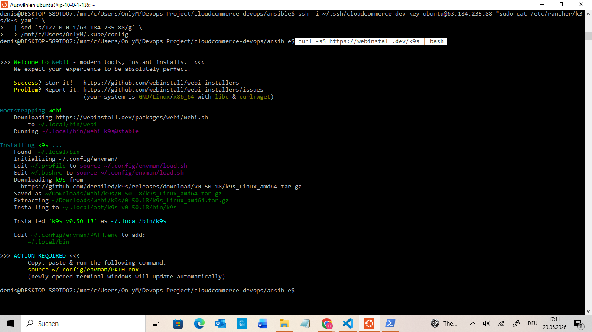
*k9s v0.50.18 installed via webinstall in WSL — binary placed in ~/.local/bin*

k9s was launched directly to the pods view to avoid navigating from the default start screen:

```bash
k9s --command pods
```

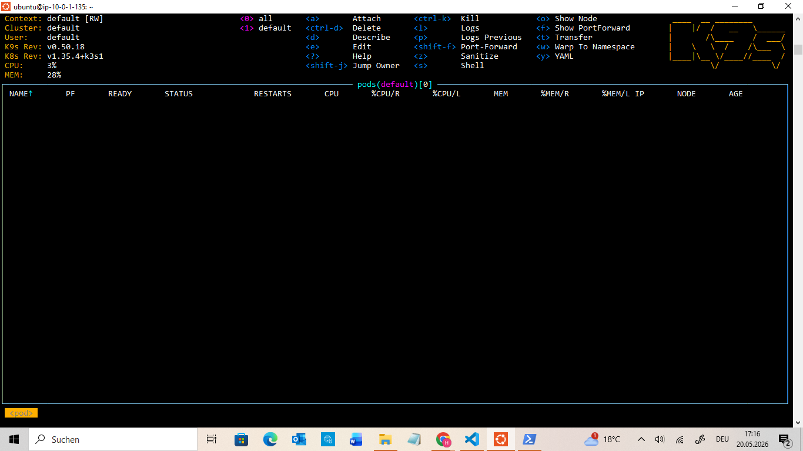
*k9s launching — kubeconfig detected, connecting to k3s cluster at 63.184.235.88:6443*

All 7 system pods were Running with healthy resource usage — 3% CPU, 28% memory on the t3.medium node:

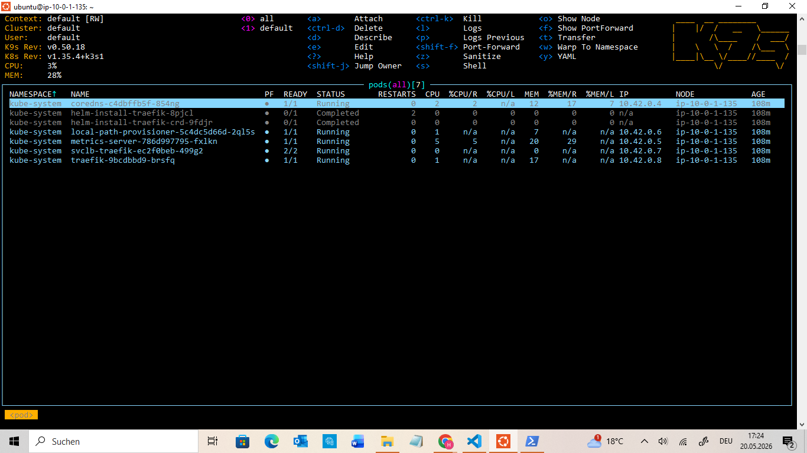
*k9s pods view — 7 system pods all Running: coredns, metrics-server, traefik, local-path-provisioner, svclb-traefik. Cluster health confirmed.*

For comparison, the same cluster state from kubectl:

```bash
kubectl get pods -A
```

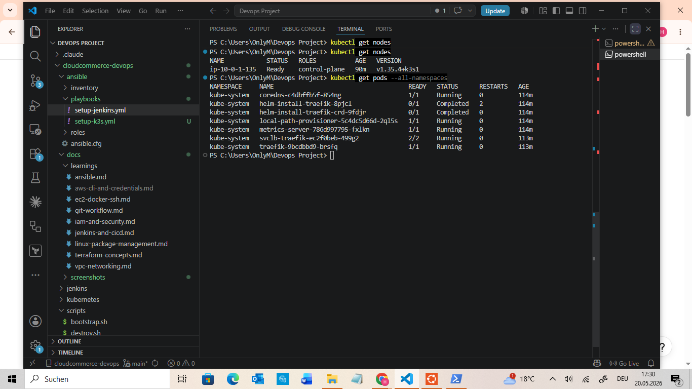
*kubectl get pods -A — all namespaces, all pods Running. k9s and kubectl showing identical cluster state.*

---

### Making kubectl PATH Permanent on Windows

The temporary PATH addition (`$env:PATH += "..."`) does not persist across PowerShell sessions. The permanent fix uses the Windows environment registry directly via SetEnvironmentVariable:

```powershell
[System.Environment]::SetEnvironmentVariable(
    "PATH",
    $env:PATH + ";C:\Users\OnlyM\Devops Project",
    [System.EnvironmentVariableTarget]::User
)
```

New terminal sessions inherit the updated PATH automatically — no manual setup required.

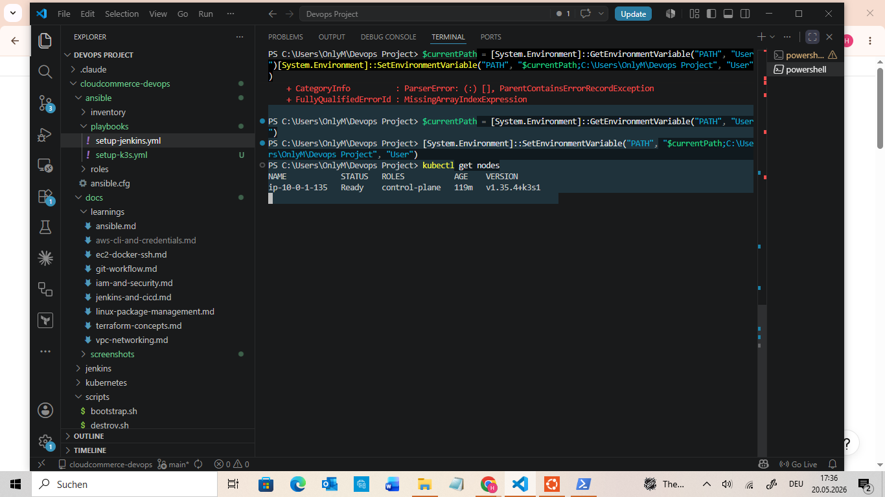
*kubectl get nodes working in a new PowerShell session — PATH is permanent, no manual setup needed*

---

### Progress
- [x] k3s installed via Ansible — single-binary Kubernetes on EC2 t3.medium
- [x] TLS SAN challenge diagnosed and resolved — public Elastic IP added to certificate via `--tls-san`
- [x] kubectl installed and configured — remote cluster access from local machine confirmed
- [x] k9s v0.50.18 installed — terminal UI showing all 7 system pods Running
- [x] kubectl PATH made permanent on Windows — works across all terminal sessions
- [ ] Install ArgoCD on k3s cluster
- [ ] Deploy Online Boutique via Helm
- [ ] Configure Ingress
- [ ] Set up HPA (Horizontal Pod Autoscaler)

---

## Phase 4 — Observability *(upcoming)*

- [ ] Deploy Prometheus + Grafana stack
- [ ] Deploy Loki + Promtail for log aggregation
- [ ] Configure AlertManager rules
- [ ] Build Grafana dashboards for cluster and application metrics
- [ ] Monitor HPA scaling events under k6 load

---

## Phase 5 — Security + Load Test *(upcoming)*

- [ ] Integrate Trivy image scanning into Jenkins pipeline
- [ ] Deploy HashiCorp Vault for secrets management
- [ ] Write k6 load test scripts
- [ ] Run load test and observe HPA scaling in real time
- [ ] Document Trivy scan results and k6 performance metrics

---

## Repository Structure

```
cloudcommerce-devops/
├── terraform/
│   ├── modules/
│   │   ├── vpc/          # VPC, subnets, route tables, internet gateway, security groups
│   │   ├── ec2/          # EC2 instances, Elastic IPs, key pairs, security groups
│   │   ├── ecr/          # 12 container registries with lifecycle policies
│   │   ├── iam/          # Jenkins and k3s roles, ECR policies, instance profiles
│   │   └── dns/          # Route53 hosted zone and records
│   ├── environments/
│   │   ├── dev/          # Development environment (current)
│   │   └── prod/         # Production environment (future)
│   └── keys/             # SSH public key (private key gitignored)
├── ansible/
│   ├── inventory/        # Server IP addresses
│   ├── playbooks/        # Jenkins setup, k3s install, server hardening
│   └── roles/            # Reusable Ansible roles
├── kubernetes/
│   ├── namespaces/       # Namespace definitions
│   ├── apps/
│   │   └── online-boutique/  # Helm values for the 12-service application
│   ├── monitoring/
│   │   ├── prometheus/   # Prometheus config and alerting rules
│   │   └── grafana/      # Dashboard definitions
│   └── argocd/           # ArgoCD application manifests
├── jenkins/
│   ├── Jenkinsfile       # Pipeline definition — build, scan, push, deploy
│   └── casc/             # Jenkins configuration as code
├── scripts/
│   ├── bootstrap.sh      # Prerequisites check + terraform init/plan/apply
│   └── destroy.sh        # Pre-destroy checklist + terraform destroy
└── docs/
    ├── screenshots/      # Evidence for every phase — console, terminal, dashboards
    └── learnings/        # Deep-dive notes on every concept covered in this project
```

---

## How to Deploy

**Prerequisites:**
- AWS account with programmatic access configured (`aws configure --profile cloudcommerce`)
- Terraform >= 1.10.0
- Ansible >= 2.15 (via WSL on Windows)
- kubectl
- Helm >= 3.0

```bash
# 1. Clone this repo
git clone https://github.com/Dennis4507/cloudcommerce-devops.git
cd cloudcommerce-devops

# 2. Generate SSH key pair for EC2 access
ssh-keygen -t rsa -b 4096 -f terraform/keys/cloudcommerce-dev-key

# 3. Provision infrastructure
cd terraform/environments/dev
terraform init
terraform plan
terraform apply

# 4. Configure servers with Ansible
cd ../../../ansible
ansible-playbook playbooks/setup-jenkins.yml
ansible-playbook playbooks/setup-k3s.yml

# 5. Deploy application via ArgoCD
kubectl apply -f kubernetes/argocd/
```

---

## Deep-Dive Learning Notes

Every concept covered in this project — VPC networking, IAM design, Terraform architecture, EC2 and Docker, SSH authentication, AWS CLI, and Git workflow — is documented in detail in [`docs/learnings/`](docs/learnings/). These notes capture not just what was done but why each decision was made, including the tradeoffs considered and the problems encountered.

---

## Author

Built by Denis Muriuki — DevOps and Cloud Engineering Portfolio Project
[GitHub](https://github.com/Dennis4507) · [LinkedIn](https://www.linkedin.com/in/denis-muriuki-693374327/)
