# CloudCommerce DevOps Platform

A production-grade DevOps platform built around Google's Online Boutique — a 12-microservice e-commerce application written in Go, Python, Java, C#, and Node.js. This project was built from scratch to demonstrate real-world DevOps engineering: architectural decisions, security design, infrastructure automation, CI/CD pipelines, Kubernetes orchestration, and full-stack observability.

> This is not a tutorial follow-along. Every decision in this project was made deliberately, with a specific reason, and is documented here alongside the evidence that it was implemented.

**Application source:** [Google Online Boutique](https://github.com/GoogleCloudPlatform/microservices-demo)

---

## Why This Project Exists

Most DevOps portfolios deploy a single containerised application to a managed Kubernetes service and call it done. This project takes a different approach: build the entire platform from scratch — networking, identity, compute, CI/CD, orchestration, and observability — making real engineering decisions along the way and documenting every one of them.

The goals are:
- Design and provision a complete AWS infrastructure using Infrastructure as Code
- Build a production-grade CI/CD pipeline that builds, scans, and deploys automatically
- Run a real 12-microservice application on Kubernetes under real traffic
- Demonstrate security practices that would be expected in a professional environment
- Keep costs under control through disciplined infrastructure management

---

## Architecture

```
Developer pushes code to GitHub
         │
         ▼ webhook
    ┌─────────────┐
    │   Jenkins   │  ← CI/CD on EC2 t3.medium (eu-central-1)
    │  Pipeline   │    Build → Scan → Push → Update values.yaml
    └──────┬──────┘
           │ triggers ArgoCD sync
           ▼
    ┌─────────────┐         ┌──────────────────────────┐
    │   ArgoCD    │────────►│     k3s Kubernetes       │
    │  (GitOps)   │  sync   │     EC2 t3.medium        │
    └─────────────┘         │                          │
                            │  12 Microservices        │
                            │  Prometheus + Grafana    │
                            │  Loki + Promtail         │
                            │  k9s (terminal dashboard)│
                            └────────────┬─────────────┘
                                         │
                        ┌────────────────┼──────────────┐
                        ▼                ▼               ▼
                  ┌──────────┐   ┌────────────┐  ┌────────────┐
                  │ AWS ECR  │   │   AWS S3   │  │  Route53   │
                  │ 12 Repos │   │ TF State   │  │    DNS     │
                  └──────────┘   └────────────┘  └────────────┘

     All infrastructure provisioned with Terraform
     All server configuration managed with Ansible
```

---

## Key Architectural Decisions

### k3s over EKS
EKS (AWS managed Kubernetes) costs $0.10/hour for the control plane alone — $72/month before a single worker node is added. For a portfolio project, this is significant cost with no engineering benefit. k3s is a CNCF-certified, production-grade Kubernetes distribution that runs the complete Kubernetes API on a single EC2 instance. We get full Kubernetes features — HPA, RBAC, Ingress, persistent volumes, ArgoCD — at a fraction of the cost. In a real organisation, EKS would be the correct choice for its managed control plane, deep AWS integration, and enterprise support. For this project, k3s is the right engineering decision.

### Stop/Start over Destroy/Apply
Rather than destroying and recreating infrastructure every session, both EC2 servers are stopped between working sessions and started again when needed. AWS charges nothing for stopped EC2 instances (only a small EBS storage charge). Elastic IPs ensure the server addresses never change, so SSH config, Ansible inventory, and kubectl config all remain valid. This pattern preserves installed software between sessions while keeping running costs near zero.

### Modules and Environments separation
Terraform code is split into reusable modules (VPC, EC2, ECR, IAM) and environment-specific deployments (dev, prod). Modules define the *how* — how to build a VPC, how to create IAM roles. Environments define the *what and where* — which instance sizes, which region, which settings. This means fixing a bug in a module immediately benefits both environments, and adding a prod environment requires no module changes — only new variable values.

---

## Tech Stack

| Category | Tool | Rationale |
|----------|------|-----------|
| Cloud | AWS (eu-central-1) | Industry standard; Frankfurt region for GDPR compliance |
| IaC | Terraform 1.10+ | Declarative, version-controlled infrastructure; native S3 locking |
| Config Mgmt | Ansible | Agentless; SSH-based; idempotent server configuration |
| Containers | Docker | Standard container runtime; multi-stage builds for lean images |
| Orchestration | k3s | Full Kubernetes API at a fraction of EKS cost |
| CI/CD | Jenkins | Industry-standard; highly configurable pipeline-as-code |
| GitOps | ArgoCD | Git as the single source of truth for Kubernetes state |
| Registry | AWS ECR | Private; IAM-integrated; automatic image scanning |
| Metrics | Prometheus + Grafana | De facto Kubernetes observability stack |
| Logging | Loki + Promtail | Lightweight log aggregation; Grafana-native |
| Monitoring | k9s | Real-time terminal Kubernetes dashboard |
| Security | Trivy + Vault | Image vulnerability scanning + secrets management |
| Load Testing | k6 | Developer-friendly; JavaScript-based load scripts |
| Package Mgmt | Helm | Kubernetes application templating and versioning |

---

## Phase 1 — Foundation: Infrastructure as Code

Phase 1 covers everything required to have two production-ready servers running in AWS, fully provisioned and configured by code, with no manual console clicking.

### Step 1 — Repository and Git Discipline

The project starts with a Git repository before any infrastructure exists. This is intentional — infrastructure code needs the same version control discipline as application code.

The `.gitignore` is the first file created. It blocks:
- `.terraform/` — Terraform's local provider cache (can be hundreds of MB, regenerated by `init`)
- `*.tfstate` — Terraform state files (contain resource IDs and sometimes sensitive values)
- `*.pem`, `*.key`, `*.csv` — SSH private keys and credential export files
- `*accessKeys*`, `*credentials*` — AWS credential files
- `terraform/keys/cloudcommerce-dev-key` — the SSH private key path specifically

The rule applied throughout: if it contains a secret, a key, or can be regenerated — it belongs in `.gitignore` before a single `git add` is run. Credentials committed to a public GitHub repository are found by automated bots within minutes. The bots spin up thousands of EC2 instances for cryptocurrency mining. AWS bills accumulate until you notice — often thousands of dollars.

The repository was created on GitHub and the first commit was the `.gitignore`. Every meaningful change since has followed this discipline:

```
git add <specific files>    → stage intentionally, never git add -A blindly
git status                  → verify exactly what is staged
git commit -m "type: desc"  → conventional commit format
git push                    → make the work permanent
```


*The project repository on GitHub — README, structured Terraform code, and documented learnings all visible from the first visit*

---

### Step 2 — AWS Account Isolation

A dedicated IAM user (`cloudcommerce-devops`) was created for this project rather than using an existing account or root credentials.

**Why not root:** The root user is the master key to an AWS account. Root credentials cannot be scoped, cannot be rotated the same way as IAM keys, and if compromised give an attacker full control — including locking you out. Root is used only for initial account setup and never for daily work.

**Why a dedicated IAM user:** This project runs in an AWS account that also has other projects. Using a shared user would mix credentials and risk accidentally provisioning resources in the wrong project context. A dedicated `cloudcommerce-devops` user means its credentials are scoped to this project and can be rotated or deleted without affecting anything else.

**Why a user group:** The `cloudcommerce-devops` user is placed in a `cloudcommerce-admins` group. Permissions are attached to the group, not the user. When a team grows, adding a new engineer means adding them to the group — not manually re-configuring every permission for every person.


*cloudcommerce-admins group — permissions managed at the group level, not per user*


*cloudcommerce-devops user — isolated credentials for this project only*

The AWS CLI is configured with a named profile so every command is explicitly scoped to this project:

```bash
aws configure --profile cloudcommerce
aws sts get-caller-identity --profile cloudcommerce  # always verify before running anything
```

Named profiles prevent the most common and expensive infrastructure mistake: running `terraform apply` authenticated as the wrong account.

---

### Step 3 — Remote State

Terraform tracks everything it has created in a state file (`terraform.tfstate`). Without state, Terraform cannot tell what already exists and would attempt to recreate everything from scratch on every `apply`.

Local state works for a single engineer on a single machine. It breaks the moment:
- The laptop is lost or the disk fails
- A second engineer needs to run Terraform
- Two people run `apply` simultaneously and corrupt the state

State is stored in S3 (`cloudcommerce-tfstate-<account-id>`) with two critical settings enabled:

**Versioning** — S3 keeps every previous version of the state file. If a bad `apply` corrupts state, the previous version can be restored. Without versioning, a corrupted state file means manually reconciling what Terraform thinks exists against what actually exists in AWS — an extremely painful process.

**Native S3 locking (Terraform 1.10+)** — Prevents two simultaneous `terraform apply` runs from writing to the state file at the same time. A corrupted state file in a team environment can break the entire project.

**Encryption** — State files can contain resource IDs, ARNs, and occasionally sensitive values. SSE-S3 encryption ensures the file is encrypted at rest.


*Versioning enabled — every state change is preserved and recoverable*


*SSE-S3 encryption — state file encrypted at rest*

---

### Step 4 — Terraform Architecture

The Terraform code is split into two layers:

```
terraform/
├── modules/          ← reusable blueprints (the HOW)
│   ├── vpc/          how to build a VPC
│   ├── ec2/          how to build EC2 instances
│   ├── ecr/          how to build container registries
│   └── iam/          how to build roles and policies
└── environments/
    └── dev/          ← deployments (the WHAT and WHERE)
        ├── providers.tf    which cloud, which region, which credentials
        ├── backend.tf      where to store state
        ├── variables.tf    what inputs this environment accepts
        ├── terraform.tfvars the actual values for those inputs
        ├── main.tf         calls all modules with those values
        └── outputs.tf      what to print after apply
```

Modules have no knowledge of which environment they run in. The VPC module knows how to build a VPC — the CIDR ranges, subnet sizes, and region are passed in as variables. The dev environment calls the VPC module with dev values; a prod environment would call the same module with different values. Fix a bug in a module once and every environment that uses it benefits.

The `providers.tf` separates AWS authentication from infrastructure logic:

```hcl
provider "aws" {
  region  = var.aws_region
  profile = "cloudcommerce"
  default_tags {
    tags = { Project = var.project, Environment = var.environment, ManagedBy = "terraform" }
  }
}
```

`default_tags` automatically applies consistent tags to every resource created. Every EC2 instance, security group, subnet, and IAM role in this project is tagged with `Project = cloudcommerce`, `Environment = dev`, and `ManagedBy = terraform`. In a large AWS account with hundreds of resources, this tagging discipline is what makes cost tracking and resource identification manageable.


*Repository structure in VS Code — the modules/environments separation is visible in the Terraform directory*

---

### Step 5 — Network Design

The VPC (`cloudcommerce-dev-vpc`, CIDR `10.0.0.0/16`) is the private network boundary for the entire project. All resources live inside it.

```
VPC: 10.0.0.0/16  (65,536 addresses — large enough for future growth)
├── Public Subnet: 10.0.1.0/24   ← Jenkins + k3s (need internet access)
└── Private Subnet: 10.0.2.0/24  ← future databases (no internet access)
```

**Why a public/private split:** The principle of least exposure — only resources that genuinely need internet access are placed in the public subnet. Jenkins needs to be reachable for GitHub webhooks. k3s needs to serve application traffic. Databases do not. A database in the private subnet has no route to the internet gateway, so even if the application is compromised, an attacker cannot directly reach the database from outside — they would first need to compromise a server in the public subnet.

**Route tables vs security groups** — these operate at different layers and both must permit traffic for it to flow:
- Route tables operate at the **subnet level** — they decide *where* traffic is directed (e.g., all outbound traffic goes to the internet gateway)
- Security groups operate at the **instance level** — they decide *who* is allowed through (e.g., only port 80 is accepted)

A packet arriving at the VPC passes through the route table first (does a path to this destination exist?) and then through the security group (is this traffic type permitted?). Both must say yes.

Jenkins security group — ports 22 (SSH admin access) and 8080 (Jenkins web UI)
k3s security group — ports 22, 80, 443 (application traffic), 6443 (Kubernetes API for kubectl), 30080 (ArgoCD dashboard)


*cloudcommerce-dev-vpc — isolated network boundary for the project*


*Public and private subnets — only the public subnet has a route to the internet gateway*


*Private subnet detail — no internet gateway route, databases will live here*

---

### Step 6 — Identity Design

By default, EC2 instances have zero AWS permissions. A Jenkins server that needs to push Docker images to ECR cannot do so without explicit permission. The wrong solution is putting AWS access keys on the server — if the server is ever compromised, those long-lived credentials are stolen. The correct solution is IAM roles.

IAM roles generate **temporary credentials** automatically, rotating every few hours. Nothing sensitive is stored on disk. If the server is compromised, the credentials expire on their own schedule and cannot be exfiltrated permanently.

Two roles were created with deliberately different permissions:

```
Jenkins Role → ECR push + pull
  Can: build images, push to ECR, pull from ECR, describe and list repositories

k3s Role → ECR pull only
  Can: pull images from ECR, describe and list repositories
  Cannot: push images, modify repositories
```

This separation matters. k3s only runs images — it never builds them. Giving k3s push permissions would mean a compromised k3s node could push malicious images to ECR, which Jenkins would then pull and deploy. By restricting k3s to pull-only, an attacker who compromises the k3s node cannot inject code into the build pipeline. The attack surface is limited by design.


*Jenkins role (push+pull) and k3s role (pull-only) — least privilege enforced at the IAM level*

---

### Step 7 — Container Registry

ECR (Elastic Container Registry) provides 12 private repositories — one per microservice. The naming convention is `cloudcommerce/<service-name>` (e.g., `cloudcommerce/frontend`, `cloudcommerce/cartservice`).

Two settings are enabled on every repository:

**Scan on push** — every image is automatically scanned for known CVEs (Common Vulnerabilities and Exposures) when pushed. The scan results appear in the ECR console. This provides a baseline security gate without adding complexity to the pipeline.

**Lifecycle policy** — keeps the last 5 images per repository and automatically expires older ones. Without lifecycle policies, a CI/CD pipeline pushing multiple images per day will accumulate hundreds of gigabytes of stale images in ECR within weeks. Storage is cheap, but unchecked accumulation is wasteful and signals a lack of operational discipline.

The 12 repositories are created with a single Terraform `for_each` block rather than 12 identical resource blocks:

```hcl
resource "aws_ecr_repository" "services" {
  for_each = toset(var.services)
  name     = "${var.project}/${each.key}"
}
```

Adding a 13th service requires adding one name to a list. No module code changes.


*12 container registries — one per microservice, scan on push enabled on all*

---

### Step 8 — Compute

Two EC2 instances are provisioned:

| Instance | Type | Disk | Purpose |
|----------|------|------|---------|
| Jenkins | t2.micro | 20GB gp3 | CI/CD pipeline — build, scan, push |
| k3s | t3.medium | 30GB gp3 | Kubernetes node — runs all 12 services |

**Why t3.medium for k3s:** Running 12 microservices simultaneously requires memory. A t2.micro (1GB RAM) would cause out-of-memory kills under normal load. A t3.medium (4GB RAM) provides enough headroom for the application, the Kubernetes system pods, Prometheus, Grafana, and Loki to coexist.

**SSH key pairs:** EC2 instances use public/private key authentication instead of passwords. A 4096-bit RSA key pair was generated locally. The public key was uploaded to AWS and attached to both instances at creation. The private key stays only on the engineer's machine and is gitignored. Knowing a server's IP address without the corresponding private key results in immediate `Permission denied` — there is no password to brute-force.

**user_data bootstrap:** Both instances run a shell script automatically on first boot via the `user_data` field in the Terraform resource. This script installs Docker CE, enables the Docker daemon, and starts it. The server is fully ready — Docker running, daemon enabled for automatic restart — before any engineer touches it. This is what "infrastructure as code" means in practice: the server configures itself.

**Elastic IPs:** Standard EC2 instances are assigned a dynamic public IP that changes every time the instance stops and starts. This would break SSH commands, Ansible inventory, and kubectl configuration every session. Elastic IPs are static public addresses that remain attached through stop/start cycles. They are free while the instance is running and cost ~$0.005/hour while stopped.


*Both instances running in eu-central-1a after terraform apply*


*Static Elastic IPs attached to both servers — addresses will not change between sessions*

---

### Step 9 — Provisioning

With all four modules complete (VPC, IAM, ECR, EC2), the infrastructure is provisioned with a single command:

```bash
terraform plan   # review exactly what will be created — always read this
terraform apply  # provision everything
```

The initial apply created **43 resources** in under 60 seconds:
- 1 VPC, 2 subnets, 1 internet gateway, 1 route table, 1 route table association
- 2 IAM roles, 2 IAM policies, 2 policy attachments, 2 instance profiles
- 12 ECR repositories, 12 ECR lifecycle policies
- 1 SSH key pair, 2 EC2 instances, 2 security groups

A second apply added 2 Elastic IPs — demonstrating Terraform's incremental apply behaviour. Existing resources were read from state and left completely untouched. Only the 2 new resources were created.


*Initial apply output — 43 resources created, 0 changed, 0 destroyed*


*Incremental apply — 2 resources added, 43 existing resources untouched*

---

### Step 10 — Verification

After provisioning, both servers were SSH'd into to confirm the user_data bootstrap ran successfully:

```bash
ssh -i terraform/keys/cloudcommerce-dev-key ubuntu@3.127.90.169
docker --version
sudo systemctl status docker --no-pager
```

Results on both servers:
- Ubuntu 22.04.5 LTS — correct AMI
- Docker 29.5.1 — installed by user_data
- `Active: active (running)` — daemon started and enabled

This verification step matters. `user_data` runs silently at boot with no visible output. Checking `docker --version` is the confirmation that the script ran to completion. Skipping this check and proceeding to Ansible without verifying Docker would mean debugging a failure several steps later with no indication of where it originated.


*SSH into Jenkins server — Ubuntu 22.04 booted, private IP 10.0.1.253 confirms VPC placement*


*Docker 29.5.1 installed automatically by user_data bootstrap script*


*Docker daemon active and running — enabled for automatic restart on reboot*

---

### Step 11 — Cost Management: The Stop/Start Pattern

Infrastructure is not left running between working sessions. Both EC2 instances are stopped via the AWS Console at the end of every session and started again at the beginning of the next.

**Starting a session:**
1. AWS Console → EC2 → Instances → select both → Instance State → Start
2. Wait ~30 seconds for Running state
3. Verify SSH: `ssh -i terraform/keys/cloudcommerce-dev-key ubuntu@3.127.90.169`
4. Elastic IPs ensure the same addresses — no configuration changes needed

**Ending a session:**
1. AWS Console → EC2 → Instances → select both → Instance State → Stop
2. Compute billing stops immediately
3. EBS disks and Elastic IPs persist — all installed software is preserved

This was tested: both instances were stopped overnight and restarted the following day. SSH connected immediately to the same IPs. All data and configuration on the EBS volumes was intact.

| State | Cost |
|-------|------|
| Both instances running | ~$0.065/hour |
| Both instances stopped | ~$0.27/day |
| Full project to completion | ~$15–25 total |


*Both instances Running after overnight stop — Elastic IPs confirmed unchanged*


*Jenkins SSH after restart — same IP (3.127.90.169), same private address (10.0.1.253)*


*k3s SSH after restart — same IP (63.184.235.88), stop/start pattern confirmed working*

---

## Phase 2 — CI/CD Pipeline *(in progress)*

### Ansible Setup — Configuring Servers Without Touching Them

Ansible is the configuration management layer. Where Terraform provisions infrastructure (what exists in AWS), Ansible configures what runs on those servers — installing packages, writing config files, starting services, managing users. It is agentless: there is nothing to install on the target servers. Ansible SSHes in from the control node, runs tasks, and disconnects. Every task is idempotent — running the same playbook twice produces the same result without duplicating work.

The control node for this project is WSL (Windows Subsystem for Linux) on the local machine, running Ubuntu 22.04. Ansible does not run natively on Windows, so WSL provides the Linux environment required.

#### Step 1 — Install Ansible on WSL

Ansible was installed via pip rather than Ubuntu's packaged version. The Ubuntu package is typically several versions behind; pip gives the current release.


*WSL Ubuntu 22.04 — the Ansible control node for this project*


*Ansible installed via pip — current release, not Ubuntu's older packaged version*


*ansible --version confirms installation and the Python interpreter being used*

#### Step 2 — SSH Key Setup

The SSH private key lives in `terraform/keys/` on the Windows filesystem. For Ansible to use it from WSL, it must be copied into the WSL home directory with restrictive permissions. SSH (and by extension Ansible) refuses to use private keys that are readable by other users — this is a hard security requirement, not a warning.

```bash
cp /mnt/c/Users/OnlyM/Devops\ Project/cloudcommerce-devops/terraform/keys/cloudcommerce-dev-key ~/.ssh/
chmod 600 ~/.ssh/cloudcommerce-dev-key
```


*Private key copied to WSL home directory with chmod 600 — SSH security requirement enforced*

---

#### Challenge: Ansible Refused to Load Config from the Windows Filesystem

The first ping attempt produced no hosts at all — not a connection failure, but Ansible silently ignoring its own configuration:

```
[WARNING]: Ansible is being run in a world writable directory, ignoring it as an ansible.cfg source.
[WARNING]: provided hosts list is empty, only localhost is available.
```


*Ansible ignores ansible.cfg from /mnt/c/ — world-writable filesystem is treated as untrusted*

**Root cause:** The Windows filesystem mounted in WSL at `/mnt/c/` has world-writable permissions by default. Ansible has a deliberate security rule that refuses to auto-load `ansible.cfg` from world-writable directories — on a shared system, a malicious `ansible.cfg` in a world-writable directory could inject configuration without the user knowing. Without the config file, Ansible found no inventory and no hosts.

**Solution:** Pass inventory and credentials explicitly on every command instead of relying on auto-loading:

```bash
ansible all -i inventory/hosts -m ping --private-key ~/.ssh/cloudcommerce-dev-key -u ubuntu
```

**What this teaches:** Understanding *why* a tool rejects configuration — not just that it does — is the difference between a real fix and a blind workaround. The restriction exists for a genuine security reason. The correct response is to work with it, not disable it.

---

Both servers responded immediately once the explicit flags were passed:


*Both servers respond with pong — Ansible SSH connectivity to Jenkins (3.127.90.169) and k3s (63.184.235.88) confirmed*

---

### Writing the Jenkins Playbook

With connectivity proven, the first playbook was written to install Jenkins. A single YAML file automates the complete setup: Java 17 (Jenkins runtime dependency), GPG key import, apt repository configuration, Jenkins installation and service management, Docker group membership for the jenkins user, and initial admin password retrieval.


*setup-jenkins.yml in VS Code — initial version using Java 17, later upgraded to Java 21*

---

### Challenge: Jenkins GPG Key — Two Separate Problems

Installing Jenkins exposed two distinct GPG key problems encountered in sequence. Each required a different diagnosis technique.

#### Problem 1 — Key Format: `.asc` vs `.gpg`

The initial playbook used `get_url` to download Jenkins' GPG key as an ASCII-armored `.asc` file. Apt's `signed-by` mechanism requires keys in binary (dearmored) format. The mismatch caused every `apt-get update` to reject the repository as unsigned:

```
NO_PUBKEY 7198F4B714ABFC68
E: The repository 'https://pkg.jenkins.io/debian-stable binary/ Release' is not signed.
```


*First playbook run — FAILED at apt update, repository signature verification rejected*


*Second run — same error after first attempted fix*

**Fix:** Pipe the downloaded key through `gpg --dearmor` to convert it from ASCII to binary format. The `apt_repository` Ansible module was also replaced with a `shell` task — the module auto-triggers a cache update internally before the key is fully in place, creating a race condition.

```bash
curl -fsSL https://pkg.jenkins.io/debian-stable/jenkins.io-2023.key | gpg --dearmor -o /usr/share/keyrings/jenkins-keyring.gpg
```


*Third run after dearmor fix — same error. The problem was not the format.*

---

#### Problem 2 — Expired Key at the Official URL

The dearmor fix resolved the format issue but the same signature error persisted. More Ansible runs with further adjustments all produced the same result:


*Fourth run — dearmor applied, same NO_PUBKEY error. The problem is not the format.*


*Fifth run — all automated attempts exhausted. Root cause still unknown.*

After five failures with the same error, automated retries were stopped. The next step was SSH directly into the Jenkins server to inspect what was actually on disk:


*Manual commands on the server — checking the key file and testing apt-get update directly*

```bash
gpg --show-keys /usr/share/keyrings/jenkins-keyring.gpg
```

Output:

```
pub   rsa4096 2023-03-27 [SC] [expired: 2026-03-26]
      63667EE74BBA1F0A08A698725BA31D57EF5975CA
```


*gpg --show-keys reveals the key downloaded from jenkins.io-2023.key — fingerprint 5BA31D57EF5975CA, expired March 2026*

The key at `jenkins.io-2023.key` **expired in March 2026**. Its fingerprint (`5BA31D57EF5975CA`) does not match the key Jenkins is actually using to sign the repository (`7198F4B714ABFC68`). Jenkins rotated their signing key but the old URL continues to serve the expired key — a silent trap for anyone following documentation written before the rotation.

---

#### Resolution — Fetch the Current Key by ID from a Keyserver

Rather than downloading from a URL that serves whatever key the Jenkins team last published there, fetch the specific key by its ID from a dedicated key distribution server:

```bash
sudo gpg --no-default-keyring \
    --keyring /usr/share/keyrings/jenkins-keyring.gpg \
    --keyserver keyserver.ubuntu.com \
    --recv-keys 7198F4B714ABFC68
```

A keyserver lookup by ID always returns the current valid key for that ID. The playbook was rewritten with this approach, and `apt-get update` was run manually on the server first to confirm the fix before finalising the playbook.


*apt-get update succeeds — Jenkins repository trusted, packages now available for installation*

**What this teaches:** Package signing keys expire and rotate. Hardcoding a key URL in automation is fragile — the URL may serve a stale or expired key indefinitely after rotation. Fetching by key ID from a keyserver always retrieves the current valid key. Manual server debugging (SSH in, run the failing command by hand, inspect the artefacts) is often the fastest path to the actual root cause when automated retries produce the same error.

---

### Challenge: Jenkins Installed but Service Failed to Start — Java Version

With the GPG key issue resolved, the playbook ran successfully — Jenkins installed — but failed at the final step: starting the service.

```
TASK [Start and enable Jenkins]
fatal: [3.127.90.169]: FAILED! => {"msg": "Unable to start service jenkins: Job for
jenkins.service failed because the control process exited with error code."}
```


*Ansible output — ok=6, changed=2, failed=1. Jenkins installed successfully but service refused to start*

The systemctl and journalctl logs showed only that the process exited — not why. The fastest way to get the actual error was to run Jenkins directly:

```bash
sudo /usr/bin/jenkins
```

Output:

```
Running with Java 17 from /usr/lib/jvm/java-17-openjdk-amd64, which is older than
the minimum required version (Java 21).
Supported Java versions are: [21, 25]
```


*Jenkins executed directly — Java 17 rejected, minimum requirement is now Java 21*

**Root cause:** Jenkins dropped Java 17 support in recent releases. The playbook was written against older documentation that listed Java 17 as the supported version. The current Jenkins LTS requires Java 21 minimum.

**Fix:** Update the playbook to remove Java 17 and install Java 21. Java 17 takes ~200MB — removing it also keeps disk usage clean on the 20GB t2.micro volume.

```yaml
- name: Remove Java 17 if present
  apt:
    name: openjdk-17-jdk
    state: absent

- name: Install Java 21 and dependencies
  apt:
    name:
      - openjdk-21-jdk
      - curl
      - gnupg
    state: present
```


*Updated playbook — Java 17 removal task added before Java 21 install*

Re-running the playbook: Ansible removed Java 17, installed Java 21, and this time Jenkins started cleanly.


*Ansible run in progress — Java 17 removed (changed), Java 21 installed (changed)*


*Full successful run — 12 tasks ok, 5 changed, 0 failed. Jenkins started and initial password retrieved*

**What this teaches:** Software version requirements change. Locking to a specific version in automation and re-verifying after major releases is not optional — Jenkins silently accepted the wrong Java version at install time and only rejected it at runtime. Running the binary directly (`/usr/bin/jenkins`) is a fast diagnostic technique that bypasses systemd's wrapper and surfaces the real error immediately.

---

### Jenkins Initial Configuration

With Jenkins running, the web UI was opened at `http://3.127.90.169:8080`. The initial unlock screen requires the admin password that Ansible printed at the end of the playbook run.


*Jenkins unlock screen — initial admin password retrieved from Ansible output*

**Suggested plugins** were selected — this installs the standard set Jenkins recommends: Git, Pipeline, Credentials, GitHub integration, and build tools. Selecting plugins manually at this stage adds risk of missing dependencies with no benefit.


*Suggested plugins installing — Git, Pipeline, Credentials, GitHub, and supporting tools*

An admin account was created and Jenkins is now fully operational.


*Jenkins dashboard — CI/CD server live and accessible at http://3.127.90.169:8080*

---

### Progress
- [x] Ansible connectivity verified — both servers reachable (ping: pong)
- [x] Jenkins GPG key issue diagnosed and resolved — keyserver approach adopted
- [x] Jenkins installed via Ansible — Java 17→21 upgrade required and documented
- [x] Jenkins configured — admin account created, suggested plugins installed
- [ ] Add AWS credentials and GitHub token to Jenkins credential store
- [ ] Write Jenkinsfile — build, scan with Trivy, push to ECR
- [ ] Configure GitHub webhook → Jenkins trigger
- [ ] Set up ArgoCD for GitOps deployment

---

## Phase 3 — Kubernetes

### Why k3s

k3s is a CNCF-certified Kubernetes distribution built for resource-constrained environments. On an EC2 t3.medium with 20GB storage, full upstream Kubernetes would consume most available memory before any workloads run. k3s ships as a single binary (~100MB), uses less than 512MB RAM at idle, and includes everything needed for a production-grade cluster: containerd, CoreDNS, Traefik ingress, and persistent volume support. It is fully Kubernetes-compatible — every `kubectl` command, every Helm chart, every manifest written for upstream Kubernetes works identically on k3s.

The t3.medium running k3s has 2 vCPUs and 4GB RAM — sufficient for the 12-microservice Online Boutique application plus Prometheus, Grafana, and ArgoCD.

---

### Pre-flight Checks — Verifying the Server Before Installation

Before running the k3s playbook, Ansible connectivity to the k3s server was verified using the same `ansible ping` command used in Phase 2. The k3s server was also inspected to confirm Docker was running, disk had sufficient space, and memory was adequate.


*Ansible ping to k3s server (63.184.235.88) succeeds — SSH connectivity confirmed before playbook run*


*Docker running, disk and RAM verified on the k3s EC2 instance — server ready for k3s installation*

---

### Installing k3s via Ansible

k3s is not available via apt. It is installed by piping a shell script from the official k3s distribution server directly into the shell — a single curl command that downloads and installs the binary, configures systemd, and starts the service in one step.

The Ansible playbook automates this:

```yaml
- name: Download and install k3s
  shell: curl -sfL https://get.k3s.io | sh -

- name: Wait for k3s API server to be available
  wait_for:
    port: 6443
    delay: 10
    timeout: 120

- name: Wait for node to reach Ready state
  shell: k3s kubectl get node | grep -v NotReady | grep Ready
  register: node_ready
  until: node_ready.rc == 0
  retries: 12
  delay: 10
  changed_when: false
```

The `wait_for` task pauses until port 6443 (the Kubernetes API server) is accepting connections. The follow-up task polls until the node reaches Ready state — k3s starts the API server before the node is fully initialised, so both checks are necessary.


*k3s playbook first run — all tasks ok, cluster installed and node reached Ready state*

---

### Setting Up kubectl — Local Cluster Access

kubectl is the Kubernetes CLI — it runs locally, connects to the cluster API over HTTPS on port 6443, and sends commands to the cluster. To connect kubectl to the k3s cluster, the cluster's credentials file (kubeconfig) must be copied from the server to the local machine.

#### kubectl Installation — Four Failures Before Success

Getting kubectl onto Windows turned into a multi-step debugging exercise that required working around several issues in sequence.

**Attempt 1 — winget**

The first approach was the Windows package manager:

```powershell
winget install -e --id Kubernetes.kubectl
```

Winget reported success ("Erfolgreich installiert"). But `kubectl` could not be found anywhere on the system — `Get-Command kubectl` returned nothing, `where.exe kubectl` returned nothing. The installation completed without error but placed the binary somewhere outside the PATH with no indication of where.


*winget reports success — but kubectl is not findable on the PATH after installation*


*Get-Command kubectl and where.exe kubectl both return nothing — winget installed somewhere inaccessible*

**Attempt 2 — PowerShell Invoke-WebRequest to System32**

```powershell
Invoke-WebRequest -Uri "https://dl.k8s.io/release/v1.36.1/bin/windows/amd64/kubectl.exe" `
  -OutFile "C:\Windows\System32\kubectl.exe"
```

Access denied — writing to System32 requires elevated permissions that were not available in the current terminal session.


*PowerShell Invoke-WebRequest to System32 — access denied, insufficient permissions*

**Attempt 3 — PowerShell Invoke-WebRequest to Project Directory**

```powershell
Invoke-WebRequest -Uri "https://dl.k8s.io/release/v1.36.1/bin/windows/amd64/kubectl.exe" `
  -OutFile "C:\Users\OnlyM\Devops Project\kubectl.exe"
```

The download started but the connection broke mid-transfer. Network interruption, no partial file recovered.


*PowerShell download failed with connection error — no binary recovered*

**Resolution — WSL curl**

PowerShell's Invoke-WebRequest has known TLS and connection handling issues. WSL curl is more reliable for large binary downloads. From inside WSL:

```bash
curl -LO "https://dl.k8s.io/release/v1.36.1/bin/windows/amd64/kubectl.exe"
```

This downloaded the binary successfully into the current WSL directory, which is accessible from Windows at `C:\Users\OnlyM\Devops Project\`.


*kubeconfig copied from the server and kubectl.exe downloaded via WSL curl — binary available in the project directory*

---

### Challenge: TLS Certificate Error — Public IP Not in the Certificate

With kubectl available, the kubeconfig was copied from the k3s server and updated to point at the public Elastic IP:

```yaml
server: https://63.184.235.88:6443
```

Running `kubectl get nodes` produced a TLS certificate error:

```
tls: failed to verify certificate: x509: certificate is valid for
10.0.1.135, 10.43.0.1, 127.0.0.1, ::1, not 63.184.235.88
```


*kubectl get nodes fails — k3s self-signed certificate does not include the public Elastic IP*

**Root cause:** k3s generates a self-signed TLS certificate during installation and includes a list of IPs the certificate is valid for (Subject Alternative Names). By default, it only includes the node's private IP (`10.0.1.135`), the cluster service IP (`10.43.0.1`), and loopback addresses. The public Elastic IP (`63.184.235.88`) is not in the certificate — so TLS verification fails when connecting from outside the VPC.

This is a design constraint of how TLS works: a certificate must explicitly list every IP or hostname it is valid for. The certificate is generated at install time, so there is no way to add the public IP after the fact without reinstalling.

**Fix:** The k3s install command accepts an `INSTALL_K3S_EXEC` environment variable that passes flags to the k3s server. The `--tls-san` flag adds entries to the TLS certificate's Subject Alternative Names list:

```bash
curl -sfL https://get.k3s.io | INSTALL_K3S_EXEC="--tls-san 63.184.235.88" sh -
```

The Ansible playbook was updated:


*setup-k3s.yml updated — INSTALL_K3S_EXEC="--tls-san 63.184.235.88" added to include the Elastic IP in the TLS certificate*

The `args.creates` guard that prevented re-running the install task was removed — k3s was already installed, but its certificate needed to be regenerated with the correct SANs.

#### k3s Reinstall

The updated playbook was run, triggering a clean reinstall of k3s with the correct TLS configuration:


*Ansible playbook command with updated inventory and credentials — targeting the k3s reinstall*


*k3s reinstalling — tasks running, node returning to Ready state with new TLS certificate*

---

### k3s Reinstall Success — TLS SAN Fixed

The second playbook run completed successfully with the updated certificate:


*k3s reinstall — all tasks complete, node Ready, new certificate includes 63.184.235.88 in SANs*

The kubeconfig was re-copied from the server (the first copy contained the old certificate's cluster authority data):


*Copying fresh kubeconfig from the server after reinstall — the cluster CA data has changed*


*kubeconfig content — server set to https://63.184.235.88:6443, certificate-authority-data updated*

With the fresh kubeconfig in place, `kubectl get nodes` succeeded:


*kubectl get nodes — node ip-10-0-1-135 status Ready, control-plane role confirmed. Remote kubectl access to the cluster is working.*

**What this teaches:** k3s (and Kubernetes in general) generates TLS certificates at cluster initialisation time. For remote access from outside the cluster's internal network, the public-facing IP must be declared via `--tls-san` *before* installation — not added after. Discovering this through the x509 error is common; the fix is a full reinstall with the correct flag, which Ansible makes trivial to reproduce.

---

### Installing k9s — Terminal UI for Cluster Management

kubectl is the authoritative tool for Kubernetes operations. k9s is a terminal UI built on top of kubectl that makes it faster to navigate pods, view logs, and inspect cluster state without remembering the full kubectl syntax for every operation.

k9s was installed in WSL using the official installer script:

```bash
curl -sS https://webinstall.dev/k9s | bash
```


*k9s v0.50.18 installed via webinstall in WSL — binary placed in ~/.local/bin*

k9s was launched directly to the pods view to avoid navigating from the default start screen:

```bash
k9s --command pods
```


*k9s launching — kubeconfig detected, connecting to k3s cluster at 63.184.235.88:6443*

All 7 system pods were Running with healthy resource usage — 3% CPU, 28% memory on the t3.medium node:


*k9s pods view — 7 system pods all Running: coredns, metrics-server, traefik, local-path-provisioner, svclb-traefik. Cluster health confirmed.*

For comparison, the same cluster state from kubectl:

```bash
kubectl get pods -A
```


*kubectl get pods -A — all namespaces, all pods Running. k9s and kubectl showing identical cluster state.*

---

### Making kubectl PATH Permanent on Windows

The temporary PATH addition (`$env:PATH += "..."`) does not persist across PowerShell sessions. The permanent fix uses the Windows environment registry directly via SetEnvironmentVariable:

```powershell
[System.Environment]::SetEnvironmentVariable(
    "PATH",
    $env:PATH + ";C:\Users\OnlyM\Devops Project",
    [System.EnvironmentVariableTarget]::User
)
```

New terminal sessions inherit the updated PATH automatically — no manual setup required.


*kubectl get nodes working in a new PowerShell session — PATH is permanent, no manual setup needed*

---

### Installing ArgoCD — GitOps Continuous Delivery

ArgoCD is the GitOps engine for this platform. Where Jenkins handles CI (build, scan, push), ArgoCD handles CD — it watches a Git repository and automatically syncs the cluster state to match what's defined there. Every deployment is a git commit. Every rollback is a git revert. The cluster always reflects what's in the repository.

#### Why Ansible Instead of Raw kubectl

The initial instinct was to run the ArgoCD install as a one-off `kubectl apply` command. The better approach — and the one taken here — was to write it as an Ansible playbook. The reasons:

- **Reproducibility:** the entire ArgoCD setup can be re-run from scratch on any cluster with one command
- **Documentation:** the playbook is the install record — no undocumented steps
- **Consistency:** all infrastructure changes in this project go through the same IaC discipline
- **Recovery:** if the cluster is rebuilt, `ansible-playbook setup-argocd.yml` restores the full GitOps layer automatically

A one-off kubectl command works once. An Ansible playbook works every time.

---

#### Challenge 1 — Annotation Too Large for Client-Side Apply

The first playbook run failed immediately:

```
The CustomResourceDefinition "applicationsets.argoproj.io" is invalid:
metadata.annotations: Too long: may not be more than 262144 bytes
```

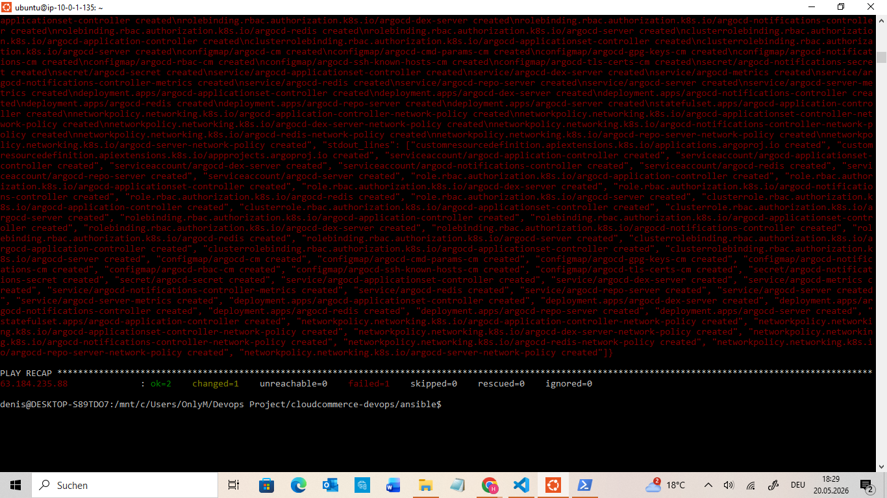
*First ArgoCD playbook run — FAILED. The applicationsets CRD annotation exceeds Kubernetes' 262144 byte limit*

**Root cause:** `kubectl apply` in its default (client-side) mode stores the entire last-applied manifest as an annotation on the resource. ArgoCD's ApplicationSet CRD is large enough that this annotation exceeds the 262144 byte hard limit Kubernetes enforces on annotations.

**Fix:** Switch to `--server-side` apply, which moves the field management tracking to the server and does not write the manifest into an annotation.

```yaml
shell: k3s kubectl apply -n argocd --server-side -f https://raw.githubusercontent.com/argoproj/argo-cd/stable/manifests/install.yaml
```

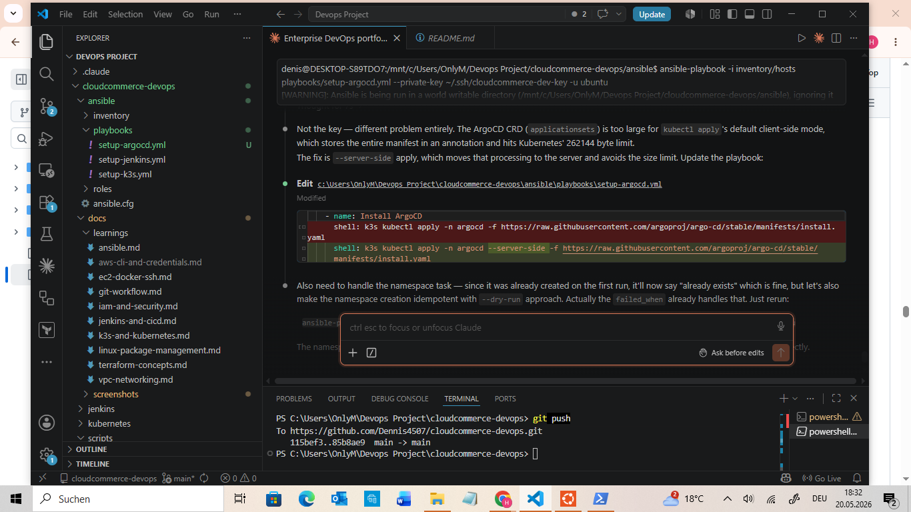
*Playbook updated — --server-side flag added to the kubectl apply command*

---

#### Challenge 2 — Field Manager Conflict Between Apply Modes

The second run failed with a different error:

```
Apply failed with 1 conflict: conflict with "kubectl-client-side-apply" using apps/v1:
.spec.template.spec.containers[name="argocd-applicationset-controller"].env[name="NAMESPACE"].valueFrom.fieldRef
```

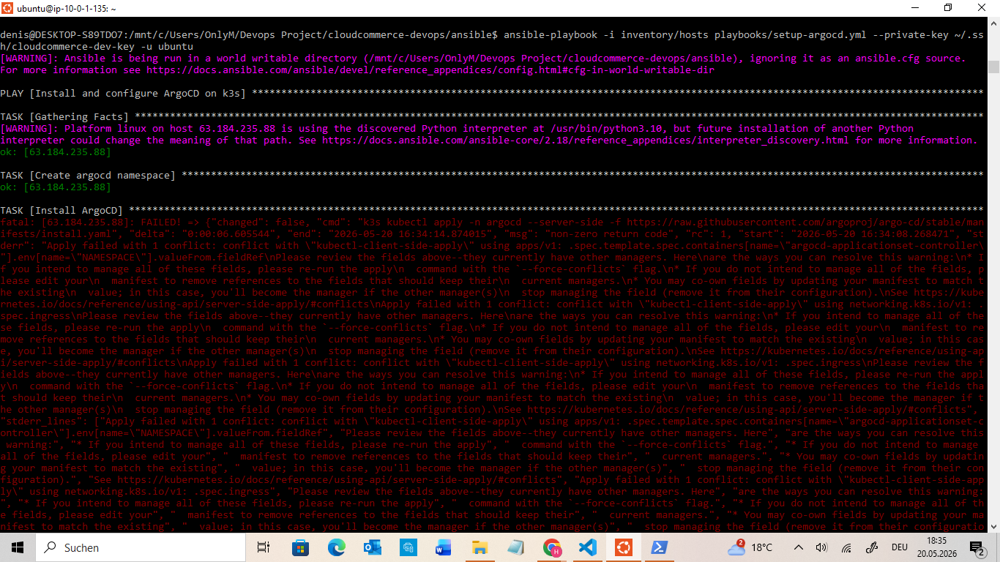
*Second run — FAILED. Server-side apply conflicts with the client-side apply manager from the first run*

**Root cause:** The first run created resources using client-side apply, which registers `kubectl-client-side-apply` as the field manager. The second run is now using server-side apply, which uses a different field manager. Kubernetes rejected the handover because two managers were claiming ownership of the same fields.

**Fix:** Add `--force-conflicts` to instruct server-side apply to take ownership of all conflicting fields, overriding the previous client-side manager:

```yaml
shell: k3s kubectl apply -n argocd --server-side --force-conflicts -f https://raw.githubusercontent.com/argoproj/argo-cd/stable/manifests/install.yaml
```

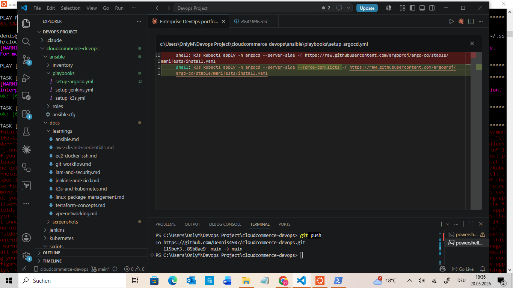
*Playbook updated again — --force-conflicts added to resolve field manager conflict*

---

#### ArgoCD Installation Success

Third run — all 7 tasks completed, 0 failed:

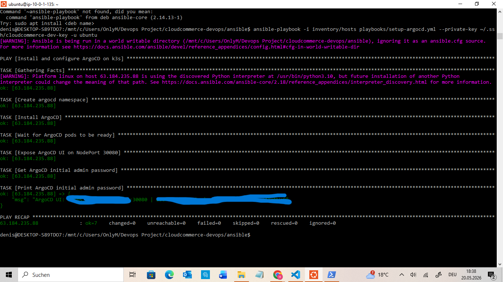
*Full successful run — namespace created, ArgoCD installed, pods ready, service patched to NodePort 30080, initial password printed*

```
ArgoCD UI: https://63.184.235.88:30080 | username: admin | password: ****
```

---

#### ArgoCD UI — First Login

Opening `https://63.184.235.88:30080` shows the expected TLS warning — the same self-signed certificate situation as with the k3s API server. Click through to reach the login page.

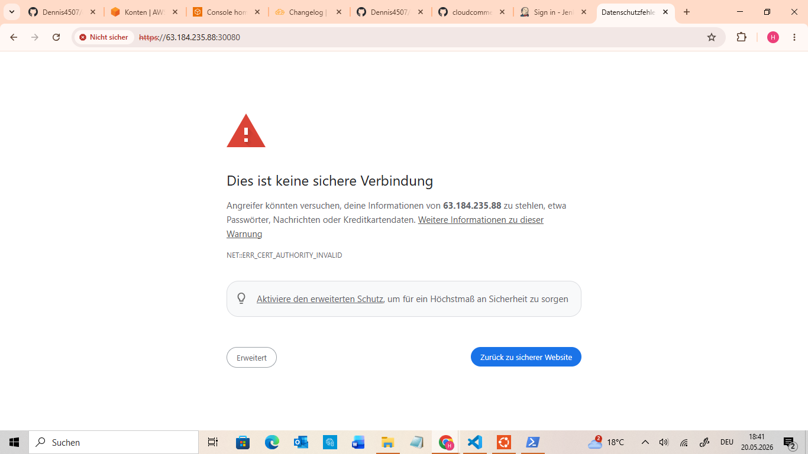
*Browser TLS warning — self-signed cert, same as kubectl. Expected and safe to proceed.*

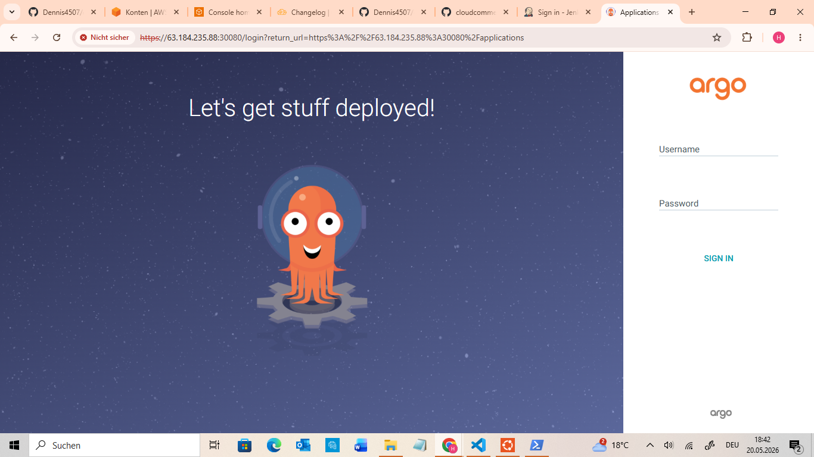
*ArgoCD login page — accessible at https://63.184.235.88:30080*

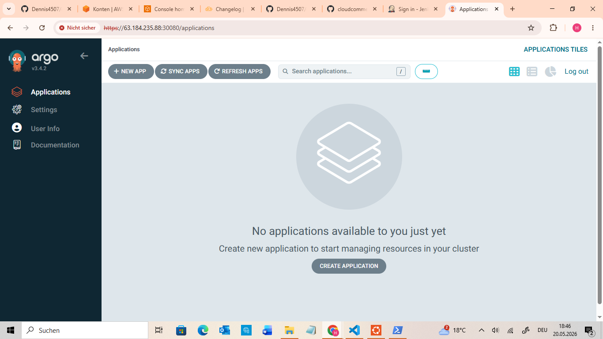
*ArgoCD dashboard — no applications yet. The GitOps engine is running and waiting for its first app definition.*

**What this teaches:** ArgoCD's install manifest includes CRDs large enough to break the default kubectl apply path — a well-known issue with CRD-heavy operators. The fix (server-side apply with force-conflicts) is the documented solution and is now standard practice for any large CRD installation. Running this through Ansible means the fix is captured in code and never needs to be rediscovered.

---

### Deploying Online Boutique — Helm and GitOps

With ArgoCD running, the next step is deploying the application. This required two decisions: how to package the application for Kubernetes, and where that package should live.

#### What is Helm?

Helm is the package manager for Kubernetes. Raw Kubernetes manifests are static — every value is hardcoded. Helm introduces templates with variables:

```yaml
# Raw manifest — hardcoded, cannot change without editing the file
image: us-central1-docker.pkg.dev/google-samples/frontend:v0.10.1

# Helm template — variable, controlled by values.yaml
image: {{ .Values.images.repository }}/frontend:{{ .Values.images.tag }}
```

A single `values.yaml` controls the entire deployment:

```yaml
images:
  repository: 123456789.dkr.ecr.eu-central-1.amazonaws.com/cloudcommerce
  tag: "abc123f"   ← Jenkins writes this after every build
```

One chart, one `values.yaml` — different values for different environments. `values.yaml` is also the handoff point between Jenkins (CI) and ArgoCD (CD): Jenkins builds an image, pushes it to ECR, writes the new tag into `values.yaml`, commits to GitHub. ArgoCD detects the commit and deploys.

#### Why the Helm Chart Lives in Our Repo

The first instinct was to point ArgoCD at Google's public microservices-demo repository and use their Helm chart directly. This is a shortcut that removes a critical step:

- Google's chart uses Google's image registry — not our ECR
- Google could change their chart without warning and break the deployment
- `values.yaml` must be in our repo — it's where Jenkins writes the new image tag
- The chart is infrastructure code — it belongs under version control in our project alongside the Ansible playbooks and Terraform modules

The correct approach: copy the Helm chart into our repo and own it.

```
kubernetes/
└── apps/
    └── online-boutique/
        ├── Chart.yaml      ← chart name, version, metadata
        ├── values.yaml     ← our config — image registry, replicas, resources
        └── templates/      ← all 12 service definitions as Helm templates
```

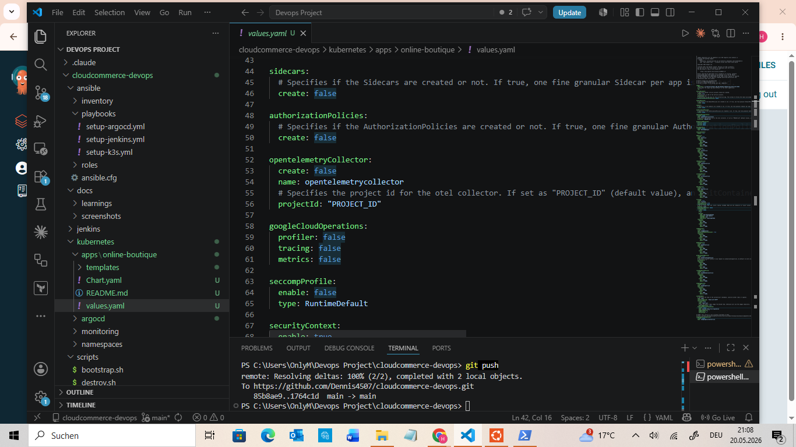
*Online Boutique Helm chart in our repo — Chart.yaml, values.yaml, and templates/ all under version control*

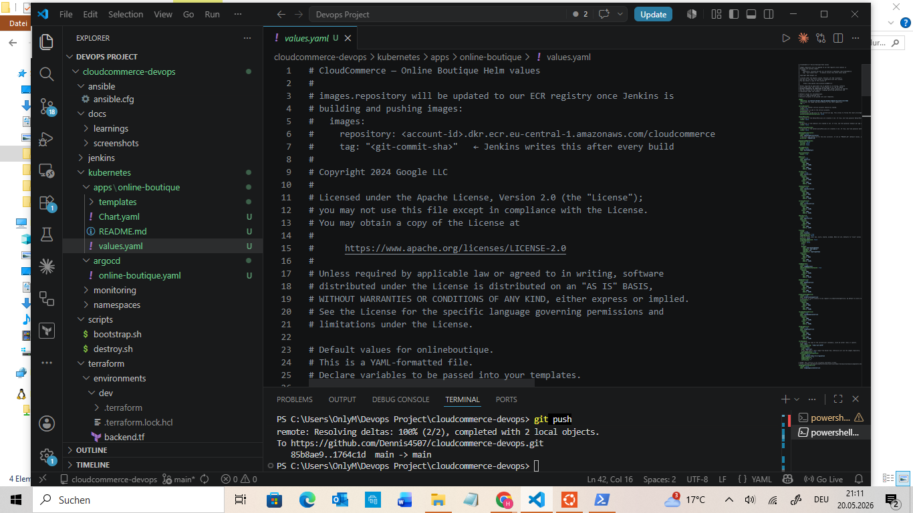
*values.yaml — images.repository points to Google's registry now, will be updated to ECR once Jenkins is building images. The tag field is what Jenkins writes after every build.*

#### Validating the Chart with helm lint

Helm v3 was already installed in WSL — confirmed before running any chart commands:

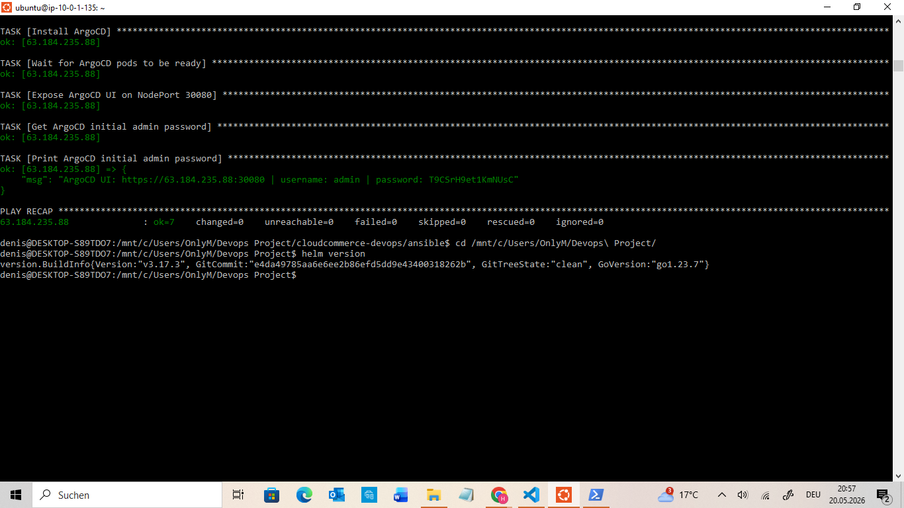
*helm v3.17.3 confirmed in WSL — ready to lint and template charts locally*

Before committing, the chart was validated locally:

```bash
helm lint kubernetes/apps/online-boutique/
```

```
==> Linting kubernetes/apps/online-boutique/
[INFO] Chart.yaml: icon is recommended

1 chart(s) linted, 0 chart(s) failed
```

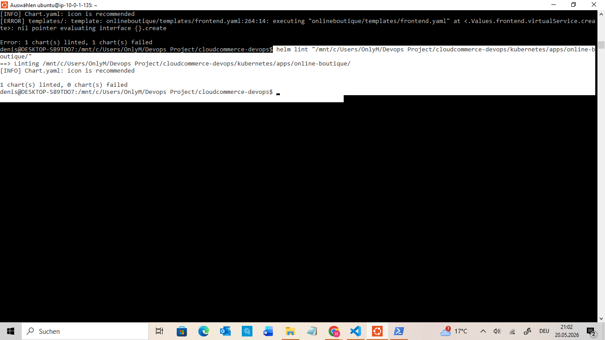
*helm lint — 1 chart linted, 0 failed. Chart is valid and ready to deploy.*

`helm lint` checks that all templates are syntactically valid and all required values are present. The INFO about a missing icon is cosmetic — not an error. Running lint before every commit catches template errors before ArgoCD attempts to render them against the cluster.

The first lint run failed — our initial `values.yaml` was missing the `frontend.virtualService` block that the template expected. The fix was to use Google's complete `values.yaml` as the base and add our ECR comment at the top.

#### The ArgoCD Application Manifest

ArgoCD learns about applications through `Application` manifests — Kubernetes custom resources that tell ArgoCD which Git repo to watch and where to deploy:

```yaml
apiVersion: argoproj.io/v1alpha1
kind: Application
metadata:
  name: online-boutique
  namespace: argocd
spec:
  project: default
  source:
    repoURL: https://github.com/Dennis4507/cloudcommerce-devops.git
    targetRevision: HEAD
    path: kubernetes/apps/online-boutique
  destination:
    server: https://kubernetes.default.svc
    namespace: online-boutique
  syncPolicy:
    automated:
      prune: true
      selfHeal: true
    syncOptions:
      - CreateNamespace=true
```

Key fields:
- `repoURL` — our GitHub repo, not Google's
- `path` — where the Helm chart lives inside our repo
- `automated` — ArgoCD syncs automatically on every git commit, no manual trigger needed
- `prune: true` — resources removed from Git are also removed from the cluster
- `selfHeal: true` — if someone manually changes the cluster, ArgoCD reverts it back to match Git
- `CreateNamespace=true` — ArgoCD creates the `online-boutique` namespace automatically

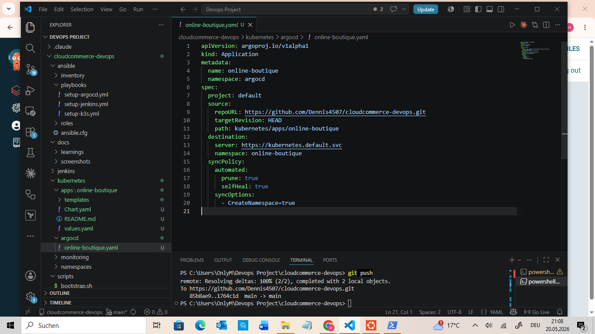
*kubernetes/argocd/online-boutique.yaml in VS Code — repoURL points at our GitHub repo, path points at our Helm chart, automated sync enabled*

**What this teaches:** `values.yaml` is not configuration to be forgotten after setup — it is the live deployment contract between CI and CD. Every Jenkins build ends with a commit to this file. Every ArgoCD sync starts by reading it. Owning the chart in your own repo means owning the entire deployment lifecycle.

---

### Applying the ArgoCD Application — First Sync

With the Helm chart committed and pushed to GitHub, the ArgoCD Application manifest was applied:

```bash
kubectl apply -f kubernetes/argocd/online-boutique.yaml
```

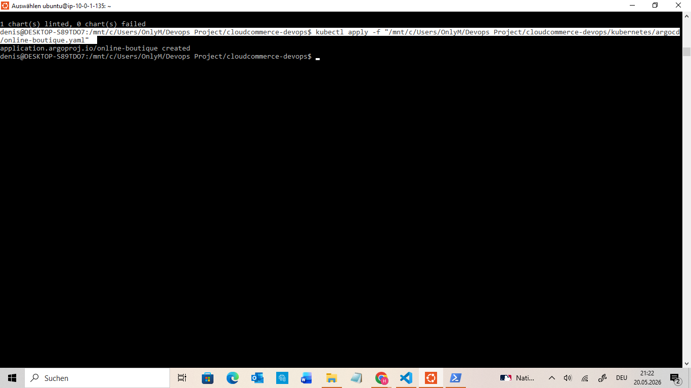
*kubectl apply — Application resource created in ArgoCD*

ArgoCD detected the new Application immediately and began syncing — pulling the Helm chart from our GitHub repo, rendering all 12 service templates with our values.yaml, and applying them to the `online-boutique` namespace:

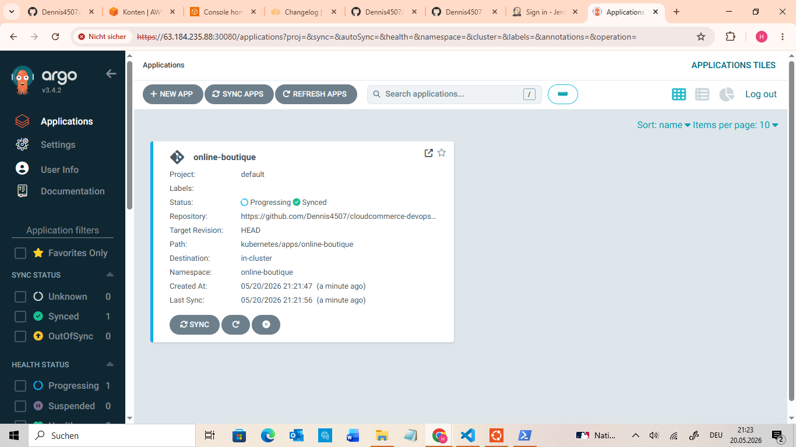
*ArgoCD showing online-boutique app syncing — Progressing/Synced, pulling from Dennis4507/cloudcommerce-devops*

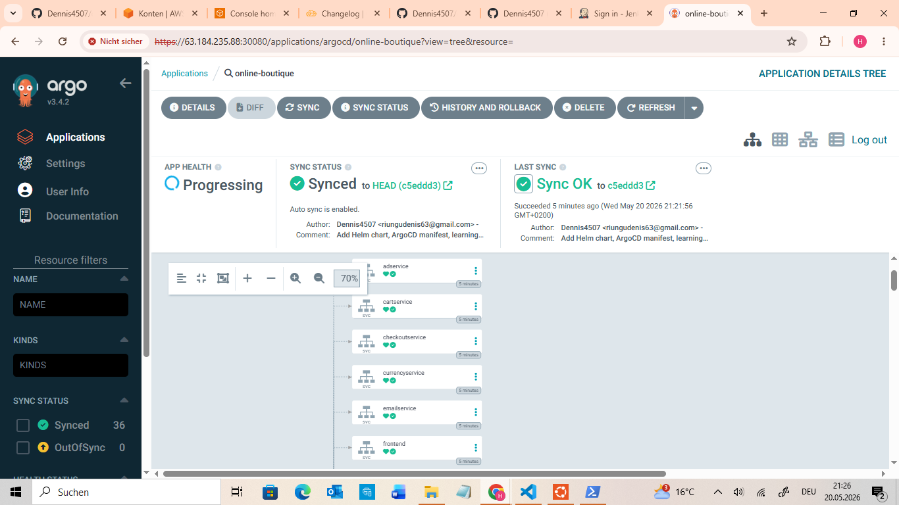
*ArgoCD application tree — all 12 deployments, services, and service accounts visible*

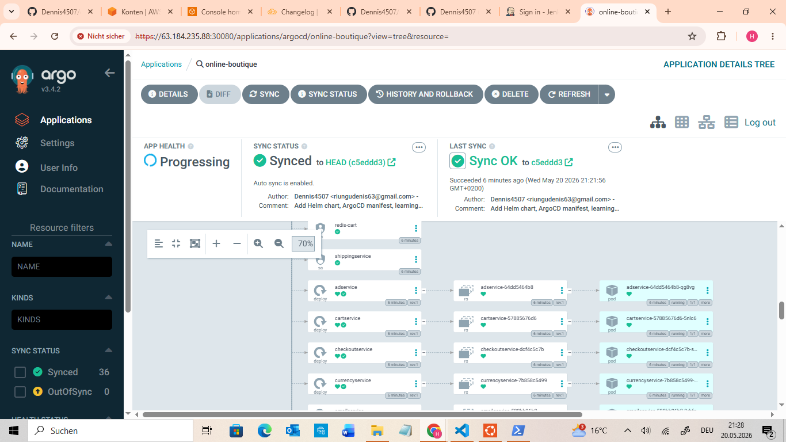
*ArgoCD tree view detail — each deployment with its ReplicaSet and running pod*

---

### Challenge: 404 — Traefik vs LoadBalancer

With all pods running, opening `http://63.184.235.88` returned a 404. The issue: the Helm chart creates a `frontend-external` LoadBalancer service for cloud environments where a load balancer is provisioned automatically. On k3s, Traefik already owns port 80 — the LoadBalancer service stayed in `<pending>` indefinitely and ArgoCD reported "Progressing" instead of "Healthy".

```bash
kubectl get svc -n online-boutique
```

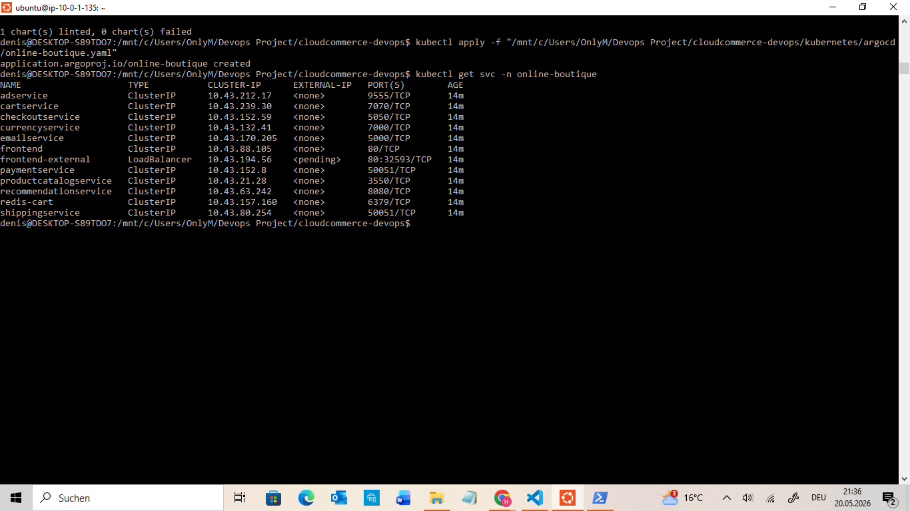
*frontend-external showing EXTERNAL-IP: pending — LoadBalancer cannot get an IP, Traefik owns port 80*

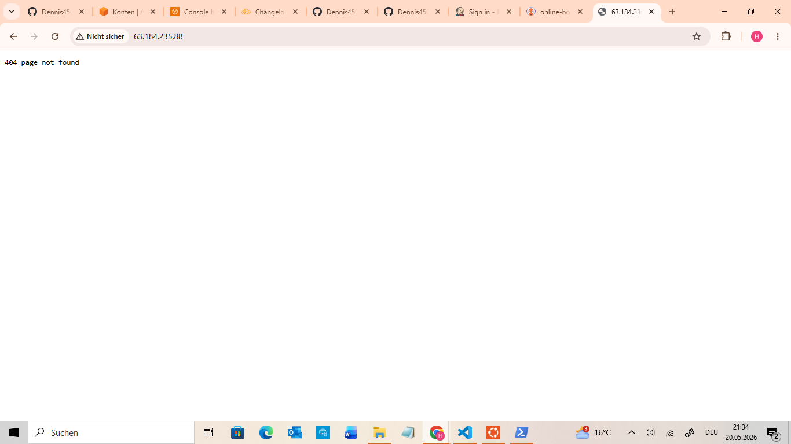
*http://63.184.235.88 returns 404 — Traefik has no route to the frontend yet*

**Fix — Traefik Ingress:** k3s ships with Traefik as the ingress controller. Instead of a LoadBalancer service, an Ingress resource routes HTTP traffic through Traefik to the frontend pod. A new template was added to the Helm chart:

```yaml
# kubernetes/apps/online-boutique/templates/ingress.yaml
apiVersion: networking.k8s.io/v1
kind: Ingress
metadata:
  name: online-boutique
  namespace: {{ .Release.Namespace }}
spec:
  rules:
  - http:
      paths:
      - path: /
        pathType: Prefix
        backend:
          service:
            name: frontend
            port:
              number: 80
```

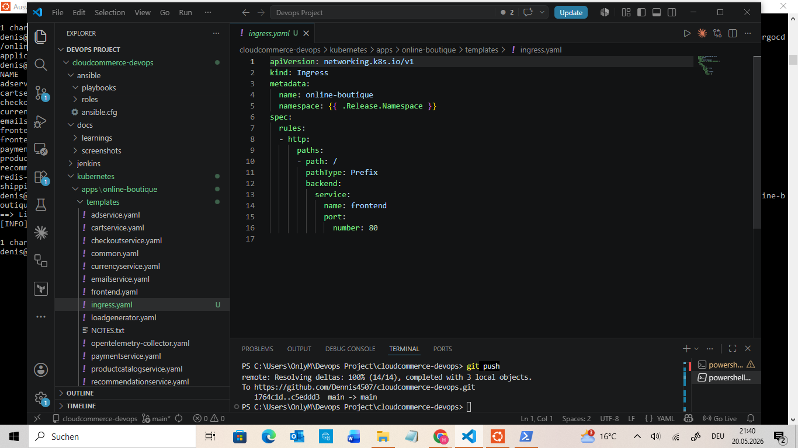
*ingress.yaml added to templates/ — routes all port 80 traffic through Traefik to the frontend service*

The chart was validated before committing:

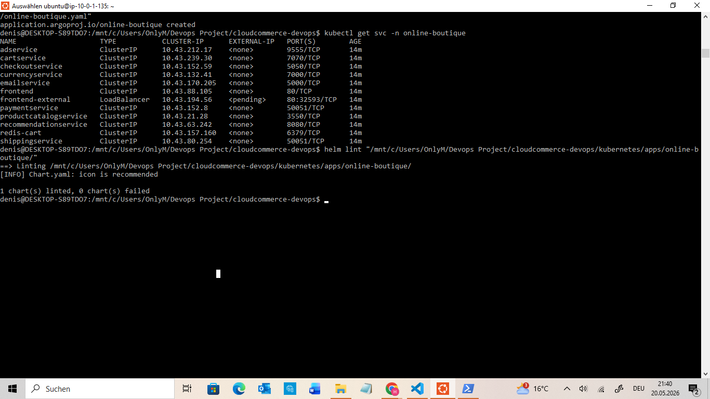
*helm lint — 0 failures after adding ingress.yaml*

The `frontend.externalService` value was also set to `false` in `values.yaml` to remove the pending LoadBalancer service and clear the ArgoCD "Progressing" health status:

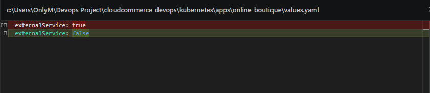
*values.yaml — externalService: false removes the frontend-external LoadBalancer service*

ArgoCD detected both commits and synced automatically. All 12 pods confirmed running:

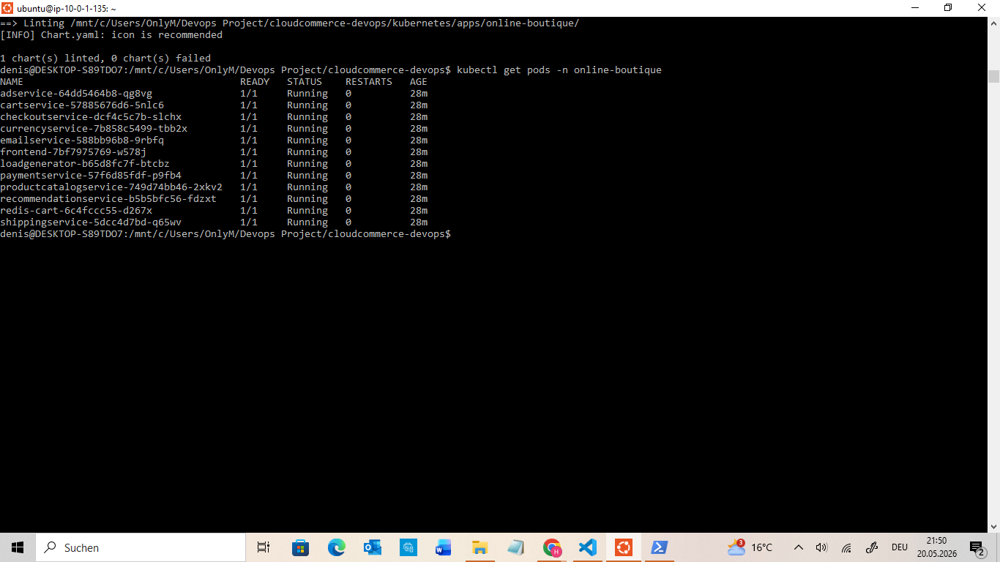
*kubectl get pods -n online-boutique — all 12 pods Running 1/1*

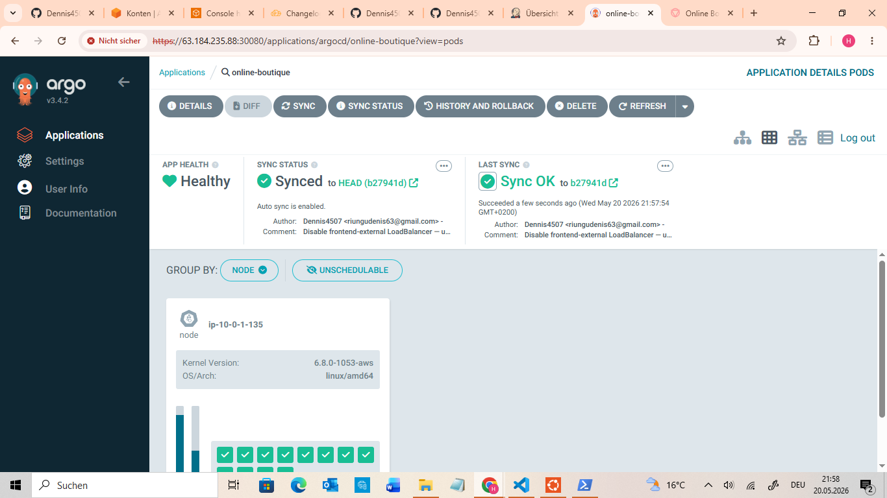
*ArgoCD showing APP HEALTH: Healthy, SYNC STATUS: Synced — all resources reconciled*

---

### Online Boutique — Live

With Traefik routing traffic correctly, `http://63.184.235.88` loaded the full e-commerce application:

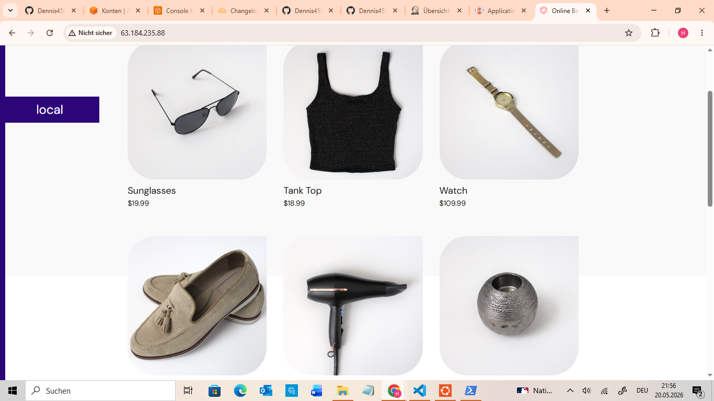
*Online Boutique homepage — 12 microservices serving a live e-commerce storefront on k3s*

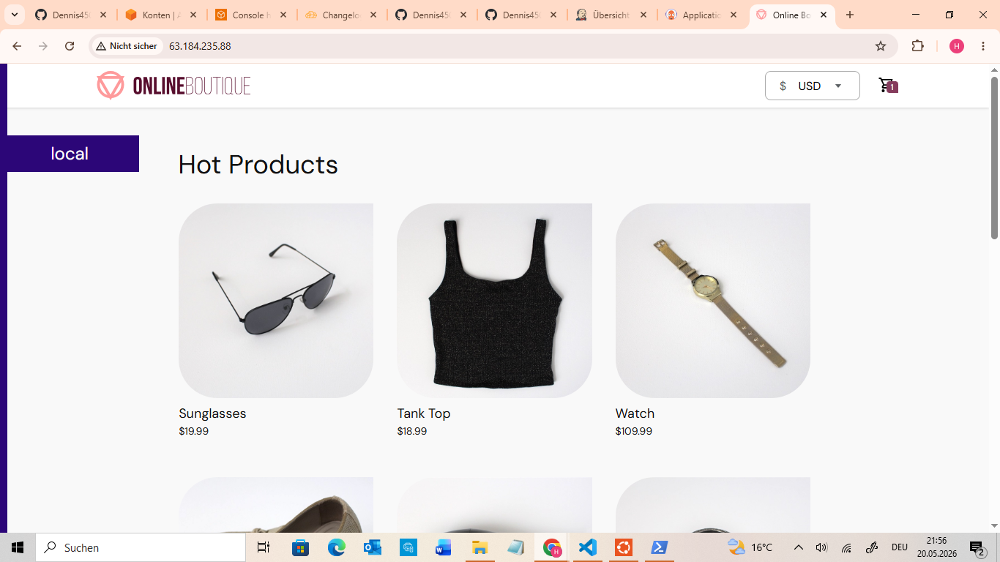
*Product catalogue — sunglasses, clothing, watches served by the productcatalogservice microservice*

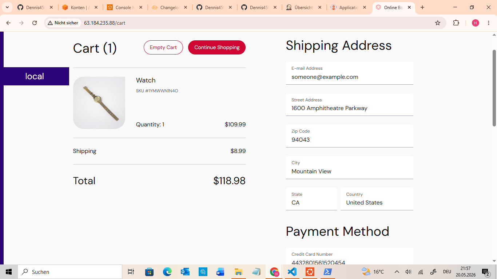
*Shopping cart — cartservice handling session state via Redis*

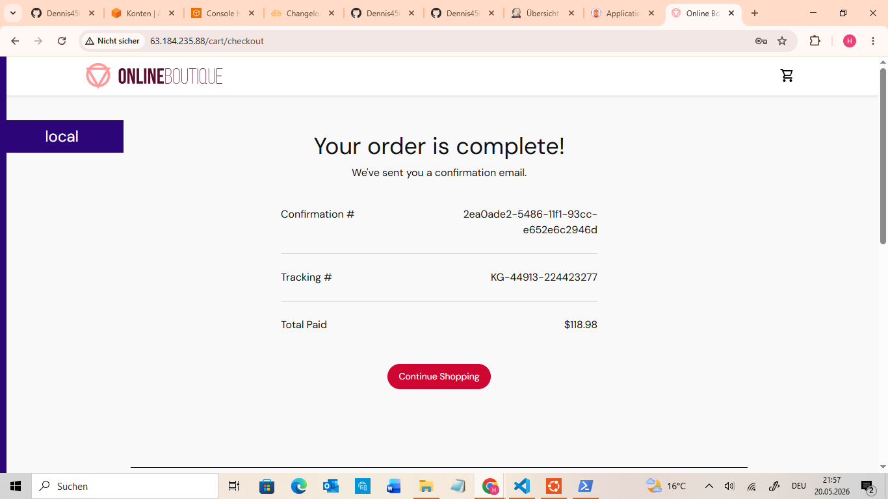
*Order confirmed — all 12 microservices working end to end: frontend → checkout → payment → email*

The full GitOps pipeline is proven: a git commit to the infrastructure repo triggered ArgoCD to deploy a live, functional 12-microservice application accessible from the public internet.

---

### Jenkins Credentials — Securing Pipeline Secrets

With the application running, Jenkins was configured to build and push images to ECR. All sensitive values are stored in Jenkins' built-in credentials store — never in Jenkinsfiles or logs.

Two credentials were added:

**1 — GitHub Personal Access Token** — allows Jenkins to commit the updated `values.yaml` back to GitHub after each build:

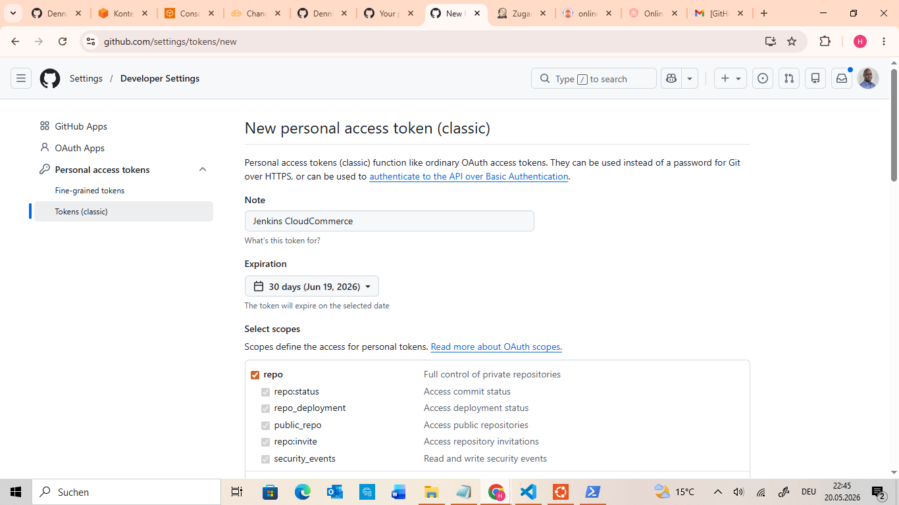
*GitHub classic personal access token — repo scope only, named Jenkins CloudCommerce*


*Jenkins credentials form — token added as Username with password type*

**2 — AWS Account ID** — used to construct the ECR registry URL in the pipeline:


*Jenkins Globale Zugangsdaten — both credentials in place: github-token and aws-account-id*

Jenkins uses the EC2 instance's IAM role for ECR authentication — no AWS access keys stored anywhere. The IAM role was provisioned by Terraform in Phase 1 with the exact permissions needed.

---

### Application Repository — microservices-demo

The Jenkinsfile belongs in the application repository, not the infrastructure repository. A separate GitHub repo was created for the application source:

**`Dennis4507/microservices-demo`** — the application code Jenkins builds from

This separates concerns correctly:
- `Dennis4507/cloudcommerce-devops` — infrastructure, Helm charts, Ansible, Terraform (DevOps team)
- `Dennis4507/microservices-demo` — application source code (development team)

Google's CI workflows (`.github/workflows/`) were removed — Jenkins replaces them:

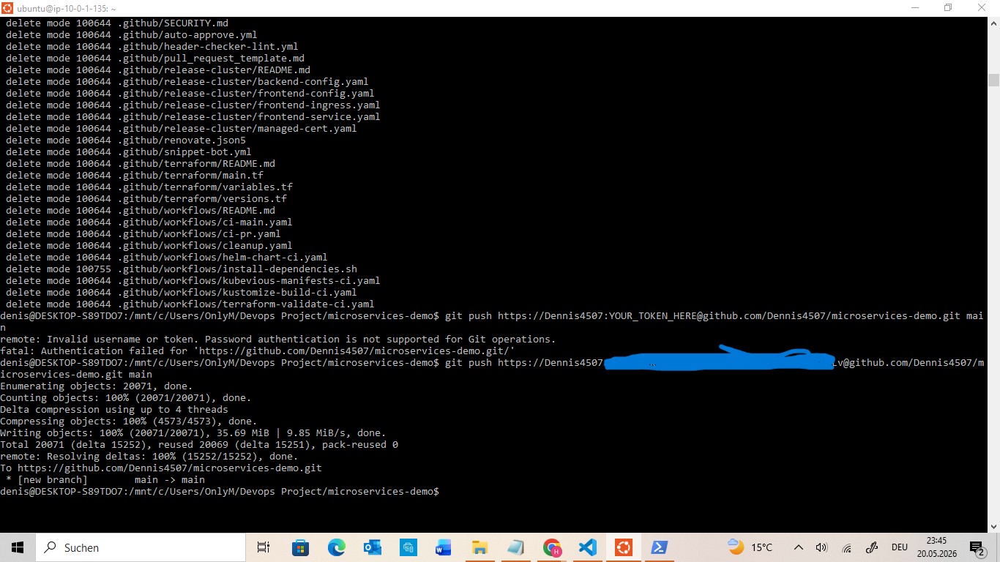
*Google's GitHub Actions workflows removed, microservices-demo pushed to Dennis4507's GitHub — Jenkins owns CI from here*

---

### Progress
- [x] k3s installed via Ansible — single-binary Kubernetes on EC2 t3.medium
- [x] TLS SAN challenge diagnosed and resolved — public Elastic IP added to certificate via `--tls-san`
- [x] kubectl installed and configured — remote cluster access from local machine confirmed
- [x] k9s v0.50.18 installed — terminal UI showing all 7 system pods Running
- [x] kubectl PATH made permanent on Windows — works across all terminal sessions
- [x] ArgoCD installed via Ansible — two kubectl apply challenges diagnosed and resolved
- [x] ArgoCD UI accessible at https://63.184.235.88:30080 — GitOps engine live
- [x] Online Boutique Helm chart copied into repo — chart validated with helm lint
- [x] ArgoCD Application manifest created and applied — all 12 services deployed
- [x] Traefik Ingress configured — 404 resolved, site live at http://63.184.235.88
- [x] Online Boutique fully functional — products, cart, and checkout all working
- [x] Jenkins credentials configured — GitHub token and AWS account ID secured
- [x] Application repo created — Dennis4507/microservices-demo owns the application source
- [x] Install Trivy and AWS CLI on Jenkins server via Ansible — two bugs diagnosed and fixed
- [ ] Create Jenkins pipeline job pointing at microservices-demo
- [ ] Configure GitHub webhook → Jenkins trigger
- [ ] Run first full pipeline build → ECR → values.yaml update → ArgoCD deploy

---

### Installing Trivy and AWS CLI — Session Management and Silent Failures

With the Online Boutique live and credentials configured, the final step before running the Jenkins pipeline was installing two tools on the Jenkins server: Trivy (image scanner) and AWS CLI (ECR authentication). This exposed two separate problems that required diagnosis and playbook fixes.

#### Stop/Start Discipline — EC2 Instance Management

Instances are stopped between working sessions and started again when needed. This keeps running costs near zero — AWS charges nothing for stopped EC2 instances — while Elastic IPs ensure the addresses never change.

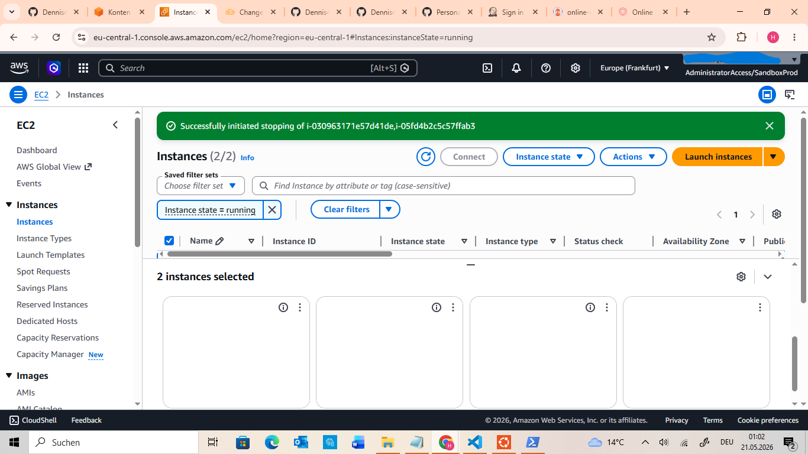
*Instances stopped at end of session — "Successfully initiated stopping" confirmation in AWS console*

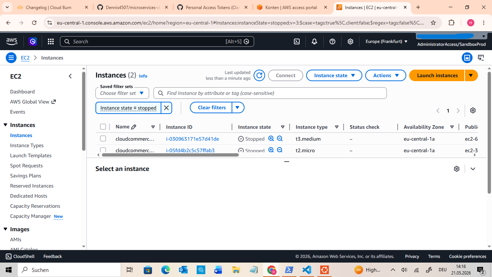
*AWS console filtered by instance state = stopped — both Jenkins and k3s instances off*

At the start of the next session, both instances are started together:

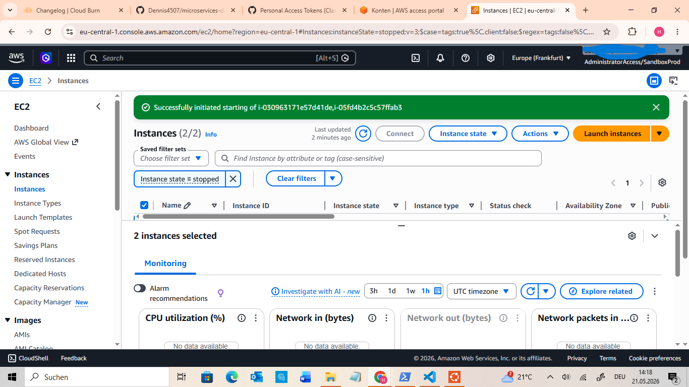
*Both instances successfully started — AWS console showing running state restored*

---

#### Challenge 1 — Ansible Playbook Stuck: t2.micro Memory Constraint

The Ansible playbook ran but hung at "Install Java 21 and dependencies" — the terminal showed no progress for minutes. SSHing into the server and running `free -h` revealed the cause:

```
Mem:   957Mi   697Mi   70Mi   0.0Ki   188Mi   100Mi
Swap:     0B     0B    0B
```

Only 100MB available, no swap. Jenkins JVM was holding ~600MB of the 1GB total. With so little free memory, apt could not spawn the processes needed to install packages — even `java --version` hung when run interactively.

**Fix:** Stop Jenkins first to free ~400MB, then run the playbook:

```bash
sudo systemctl stop jenkins
```

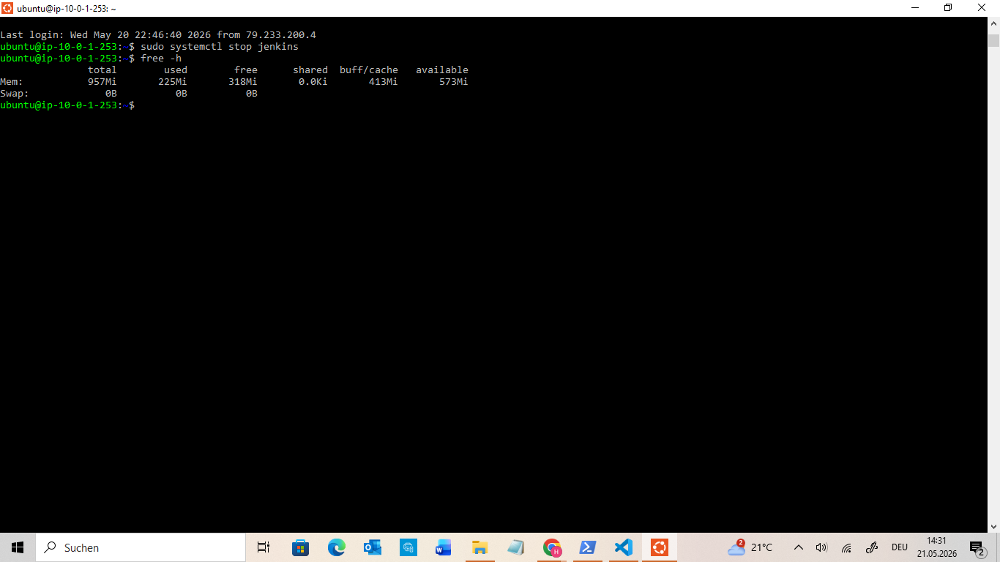
*Jenkins stopped — free -h shows 573MB available, plenty of headroom for apt to work*

This is a known constraint of the t2.micro (1GB RAM). Jenkins is fine for running pipelines, but system maintenance must be done with Jenkins stopped. The pattern: stop Jenkins → run Ansible → Jenkins restarts automatically at the end of the playbook.

---

#### Challenge 2 — Ansible Reported Success but AWS CLI Was Not Installed

With Jenkins stopped, the playbook ran and reported `changed=4, failed=1`. The failure was the initial admin password task — but more importantly, even though "Install AWS CLI" showed `changed` (meaning Ansible believed it succeeded), running `aws --version` on the server returned command not found.

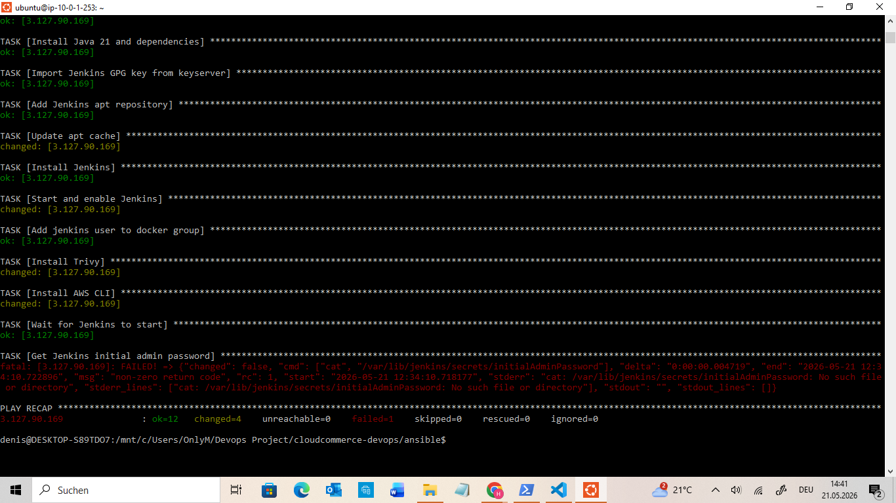
*Ansible output — ok=12, changed=4, failed=1. AWS CLI shows changed but the binary does not exist*

This is a silent failure — Ansible reported success for a task that did not actually complete. The root cause: the AWS CLI install script requires `unzip` to extract the downloaded zip file, but `unzip` was not installed on the server.

```bash
curl ...           # downloads the zip — succeeds
unzip ...          # FAILS — unzip not installed
/tmp/aws/install   # never runs
rm -rf ...         # always succeeds — exit code 0
```

Because bash only checks the exit code of the **last command**, and `rm -rf` always exits 0, Ansible saw success. The actual failure was invisible.

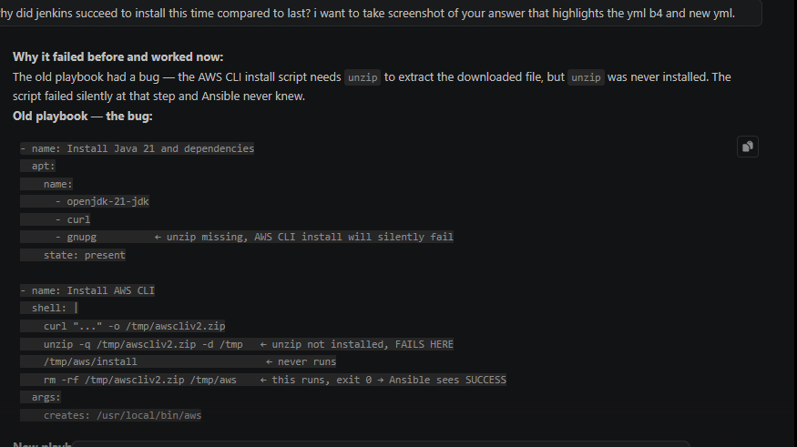
*Old playbook — unzip missing from dependencies, AWS CLI install silently fails at extraction step*

---

#### Fix 1 — Playbook Crash on Missing Password File

The separate `failed=1` was the "Get Jenkins initial admin password" task trying to read a file that only exists on first-time Jenkins setup. Since Jenkins was already configured, the file was long gone. The fix — `failed_when: false` — tells Ansible not to crash when the file is absent:

```yaml
- name: Get Jenkins initial admin password
  command: cat /var/lib/jenkins/secrets/initialAdminPassword
  register: jenkins_password
  changed_when: false
  failed_when: false    ← file not found is acceptable after first setup
```

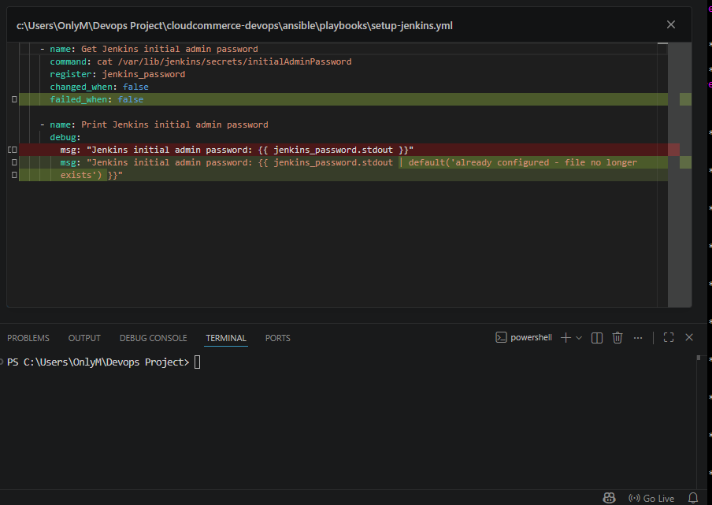
*VS Code diff — failed_when: false added, default message updated to explain the missing file*

---

#### Fix 2 — AWS CLI Silent Failure

Three changes to the playbook fixed the silent AWS CLI failure:

**1 — Add `unzip` to dependencies** so it is always present before the install script runs:

```yaml
- name: Install Java 21 and dependencies
  apt:
    name:
      - openjdk-21-jdk
      - curl
      - gnupg
      - unzip          ← added
```

**2 — Add `set -e`** to the shell script so any step failure stops the script immediately and Ansible reports a real error:

```yaml
- name: Install AWS CLI
  shell: |
    set -e             ← stops on any failure, no more silent passes
    curl "https://awscli.amazonaws.com/awscli-exe-linux-x86_64.zip" -o /tmp/awscliv2.zip
    unzip -q /tmp/awscliv2.zip -d /tmp
    /tmp/aws/install
    rm -rf /tmp/awscliv2.zip /tmp/aws
```

**3 — Add a cleanup task** to remove any leftover files from the previous failed attempt before retrying:

```yaml
- name: Clean up any partial AWS CLI install
  file:
    path: "{{ item }}"
    state: absent
  loop:
    - /tmp/awscliv2.zip
    - /tmp/aws
```

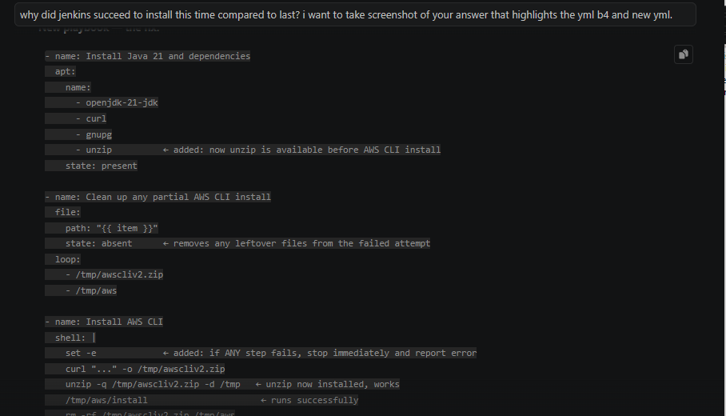
*New playbook — unzip added to dependencies, cleanup task added before install*

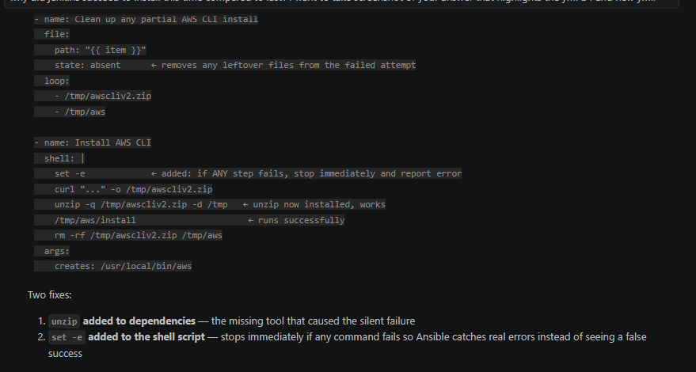
*set -e and cleanup task in context — any step failure now surfaces immediately*

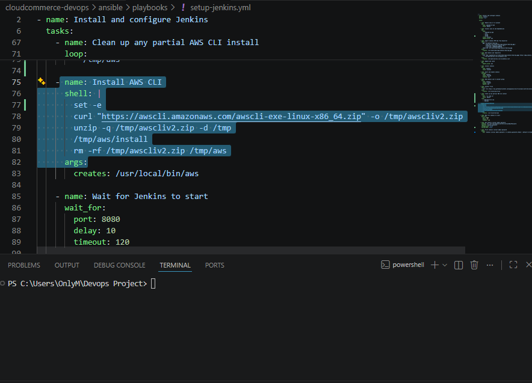
*setup-jenkins.yml in VS Code — updated Install AWS CLI task with set -e and correct unzip*

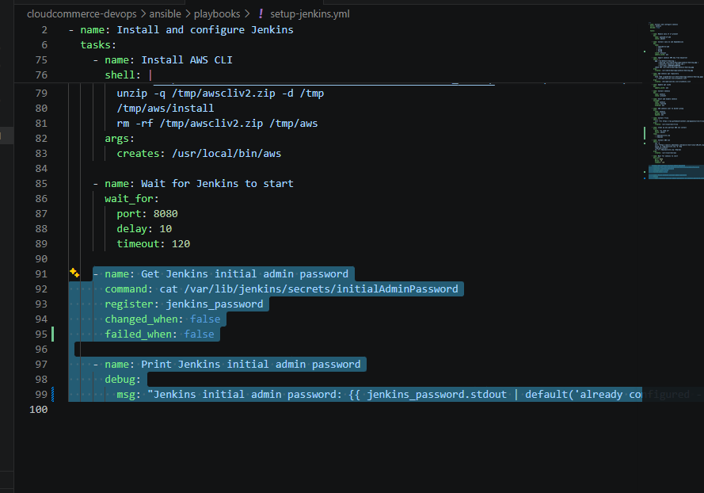
*setup-jenkins.yml in VS Code — failed_when: false on password task and default message*

---

#### Final Playbook Run — Full Success

With both fixes applied, the playbook ran cleanly: 15 tasks, 4 changed, 0 failed:

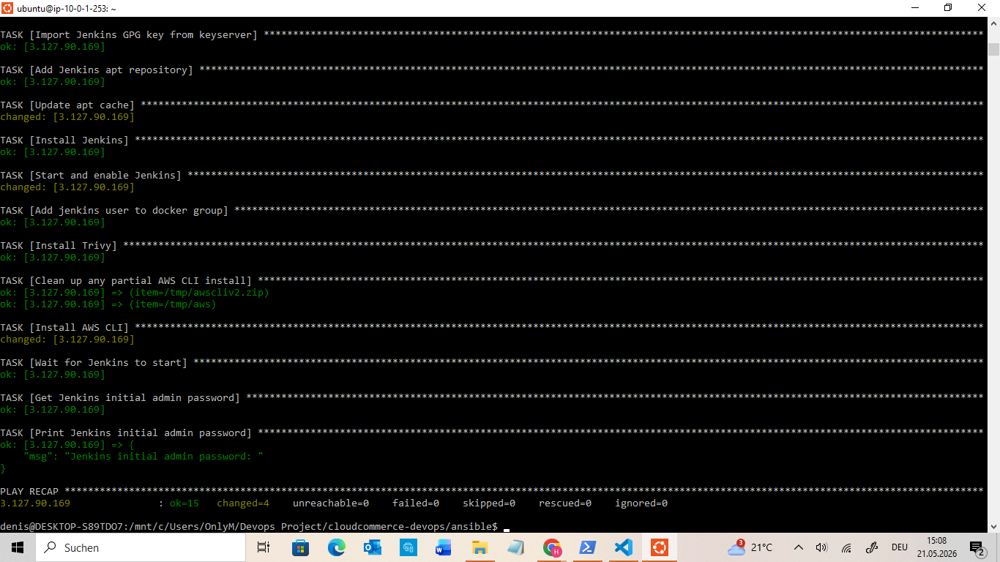
*Full successful run — ok=15, changed=4, failed=0. AWS CLI installed, Trivy confirmed, Jenkins started*

AWS CLI verified on the server:

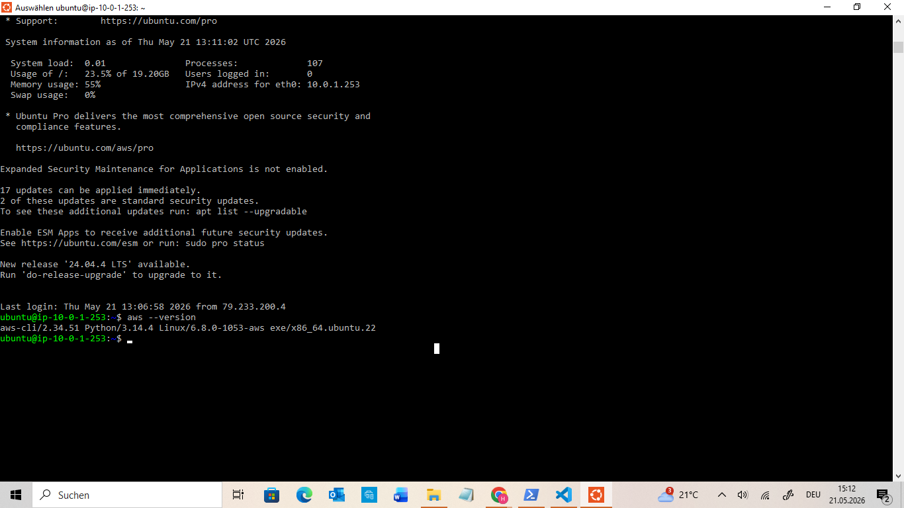
*aws --version confirms aws-cli/2.34.51 installed and available — Jenkins is now ready to authenticate to ECR*

**What this teaches:**

- `changed` in Ansible means the task ran — it does not guarantee the task did what you intended. Always verify the actual outcome on the server
- `shell` tasks only see the exit code of the last command. Add `set -e` to any multi-step shell script so failures surface immediately
- Use Ansible's built-in modules (`apt`, `systemd`, `file`) wherever possible — they handle error detection and idempotency automatically. Use `shell` only when no module exists, and always add `set -e`
- On memory-constrained servers (t2.micro, 1GB RAM), stop memory-hungry services before running system maintenance. Jenkins JVM holds ~600MB — leaving no room for apt to operate

---

### Progress
- [x] k3s installed via Ansible — single-binary Kubernetes on EC2 t3.medium
- [x] TLS SAN challenge diagnosed and resolved — public Elastic IP added to certificate via `--tls-san`
- [x] kubectl installed and configured — remote cluster access from local machine confirmed
- [x] k9s v0.50.18 installed — terminal UI showing all 7 system pods Running
- [x] kubectl PATH made permanent on Windows — works across all terminal sessions
- [x] ArgoCD installed via Ansible — two kubectl apply challenges diagnosed and resolved
- [x] ArgoCD UI accessible at https://63.184.235.88:30080 — GitOps engine live
- [x] Online Boutique Helm chart copied into repo — chart validated with helm lint
- [x] ArgoCD Application manifest created and applied — all 12 services deployed
- [x] Traefik Ingress configured — 404 resolved, site live at http://63.184.235.88
- [x] Online Boutique fully functional — products, cart, and checkout all working
- [x] Jenkins credentials configured — GitHub token and AWS account ID secured
- [x] Application repo created — Dennis4507/microservices-demo owns the application source
### Creating the Jenkins Pipeline Job

With Trivy and AWS CLI installed, Jenkins was ready to run the pipeline. A pipeline job was created in the Jenkins UI pointing at the `microservices-demo` application repository.

**Job configuration:**
- **Type:** Pipeline
- **Trigger:** GitHub hook trigger for GITScm polling — Jenkins listens for webhook events from GitHub
- **Definition:** Pipeline script from SCM — Jenkins reads the Jenkinsfile from the repository, not from the UI
- **SCM:** Git
- **Repository:** `https://github.com/Dennis4507/microservices-demo.git`
- **Credentials:** None — the repo is public, no authentication needed to clone
- **Branch:** `*/main`
- **Script Path:** `Jenkinsfile`

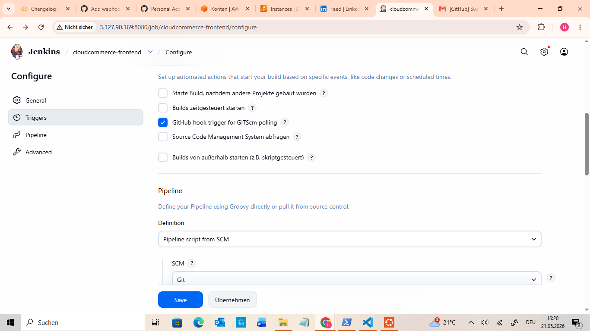
*cloudcommerce-frontend pipeline job — GitHub hook trigger enabled, Pipeline script from SCM pointing at microservices-demo*


*Jenkins Configure page — "GitHub hook trigger for GITScm polling" enabled (checked) so every git push fires a build, and Pipeline definition set to "Pipeline script from SCM" so Jenkins reads the Jenkinsfile from the repository*


*Jenkins main dashboard — cloudcommerce-frontend pipeline job listed with a build in progress (blue spinner), no successful or failed builds yet since it was just created*

**Why Pipeline script from SCM instead of writing the script in the UI?**

The Jenkinsfile lives in the same repository as the application code. This means:
- Pipeline changes are reviewed alongside application changes
- The pipeline is version controlled — you can see exactly what changed and when
- Any developer cloning the repo gets the pipeline definition automatically
- Jenkins always runs the pipeline version that matches the code being built

Writing the pipeline directly in the Jenkins UI would mean it lives only in Jenkins — invisible to git, unreviewed, and disconnected from the code it builds.

---

### GitHub Webhook — Instant Trigger on Push

A webhook was configured on the `microservices-demo` repository so that every `git push` immediately triggers a Jenkins build — no polling delay.

**Webhook settings:**
- **Payload URL:** `http://3.127.90.169:8080/github-webhook/`
- **Content type:** `application/json`
- **Events:** Push only


*GitHub webhook form — Payload URL pointing at Jenkins, application/json content type, push events only*

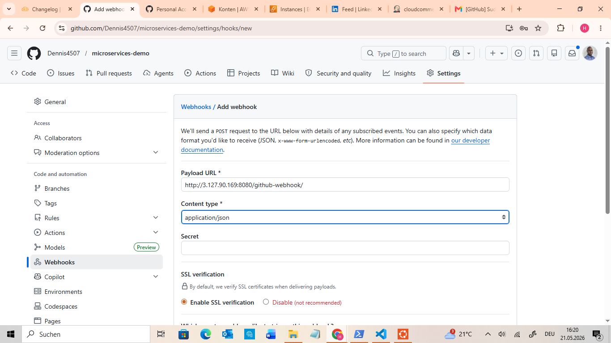
*Webhook configuration in GitHub — Payload URL and content type filled in before saving*

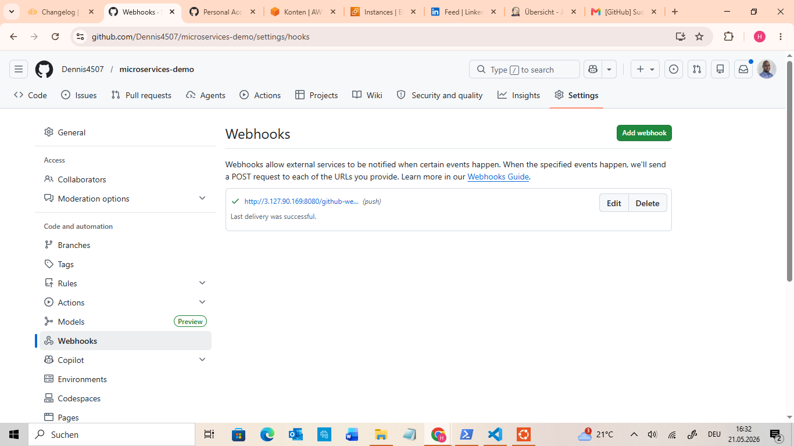
*Webhook confirmed — green tick, "Last delivery was successful"*


*GitHub Webhooks page — green checkmark and "Last delivery was successful" confirms Jenkins received and processed the push event from GitHub*

**Without the webhook:** Jenkins would poll GitHub every few minutes — there would be a delay between pushing code and the build starting.

**With the webhook:** GitHub sends a POST request to Jenkins the instant a push happens. The build starts within seconds.

---

### First Build — Triggered by Webhook

The webhook was tested immediately by pushing a small change to `microservices-demo`:

```bash
echo "# CloudCommerce CI/CD" >> README.md
git add README.md
git commit -m "ci: trigger first Jenkins build"
git push
```


*WSL terminal — making a small change to microservices-demo and pushing to trigger the Jenkins webhook and start build #1*

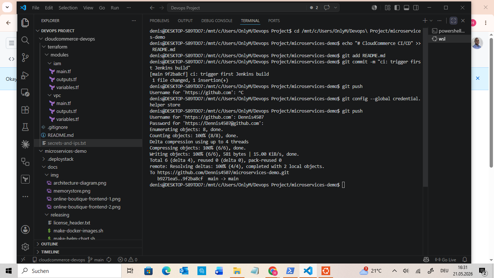
*WSL terminal — git push to microservices-demo triggers the GitHub webhook, Jenkins receives the event and starts build #1*

Jenkins received the webhook and started build #1 immediately:

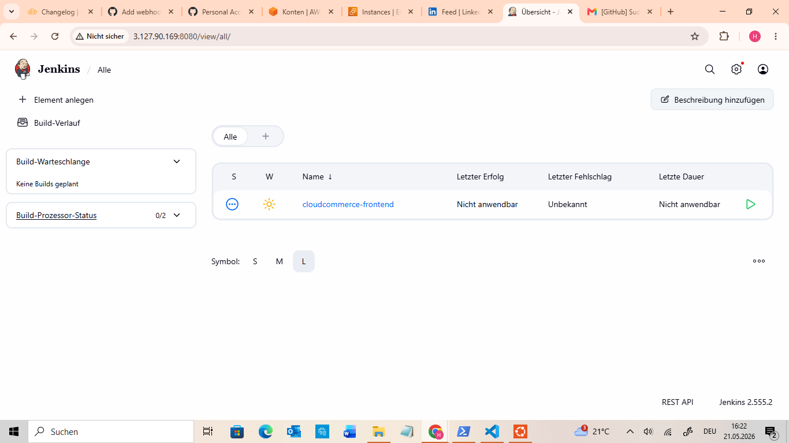
*Jenkins dashboard — cloudcommerce-frontend job visible, build #1 in progress*


*Jenkins job page loading — the UI is slow because Jenkins JVM is actively running the build on a 1GB t2.micro*

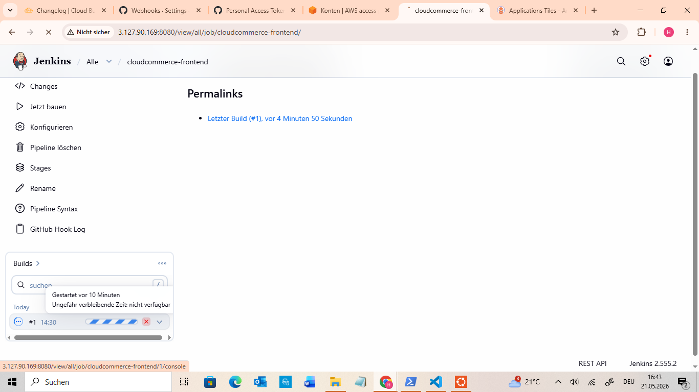
*Build #1 running — started 10 minutes ago, Docker image compilation in progress*


*Jenkins cloudcommerce-frontend build #1 — started 10 minutes ago, progress bar still running, no estimated finish time (the Go compiler is using all available RAM and the build is effectively stalled)*

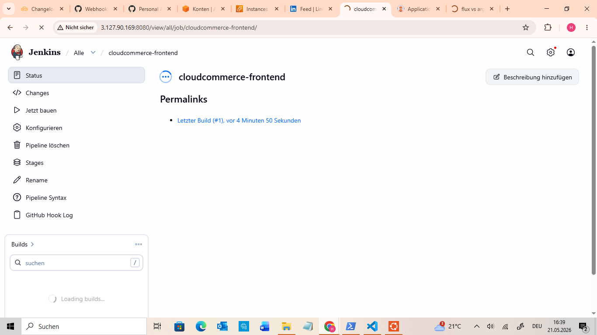
*Jenkins cloudcommerce-frontend job page — Jenkins received the build via the GitHub webhook (Last Build #1 visible) but the builds list is still "Loading..." because the server is too slow to respond; the browser tab is still spinning*

The build console confirmed the full pipeline in motion:
- ✅ Webhook fired by GitHub push
- ✅ Jenkinsfile read from `microservices-demo` repository
- ✅ Image tag set to `9f2ba8cf` (git commit short hash)
- ✅ ECR login succeeded — IAM instance profile authentication working
- ✅ Docker build started — Go frontend binary compiling from source

---

### Progress
- [x] Trivy installed on Jenkins server — image scanning ready
- [x] AWS CLI installed on Jenkins server — ECR authentication ready
- [x] t2.micro memory constraint understood — stop Jenkins before system maintenance
---

### Incident 1 — Jenkins Server Ran Out of Memory (OOM Crash)

**What happened — in simple terms:**

Think of RAM (memory) like a desk. The more things you have open on your desk, the more space you need. Our Jenkins server had a small desk (1GB RAM). Jenkins itself was already taking up most of it. When the pipeline started building the frontend — which involves compiling Go code, a heavy task — there was no room left. The operating system, unable to fit everything, started forcibly closing programs to survive. The build died silently. The server became unresponsive.

**The technical detail:**

The t2.micro instance has 1GB RAM and no swap space. Jenkins JVM holds ~600MB at runtime. The Go compiler needs ~400-500MB to compile the frontend service. 600 + 500 = 1100MB — more than the 1000MB available. The Linux OOM (Out of Memory) killer terminated the Go compiler process. Jenkins was left waiting for a process that was already dead. The server became too memory-starved to even serve the web UI.


*Jenkins build #1 Changes tab — page is blank with a loading spinner, taking too long to load after the webhook triggered the build; the t2.micro had no memory left during Go compilation*


*WSL terminal during the OOM incident — SSH into Jenkins hangs and has to be cancelled (^C) because the server is too memory-starved to respond; this confirmed the server was unreachable without a reboot*

**How it was diagnosed:**

```bash
free -h
# available: 100Mi  ← only 100MB free while build was running
# available: 70Mi   ← server nearly unresponsive
```

After the server stopped responding to SSH entirely, the instance was rebooted from the AWS console.


*AWS console — Reboot Instance used to bring Jenkins back after OOM kill made SSH impossible*


*Server is back — only 262MB available even at idle with Jenkins running, confirming the root cause: this server cannot build Go code while Jenkins is running*

**The fix — upgrade Jenkins to t3.medium via Terraform:**

The Jenkins instance type was changed from `t2.micro` (1GB RAM) to `t3.medium` (4GB RAM) in one line of Terraform:

```hcl
# variables.tf — before
variable "jenkins_instance_type" {
  default = "t2.micro"   ← 1GB RAM, no headroom for builds
}

# variables.tf — after
variable "jenkins_instance_type" {
  default = "t3.medium"  ← 4GB RAM, plenty for Jenkins + Docker builds
}
```


*VS Code showing variables.tf with jenkins_instance_type changed to t3.medium — running terraform apply will stop Jenkins, resize it from t2.micro to t3.medium, and restart it; the Elastic IP stays the same so nothing else changes*


*Jenkins is now on t3.medium (4GB RAM) — AWS console confirms the instance type change*

This led directly to Incident 2.

---

### Incident 2 — Terraform Destroyed Both Servers (AMI Change)

**What happened — in simple terms:**

Imagine you ask a builder to renovate your kitchen. You say "use the latest tiles available." The builder goes to the shop and finds that the tiles you used when you first built the house are no longer the latest model — a new version was released last week. The builder decides the only way to put in the new tiles is to demolish the kitchen and rebuild it from scratch. You lose everything in the kitchen.

That is exactly what Terraform did. Both servers were demolished and rebuilt from scratch.

**The technical detail:**

Our Terraform code used `most_recent = true` in the AMI data source — meaning "always use the latest Ubuntu image from AWS." Between when we first built the servers and now, AWS published a new Ubuntu AMI:

```
Old AMI: ami-0f7804991cb8f07c4   ← what our servers were running on
New AMI: ami-0c905937c14bd22b0   ← what AWS published recently
```

Terraform detected the new AMI and determined it needed to replace both instances. In the plan output, this appeared as:

```
# module.ec2.aws_instance.jenkins must be replaced
-/+ resource "aws_instance" "jenkins" {
      ~ ami = "ami-0f7804991cb8f07c4" -> "ami-0c905937c14bd22b0" # forces replacement
```


*Terraform plan — `module.ec2.aws_instance.jenkins must be replaced` with -/+ symbol clearly visible*


*Plan detail for Jenkins instance — `# forces replacement` next to the AMI change line*


*Plan detail for k3s instance — same AMI change forcing replacement on the second server too*

The `-/+` symbol and `# forces replacement` were the warning signs. The plan was approved without fully reading it, and both servers were destroyed.


*Apply complete — 2 added, 2 changed, 2 destroyed. Both servers are gone.*


*AWS EC2 console — two fresh instances running after Terraform rebuilt them from scratch. All installed software is gone.*

**The warning signs that should have stopped the apply:**

| Symbol | Meaning | Action |
|---|---|---|
| `+` | Create new resource | Generally safe |
| `~` | Update existing resource | Generally safe |
| `-` | Destroy resource | Stop and read carefully |
| `-/+` | Destroy then recreate | **Stop. Read everything. Ask why.** |

**The fix — `lifecycle { ignore_changes = [ami] }`:**

This tells Terraform: "even if a new AMI is published, do not recreate the instance because of it." AMI updates on running servers are handled through Ansible, not by destroying and rebuilding.

```hcl
resource "aws_instance" "jenkins" {
  ami           = data.aws_ami.ubuntu.id
  instance_type = var.jenkins_instance_type

  lifecycle {
    ignore_changes = [ami]   ← never destroy the server just because a new AMI exists
  }
}
```


*`lifecycle { ignore_changes = [ami] }` added to the Jenkins instance in terraform/modules/ec2/main.tf — Terraform will never destroy this instance due to an AMI change again*


*Same lifecycle fix applied to the k3s instance — both servers now protected from AMI-triggered replacement*

This fix was applied to both the Jenkins and k3s instance resources immediately after the incident.

---

### Why This Incident is Valuable — Infrastructure as Code in Action

**The silver lining:** Both servers were rebuilt and fully operational again within a few hours. Not because of luck — because every installation step was already written as Ansible playbooks.

Without IaC, rebuilding would mean:
- Remembering every package installed over weeks of work
- Clicking through AWS consoles
- Re-entering every configuration manually
- Hours or days of work with no guarantee of matching the original

With IaC, rebuilding means:
```bash
ansible-playbook setup-jenkins.yml   # Jenkins + Trivy + AWS CLI back in minutes
ansible-playbook setup-k3s.yml       # k3s Kubernetes cluster back in minutes
ansible-playbook setup-argocd.yml    # ArgoCD GitOps engine back in minutes
kubectl apply -f kubernetes/argocd/  # Online Boutique redeployed from Git
```

Everything was back because everything was in code. The servers are disposable. The code is permanent.

**This is exactly why Infrastructure as Code exists.** Not to prevent mistakes — mistakes happen. But to make recovery fast, consistent, and complete.

---

### Recovery Plan — Rebuilding After the Terraform Incident

Both servers are fresh Ubuntu with only Docker installed (from the Terraform user_data script). Everything else needs to be reinstalled via Ansible playbooks.

**Step 1 — Reinstall Jenkins (with Trivy and AWS CLI):**
```bash
ansible-playbook -i inventory/hosts playbooks/setup-jenkins.yml \
  --private-key ~/.ssh/cloudcommerce-dev-key -u ubuntu
```

**Step 2 — Reconfigure Jenkins in the UI:**
- Unlock with initial admin password
- Install suggested plugins
- Create admin account
- Add credentials (aws-account-id, github-token)
- Create cloudcommerce-frontend pipeline job
- Re-enable GitHub webhook trigger

**Step 3 — Reinstall k3s:**
```bash
ansible-playbook -i inventory/hosts playbooks/setup-k3s.yml \
  --private-key ~/.ssh/cloudcommerce-dev-key -u ubuntu
```

**Step 4 — Reinstall ArgoCD:**
```bash
ansible-playbook -i inventory/hosts playbooks/setup-argocd.yml \
  --private-key ~/.ssh/cloudcommerce-dev-key -u ubuntu
```

**Step 5 — Redeploy Online Boutique:**
```bash
kubectl apply -f kubernetes/argocd/online-boutique.yaml
```
ArgoCD detects the manifest and automatically syncs the Helm chart from GitHub. The application is back within minutes.

**Step 6 — Retry the Jenkins pipeline build:**

Push any change to `microservices-demo` to trigger the webhook. This time Jenkins has 4GB RAM — the Go compilation completes without OOM.

---

### Incident 3 — Jenkins Reinstallation: GPG Key Mismatch

After the Terraform AMI incident destroyed both servers, the Jenkins Ansible playbook was run to rebuild from scratch. It failed four times in a row before succeeding. Here is exactly what happened and why.

**What happened — in simple terms:**

When Ubuntu installs software from a third-party source like Jenkins, it first asks: "can I trust this source?" To answer that, it checks a digital stamp called a GPG key — like a wax seal on an envelope proving the letter is genuine. If the seal doesn't match, Ubuntu refuses to open the envelope and install anything.

We had the right envelope (Jenkins repository) but kept presenting the wrong stamp. Ubuntu refused every time.

**The four failed attempts:**

**Attempt 1 — Original playbook, keyserver method:**

The playbook fetched the Jenkins key from a public key directory (keyserver.ubuntu.com) and stored it in a custom file. The key was imported but in the wrong format — like a photocopy of a stamp instead of the real one. Ubuntu checked it and rejected it.


*First Ansible run — `failed=1` at the Update apt cache step; Ubuntu refuses to trust the Jenkins repository because the GPG key format is wrong*

**Attempt 2 — Reordered playbook, same key method:**

The tasks were reordered so the key import happened before the Java installation (to stop the failed apt update blocking Java). The key was still wrong. Same error.


*Second attempt — same `NO_PUBKEY 7198F4B714ABFC68` error; reordering tasks fixed the sequence but not the underlying key mismatch*

**Attempt 3 — Downloaded key directly from Jenkins website (armored format):**

Instead of the keyserver, the key was downloaded straight from Jenkins' own website (`jenkins.io-2023.key`) and saved as `.asc` format. The download succeeded but the key in that file had a **different ID** than the one Jenkins used to sign their packages. Ubuntu compared the two — they didn't match — and refused again.


*VS Code showing the playbook update — switching from keyserver to direct download from Jenkins' website in an attempt to fix the key mismatch*


*Third attempt — key downloaded successfully but still wrong ID; the `jenkins.io-2023.key` file contains a different key than the one that signed the stable repository*

**Attempt 4 — Downloaded and converted the key (dearmor):**

The same key was downloaded and run through a conversion tool (`gpg --dearmor`) to change its format. The format was still wrong and the key ID was still the wrong one.


*VS Code diff — the playbook change showing the direct download + dearmor conversion attempt. Red lines removed, green lines added.*


*Fourth attempt — still `NO_PUBKEY 7198F4B714ABFC68`; converting the key format did not help because the key ID itself was wrong*

**The fix — fetch the exact key by its ID:**

Instead of guessing which file contained the right key, the playbook was updated to tell Ubuntu: "go and fetch exactly key number `7198F4B714ABFC68` from the Ubuntu key directory — the same key Jenkins used to sign their packages." Ubuntu fetched that exact key, matched it to the Jenkins repository signature, and accepted it.

```yaml
- name: Import Jenkins GPG key by exact key ID
  shell: |
    gpg --batch --keyserver hkp://keyserver.ubuntu.com:80 --recv-keys 7198F4B714ABFC68
    gpg --batch --export --armor 7198F4B714ABFC68 > /usr/share/keyrings/jenkins-keyring.asc
```

**Why this happened now but not before:** The newer Ubuntu AMI (created after the Terraform incident) has a stricter version of apt that verifies the key ID more precisely. The original server was more lenient. Same principle, tighter enforcement.


*Fifth attempt — `ok=15, changed=7, failed=0`. Jenkins, Trivy, and AWS CLI all installed successfully. Initial admin password printed (redacted).*

---

### Jenkins UI Setup After Reinstallation

With Jenkins installed and running, the browser was opened at `http://3.127.90.169:8080`. The initial setup wizard appeared.

**Step 1 — Install suggested plugins:**


*Jenkins first-run wizard — "Install suggested plugins" selected. This installs Git, Pipeline, GitHub integration, and Credentials in one click.*


*Plugins installing — green checkmarks appearing as each plugin completes. Pipeline, Git, GitHub Branch Source, and all core plugins installed successfully.*

**Step 2 — Install Docker Pipeline plugin:**

The suggested plugin set does not include the Docker Pipeline plugin, which our Jenkinsfile needs to build Docker images inside the pipeline. It was installed separately from the Plugin Manager.


*Plugin Manager — Docker Pipeline showing "Erfolgreich" (Success). All plugins Jenkins needs for our CI/CD pipeline are now installed.*

**Step 3 — Log in to Jenkins dashboard:**

After creating an admin account, Jenkins is fully operational and ready for the pipeline job to be recreated.


*Jenkins dashboard — "Willkommen bei Jenkins!" (Welcome to Jenkins!). Clean dashboard, no jobs yet. Ready to recreate the cloudcommerce-frontend pipeline.*

---

### Progress
- [x] Jenkins pipeline job created — cloudcommerce-frontend pointing at microservices-demo
- [x] GitHub webhook configured — push to microservices-demo triggers Jenkins instantly
- [x] OOM crash diagnosed — Jenkins server ran out of memory during Go compilation
- [x] Terraform AMI incident — both servers accidentally destroyed and recreated, lifecycle fix applied
- [x] Jenkins reinstalled via Ansible — GPG key mismatch resolved after 4 failed attempts
- [x] Jenkins UI configured — suggested plugins, Docker Pipeline, admin account created
- [x] Add Jenkins credentials — GitHub token and AWS account ID
- [x] Recreate cloudcommerce-frontend pipeline job
- [x] Root cause diagnosed — Jenkins was actually running on t2.micro, not t3.medium
- [x] Instance resized to t3.medium — first successful pipeline build completed
- [ ] Rebuild k3s via Ansible playbook
- [ ] Reinstall ArgoCD
- [ ] Redeploy Online Boutique via ArgoCD
- [ ] Run first full end-to-end pipeline → ECR → ArgoCD → k3s deploy

---

### Jenkins Credentials — Restored After Reinstallation

With Jenkins reinstalled and configured, both pipeline credentials were added to the Jenkins credential store under **Global** scope (not System scope — System scope limits credentials to Jenkins internals only, Global makes them available to pipeline jobs):

**1 — AWS Account ID** (`aws-account-id`) — Secret Text. Used to construct the ECR registry URL:
```
<account-id>.dkr.ecr.eu-central-1.amazonaws.com/cloudcommerce/frontend
```

**2 — GitHub Personal Access Token** (`github-token`) — Username with Password. Jenkins uses this to clone `cloudcommerce-devops` and push the updated `values.yaml` back to GitHub after every build.


*Globale Zugangsdaten — both credentials in place: github-token and aws-account-id under Global scope. Jenkins authenticates to ECR via IAM role — no AWS keys stored anywhere.*

---

### Recreating the cloudcommerce-frontend Pipeline Job

The pipeline job was recreated pointing at `microservices-demo`:

- **Type:** Pipeline
- **Trigger:** GitHub hook trigger for GITScm polling — Jenkins listens for webhook events from GitHub
- **Definition:** Pipeline script from SCM — Jenkins reads the Jenkinsfile directly from the repository on every build
- **Repository:** `https://github.com/Dennis4507/microservices-demo.git`
- **Branch:** `*/main`


*Pipeline configuration — "Pipeline script from SCM" selected. The Jenkinsfile lives in the same repository as the application code. Pipeline changes are reviewed alongside code changes, version controlled, and always match the code being built.*


*cloudcommerce-frontend pipeline job created — ready to receive GitHub webhook events*

The GitHub webhook was recreated on `microservices-demo`:


*GitHub webhook — Payload URL: `http://3.127.90.169:8080/github-webhook/`, push events only. Every git push immediately triggers a Jenkins build with no polling delay.*


*Jenkinsfile in Dennis4507/microservices-demo — defines all 5 pipeline stages: Checkout, Build Image, Scan with Trivy, Push to ECR, Update values.yaml*

---

### Build #1 — Triggered, Then Server Became Unresponsive

A small test change was committed and pushed to `microservices-demo` to trigger the first build:

```html
<!-- CloudCommerce pipeline test v1 -->
```

Jenkins received the webhook and build #1 started within seconds:


*Build #1 triggered by GitHub push — webhook working, Jenkinsfile read from repository*


*Build #1 in progress — Stage: Build Image, Docker pulling base images and compiling the Go frontend*


*6 minutes in — normal for a first build with no Docker layer cache*

After 6 hours, the Jenkins UI became completely unreachable — `ERR_CONNECTION_TIMED_OUT`. The build had been running the entire time.


*Jenkins UI unreachable — ERR_CONNECTION_TIMED_OUT after 6 hours. The server had become unresponsive under sustained build load.*

The instance was rebooted from the AWS console:


*Stop → Start chosen over Reboot — forces AWS to provision on fresh underlying hardware and fully clears RAM*


*Jenkins instance restarting after Stop → Start*


*Jenkins instance Running — back online*

Reconnecting over SSH required clearing the old host key (Stop → Start changes physical hardware):


*SSH blocked — REMOTE HOST IDENTIFICATION HAS CHANGED. Expected after Stop → Start*


*ssh-keygen -R clears the old fingerprint — SSH connects cleanly on the next attempt*


*sudo systemctl status jenkins — active (running). Jenkins came back automatically after reboot.*

The build console showed the cause:


*Console end — `ERROR: script returned exit code -1`, `Finished: FAILURE`*


*Exit code -1 is not a build logic failure — it means Jenkins lost connection to the running Docker process when the server restarted mid-build. The Go compilation was still running when Jenkins went down.*

---

### Challenge: Second Build Attempt — Still Throttled

A second build was triggered, this time to use the Docker layer cache from build #1:


*Decision — attempt a second build before restructuring the architecture, to validate pipeline logic first*

The browser became sluggish almost immediately — the same pattern as before:


*Browser struggling to load Jenkins UI — CPU credits draining under Docker build load*

SSH was used to tail the build log directly from disk, bypassing the browser entirely:

```bash
sudo tail -f /var/lib/jenkins/jobs/cloudcommerce-frontend/builds/2/log
```

The build was stuck at the same Go compilation step. Running `top` from SSH:


*top — load average: 17.14 on a 2-core machine. 69.6% wa (disk I/O wait). The server is completely saturated.*

---

### Root Cause Discovered: Jenkins Was Running on t2.micro, Not t3.medium

The `top` output contained the answer:

```
MiB Mem: 957.2 total
```

t3.medium has 4096MB RAM. **957MB is a t2.micro (1GB).** Despite all previous work assuming t3.medium, the `terraform.tfvars` confirmed what was actually provisioned:

```hcl
jenkins_instance_type = "t2.micro"
```


*top — MiB Mem: 957.2 total. This is 1GB RAM (t2.micro), not 4GB (t3.medium). Every Jenkins crash, throttle, and failed build traced back to this single misconfiguration.*

Every failure throughout Phase 2 had the same root cause: **a 1GB server running Jenkins JVM (~600MB) + Docker build (~400-500MB) = 1100MB needed, 957MB available.** The Go compiler was always killed or throttled before it could finish.

---

### Fix: Instance Resize Directly from AWS Console

Rather than running `terraform apply` — which could trigger another AMI-related instance replacement (Incident 2) — the instance type was changed directly in the AWS Console:

1. EC2 → Instances → Jenkins → Instance State → **Stop** (instance must be fully stopped for the option to appear)
2. Actions → Instance Settings → **Change Instance Type** → `t3.medium`
3. Instance State → **Start**

The `terraform.tfvars` was updated in the local codebase to keep IaC in sync — but no `terraform apply` was run.


*AWS console — Change Instance Type. The option only appears on a fully stopped instance.*


*Instance type changed to t3.medium — 4GB RAM, confirmed in the AWS console*


*Instance starting after resize — Successfully initiated starting*

SSH known hosts cleared again (new hardware after resize), then connected:


*SSH to new t3.medium — System information shows Memory usage: 17%. 4GB RAM, only 17% used at idle. Compare to 86% on t2.micro.*


*Jenkins UI loads instantly — no sluggishness. The browser response difference between t2.micro and t3.medium is immediate.*

| Instance | Total RAM | Jenkins JVM | Available for build | Result |
|---|---|---|---|---|
| t2.micro | 957MB | ~600MB | ~357MB | OOM / CPU throttle / crash |
| t3.medium | 4096MB | ~600MB | ~3400MB | Build completes cleanly |

---

### First Successful Pipeline Build — All 5 Stages Passed

Build #3 was triggered from the Jenkins UI. With 4GB RAM, all 5 stages completed for the first time:


*ALL 5 STAGES PASSED — first successful end-to-end CI pipeline run*


*Finished: SUCCESS — duration under 5 minutes with Docker layer cache warm from previous attempts*

**Stage 1 — Checkout:**


*Checkout — Jenkins cloned `microservices-demo`, checked out commit `e0cacb0c` ("test: trigger pipeline - CloudCommerce test v1")*

**Stage 2 — Build Image:**


*Build Image — Docker build completed in 70 seconds. ECR login succeeded via IAM instance profile. All Docker layers cached from previous attempts — only the final Go compilation (step #13) ran from scratch.*

**Stage 3 — Scan with Trivy:**


*Trivy scan — 5 HIGH vulnerabilities in Go stdlib v1.26.2, 0 CRITICAL. `--exit-code 0` means the scan reports without blocking the build.*

The 5 HIGH vulnerabilities are all in the Go standard library, fixable by upgrading the Dockerfile base image from `golang:1.26.2-alpine` to `golang:1.26.3-alpine`:

| CVE | Issue | Fixed in |
|---|---|---|
| CVE-2026-33811 | DNS CNAME lookup panic | Go 1.26.3 |
| CVE-2026-33814 | HTTP/2 infinite loop | Go 1.26.3 |
| CVE-2026-39820 | Email parser crash | Go 1.26.3 |
| CVE-2026-39836 | NUL byte panic on Windows | Go 1.26.3 |
| CVE-2026-42499 | DoS via phrase parser | Go 1.26.3 |

**Stage 4 — Push to ECR:**


*Push to ECR — image `cloudcommerce/frontend:e0cacb0c` pushed successfully. All 18 layers uploaded.*

**Stage 5 — Update values.yaml:**


*Update values.yaml — Jenkins cloned `cloudcommerce-devops`, updated `kubernetes/apps/online-boutique/values.yaml` with the new ECR image tag, and committed with `[skip ci]` to prevent an infinite loop.*

---

### The Two Commit IDs — Understanding the Pipeline Audit Trail

The successful build produced two distinct commit IDs:

```
Developer's commit:  e0cacb0c  ← pushed to microservices-demo (app code change)
Jenkins' commit:     977548c   ← pushed to cloudcommerce-devops (values.yaml update)
```


*cloudcommerce-devops commit history — Jenkins' commit `977548c` updating values.yaml with image tag `e0cacb0c`. Two repos, two commits, one pipeline.*

| Commit ID | Created by | Repository | Records |
|---|---|---|---|
| `e0cacb0c` | Developer (Dennis4507) | microservices-demo | Application code change |
| `977548c` | Jenkins | cloudcommerce-devops | Image tag `e0cacb0c` written into values.yaml |

The developer's commit ID is used in two places:
1. As the Docker image tag in ECR: `cloudcommerce/frontend:e0cacb0c`
2. Written into `values.yaml` by Jenkins: `tag: "e0cacb0c"`

Jenkins' commit (`977548c`) is what ArgoCD detects — it watches `cloudcommerce-devops`, not `microservices-demo`. When ArgoCD sees `977548c`, it reads the updated `values.yaml`, finds image tag `e0cacb0c`, pulls that image from ECR, and deploys it to k3s.

**The `[skip ci]` tag** prevents an infinite loop: without it, Jenkins would see its own push to `cloudcommerce-devops` as a new event, trigger another build, push again, loop forever.

**Full audit trail for any deployed image:**
```
k3s running:     cloudcommerce/frontend:e0cacb0c
    ↑ deployed by ArgoCD detecting Jenkins commit 977548c in cloudcommerce-devops
        ↑ Jenkins built and pushed image tagged e0cacb0c
            ↑ triggered by developer commit e0cacb0c in microservices-demo
                ↑ "test: trigger pipeline - CloudCommerce test v1" by Dennis4507
```

---

### Progress (Updated)
- [x] Jenkins credentials restored — aws-account-id and github-token under Global scope
- [x] cloudcommerce-frontend pipeline recreated — Pipeline script from SCM, GITScm webhook trigger
- [x] GitHub webhook recreated — push to microservices-demo triggers Jenkins instantly
- [x] Root cause diagnosed — Jenkins was actually running on t2.micro (1GB RAM), not t3.medium
- [x] Instance resized to t3.medium via AWS Console — IaC-safe approach, no terraform apply
- [x] terraform.tfvars updated to t3.medium — IaC kept in sync
- [x] First successful pipeline build — all 5 stages completed cleanly
- [x] Docker image `e0cacb0c` pushed to ECR — `cloudcommerce/frontend:e0cacb0c`
- [x] Trivy scan — 5 HIGH (Go stdlib v1.26.2), 0 CRITICAL, fixable by upgrading to 1.26.3
- [x] values.yaml updated — Jenkins commit `977548c` with `[skip ci]`
- [x] Two commit IDs documented — developer's `e0cacb0c` vs Jenkins' `977548c`
- [x] k3s rebuilt via Ansible playbook — clean uninstall, fresh install with `--tls-san`
- [x] x509 certificate error diagnosed and resolved — root cause: KUBECONFIG env var pointing to Windows path
- [x] kubectl connected — `kubectl get nodes` returns node Ready
- [x] ArgoCD reinstalled via Ansible — all pods healthy, application manifest applied
- [x] ErrImagePull root cause diagnosed — Jenkinsfile only built `frontend`, global tag broken all 12 services
- [x] Jenkinsfile rewritten — all 12 services built, scanned, and pushed to ECR in one pipeline run
- [x] ECR authentication for containerd fixed — `/etc/rancher/k3s/registries.yaml` configured via Ansible
- [x] Ansible idempotency guard added — `args.creates: /usr/local/bin/k3s` prevents accidental k3s reinstall
- [x] Jenkins Build #5 — all 12 images pushed to ECR with tag `887892a0`
- [x] ArgoCD synced — all 12 pods Running in online-boutique namespace
- [x] Online Boutique permanently exposed at http://63.184.235.88 via LoadBalancer (externalService: true)
- [x] Pipeline separation verified — Jenkins watches microservices-demo, ArgoCD watches cloudcommerce-devops

---

## Phase 3 Continued — k3s Rebuild After Terraform Incident

The Terraform AMI incident (documented in Phase 2) destroyed both EC2 servers. The k3s server that was fully running with ArgoCD and Online Boutique was gone. This section documents the rebuild from scratch — and the x509 certificate debugging marathon that followed.

---

### Step 1 — Uninstall k3s and Remove Docker

Before reinstalling k3s, the existing partial installation and unused Docker installation were removed cleanly.

k3s ships its own uninstall script at `/usr/local/bin/k3s-uninstall.sh`. Running it removes k3s, its certificates, systemd service, data directory, and all generated configuration:

```bash
sudo /usr/local/bin/k3s-uninstall.sh
```


*k3s-uninstall.sh running — removes k3s binary, certificates, systemd service, and all cluster data. Clean slate for reinstall.*

Docker was also removed. As covered in the EC2 learning notes, k3s uses containerd (built-in) and does not need Docker. It had been installed by the Terraform `user_data` script out of habit and was wasting ~200MB of disk space:

```bash
sudo apt-get remove -y docker-ce docker-ce-cli containerd.io
sudo apt-get autoremove -y
```

---

### Step 2 — Reinstall k3s via Ansible with --tls-san

The first time k3s was installed, the TLS certificate did not include the public Elastic IP (`63.184.235.88`). kubectl from outside the VPC could not connect. The fix — adding `--tls-san 63.184.235.88` to the install command — was already in the Ansible playbook from that debugging session.

With the playbook already correct, the reinstall was a single Ansible command:

```bash
ansible-playbook -i inventory/hosts.yml playbooks/setup-k3s.yml
```

The playbook runs:
```bash
curl -sfL https://get.k3s.io | INSTALL_K3S_EXEC="--tls-san 63.184.235.88" sh -
```

`INSTALL_K3S_EXEC` passes flags to the k3s server process. `--tls-san` (Subject Alternative Name) adds the public IP to the TLS certificate at install time, so kubectl can verify the connection from outside the server.


*Ansible playbook running — INSTALL_K3S_EXEC="--tls-san 63.184.235.88" included in the k3s install command*


*Playbook complete — all tasks ok, k3s installed, node reached Ready state with certificate including public IP*

---

### Step 3 — Copy the Kubeconfig from the Server

kubectl needs the cluster's credentials file (kubeconfig) on the local machine to connect. On the k3s server, this file lives at `/etc/rancher/k3s/k3s.yaml`. The file is owned by root — a normal `scp` as the `ubuntu` user is denied:


*`/etc/rancher/k3s/k3s.yaml: Permission denied` — the file is owned by root, scp as ubuntu cannot read it*

The workaround: use SSH to run `sudo cat` on the server and redirect the output into a local file. This stays within a single SSH session and never requires the file to be readable by ubuntu:

```bash
ssh -i ~/.ssh/cloudcommerce-dev-key ubuntu@63.184.235.88 "sudo cat /etc/rancher/k3s/k3s.yaml" > ~/k3s-fresh.yaml
```


*SSH one-liner — `sudo cat` reads the root-owned file on the server; stdout is redirected into a local file*

The file was checked to confirm it was written correctly (18 lines is the correct size for a k3s kubeconfig):

```bash
wc -l ~/k3s-fresh.yaml
```


*18 lines — the complete kubeconfig including cluster CA certificate, client certificate, and client key*

The server IP was then replaced — k3s writes `127.0.0.1` (localhost) in the kubeconfig because it assumes local access. For remote access, the public Elastic IP is needed:

```bash
sed -i 's/127.0.0.1/63.184.235.88/g' ~/k3s-fresh.yaml
```

Confirmed the correct server address:

```bash
grep "server:" ~/k3s-fresh.yaml
# → server: https://63.184.235.88:6443
```


*grep server — confirms the kubeconfig now points at the public Elastic IP, not localhost*

---

### Challenge: x509 Certificate Error — Persistent Despite Fresh Install

Despite a clean reinstall with `--tls-san` and a fresh kubeconfig copy, `kubectl get nodes` kept returning the same error:

```
Unable to connect to the server: x509: certificate signed by unknown authority
```


*x509: certificate signed by unknown authority — even after reinstalling k3s with --tls-san and copying a fresh kubeconfig*


*Same error after repeated kubeconfig copies — the error is not the kubeconfig content itself*

**Diagnostic: Is the public IP actually in the certificate?**

The TLS SAN list on the server's certificate was checked directly using `openssl`:

```bash
openssl s_client -connect 63.184.235.88:6443 </dev/null 2>/dev/null | openssl x509 -noout -text | grep -A2 "Subject Alternative"
```

Output:
```
X509v3 Subject Alternative Name:
    DNS:ip-10-0-1-23, DNS:kubernetes, DNS:kubernetes.default, ...
    IP Address:63.184.235.88, IP Address:127.0.0.1, IP Address:0:0:0:0:0:0:0:1
```


*openssl confirms `IP Address:63.184.235.88` is in the certificate — the --tls-san flag worked correctly*

The public IP was in the certificate. The problem was not the certificate content.

**Root cause: KUBECONFIG environment variable pointing at the wrong file**

The KUBECONFIG environment variable tells kubectl where to find its config file. Checking it revealed the real problem:

```bash
echo $KUBECONFIG
# → /mnt/c/Users/OnlyM/.kube/config
```

`/mnt/c/Users/OnlyM/.kube/config` is the **Windows** `.kube` folder, mounted inside WSL. Every time the kubeconfig was copied, it went to `/home/denis/.kube/config` — the **WSL** home directory. kubectl was never reading that file. It was always reading the stale Windows kubeconfig left over from the original session before the Terraform incident.

**Fix — copy to the correct location:**

```bash
cp ~/k3s-fresh.yaml /mnt/c/Users/OnlyM/.kube/config
```

---

### kubectl Connected — Node Ready

```bash
kubectl get nodes
```


*kubectl get nodes — NAME: ip-10-0-1-23, STATUS: Ready, ROLES: control-plane. Remote access to the k3s cluster confirmed.*

```
NAME           STATUS   ROLES           AGE   VERSION
ip-10-0-1-23   Ready    control-plane   36m   v1.35.5+k3s1
```

**What this taught:**

The x509 error had three separate layers:
1. First occurrence (original session): `--tls-san` was missing — public IP not in the certificate. Fixed by updating the Ansible playbook.
2. Second occurrence (rebuild session): The certificate was correct (confirmed by openssl), but KUBECONFIG was pointing at the Windows path — every kubeconfig copy went to the wrong location.
3. The `Unauthorized` error when testing with `--insecure-skip-tls-verify` confirmed that TLS was the only issue — once the right kubeconfig file was in place, connectivity and authentication both worked immediately.

**Lesson:** Always check `echo $KUBECONFIG` before diagnosing TLS errors. If it points to a different path than where you are copying files, every copy is invisible to kubectl.

---

## Phase 3 Continued — ArgoCD, ECR Auth, and the Full Pipeline

With kubectl connected and the cluster healthy, the next step was reinstalling ArgoCD and deploying Online Boutique through the full GitOps pipeline.

---

### Step 4 — Reinstall ArgoCD After k3s Rebuild

The Ansible playbook for ArgoCD was re-run to reinstall the controller on the fresh k3s cluster:

```bash
ansible-playbook -i inventory/hosts playbooks/setup-argocd.yml
```


*Ansible playbook running — reinstalling ArgoCD on the fresh k3s cluster*

ArgoCD pods were verified healthy before applying the application manifest:


*All ArgoCD pods in Running state — controller, server, repo-server, applicationset-controller, redis*

The application manifest was then checked and applied:

```bash
kubectl apply -f kubernetes/argocd/online-boutique.yaml
```


*Confirming the application manifest exists before applying*


*`application.argoproj.io/online-boutique created` — ArgoCD application registered and watching the repo*

ArgoCD immediately began syncing — pulling the Helm chart from the cloudcommerce-devops repo and deploying resources to the cluster:


*ArgoCD dashboard showing the online-boutique application syncing — resources being created in the cluster*

---

### Challenge: All Pods in ErrImagePull / ImagePullBackOff

Within minutes of syncing, ArgoCD reported the application as degraded:


*ArgoCD UI — all pods yellow/red, health status degraded across every service*


*App health: Degraded — the deployment succeeded but pods cannot start*

Every pod in the `online-boutique` namespace was failing to pull its image:

```bash
kubectl get pods -n online-boutique
# All pods: ErrImagePull or ImagePullBackOff
```


*kubectl get pods — every service showing ErrImagePull or ImagePullBackOff, only redis-cart Running*

**Root cause — Jenkinsfile only built `frontend`:**

The `values.yaml` uses a single global image configuration that applies to all 12 services:

```yaml
images:
  repository: 927311782753.dkr.ecr.eu-central-1.amazonaws.com/cloudcommerce
  tag: "e0cacb0c"
```


*values.yaml showing the global images block — this tag is used for all 12 services*

Jenkins was only building and pushing `frontend`. When it updated the global `tag`, it pointed all 12 services at an ECR tag that only existed for `frontend`. The other 11 services had no images in ECR at all.

Describing a failing pod confirmed the exact error:

```bash
kubectl describe pod adservice-5c945f559b-m2mrx -n online-boutique
```


*Events: Failed to pull image — `pull access denied` or `manifest unknown` — image does not exist in ECR*

**First attempt — imagePullSecret (partial fix):**

An ECR `imagePullSecret` was created in the namespace to ensure k3s had credentials to pull:

```bash
kubectl create secret docker-registry ecr-credentials \
  --docker-server=927311782753.dkr.ecr.eu-central-1.amazonaws.com \
  --docker-username=AWS \
  --docker-password=$(aws ecr get-login-password --region eu-central-1)
  -n online-boutique
```


*ecr-credentials secret created in online-boutique namespace — gives k3s credentials to authenticate with ECR*

This addressed the authentication layer, but the underlying problem remained: most images simply did not exist in ECR yet.

---

### Fix — Rewrite Jenkinsfile to Build All 12 Services

The Jenkinsfile was rewritten to build every service in a single pipeline run using a `build_scan_push()` shell function:

```groovy
build_scan_push adservice             src/adservice
build_scan_push cartservice           src/cartservice/src
build_scan_push checkoutservice       src/checkoutservice
build_scan_push currencyservice       src/currencyservice
build_scan_push emailservice          src/emailservice
build_scan_push frontend              src/frontend
build_scan_push loadgenerator         src/loadgenerator
build_scan_push paymentservice        src/paymentservice
build_scan_push productcatalogservice src/productcatalogservice
build_scan_push recommendationservice src/recommendationservice
build_scan_push shippingservice       src/shippingservice
build_scan_push shoppingassistantservice src/shoppingassistantservice
```

Note: `cartservice` is a special case — its Dockerfile lives at `src/cartservice/src/` (nested one level deeper than the other services). Every other service follows `src/<service-name>/`.

The fix was pushed to `microservices-demo`:


*git push to microservices-demo — Jenkinsfile rewritten to build all 12 services in one run*

Helm chart values were also corrected to remove per-service image overrides and rely solely on the global ECR config:


*Helm chart values and templates pushed — all 12 services using global images.repository + images.tag*

---

### Challenge: Pods Stuck in Pending — Node Resource Pressure

After Jenkins Build #5 finished and ArgoCD synced, pods were still not starting:


*kubectl get pods — new pods created but all Pending, old ImagePullBackOff pods still present*

New pods showed `Pending` rather than `ErrImagePull`, meaning they couldn't be scheduled at all — they hadn't even tried to pull images. ArgoCD showed the app as synced despite the pod state:


*New adservice pod also showing ErrImagePull — images exist in ECR but k3s still can't authenticate*


*ArgoCD UI — Synced but Health: Degraded — the Git state is applied but pods haven't converged*

**What was happening:** Kubernetes rolling updates create new pods before terminating old ones. The old `ImagePullBackOff` pods were still consuming their CPU and memory reservations (~1500m CPU for 11 services). The node was at 88% CPU request utilisation — no room for new pods to schedule. This is the classic rolling-update deadlock on a resource-constrained single node.

---

### Challenge: Ansible Accidentally Reinstalled k3s

During this debugging session, the Ansible `setup-k3s.yml` playbook was re-run without a guard, and k3s was reinstalled unnecessarily — wiping the cluster and requiring ArgoCD to be reinstalled again:


*k3s reinstalled by Ansible — cluster wiped, all pods and ArgoCD gone, rebuild required*

**Fix — added idempotency guard to the install task:**

```yaml
- name: Download and install k3s
  shell: curl -sfL https://get.k3s.io | INSTALL_K3S_EXEC="--tls-san 63.184.235.88" sh -
  args:
    creates: /usr/local/bin/k3s   # skip if binary already exists
```

The `creates` argument makes the task idempotent — if `/usr/local/bin/k3s` already exists, Ansible skips the shell command entirely. Running the playbook on an already-provisioned server is now safe.

---

### ECR Authentication for k3s (containerd)

Unlike Docker, k3s uses `containerd` internally — and containerd does not automatically inherit IAM role credentials. Without explicit configuration, even a valid IAM role on the EC2 instance is not used when pulling images.

The fix was added to the Ansible playbook: a `registries.yaml` file is written to `/etc/rancher/k3s/registries.yaml` before k3s starts, giving containerd a permanent ECR token:

```yaml
configs:
  "927311782753.dkr.ecr.eu-central-1.amazonaws.com":
    auth:
      username: "AWS"
      password: "{{ ecr_token.stdout }}"
```

The ECR token is fetched from the local machine via `aws ecr get-login-password` during the playbook run, then written to the server. k3s is restarted to pick up the new configuration. This is a permanent, playbook-managed credential — no imagePullSecrets needed at the pod level.

---

### Jenkins Build #5 — All 12 Services Built and Pushed

With the rewritten Jenkinsfile, Build #5 ran the complete pipeline: build → Trivy scan → push for all 12 services sequentially, then updated `values.yaml` with the new commit tag `887892a0`:


*Jenkins Build #5 complete — all 12 services built, scanned, and pushed to ECR, values.yaml updated*

---

### All Pods Running — ArgoCD Synced

ArgoCD detected the `values.yaml` commit and synced:


*ArgoCD shows Synced — even while pods were still transitioning through Pending state*

Once the old pods were garbage-collected and resources freed, the new pods scheduled and reached Running:

```bash
kubectl get pods -n online-boutique
```


*All 12 services Running — 3rd generation ReplicaSets (19m old), all old RSes at DESIRED=0*

**Three generations of ReplicaSets** were visible in `kubectl get rs`:
- **143m** — first deploy, `ImagePullBackOff` (images didn't exist)
- **78m** — second deploy, `Pending` (images existed but node was resource-exhausted)
- **19m** — third deploy, all `READY=1` ✓

---

### Online Boutique Live

With all pods running, the frontend was accessed via port-forward:

```bash
kubectl port-forward svc/frontend 8080:80 -n online-boutique
```


*Online Boutique storefront — all 12 microservices running, product catalog loading from productcatalogservice*


*Shopping cart working — cartservice and Redis communicating correctly, checkout flow functional*

**Demo video — full walkthrough of the live site:**

https://github.com/Dennis4507/cloudcommerce-devops/raw/main/docs/screenshots/Online%20Boutique%20-%20Google%20Chrome%202026-05-23%2012-32-43.mp4

---

### Challenge: Port-Forward Doesn't Survive Terminal Close

The next morning, the site was unreachable:


*ERR_CONNECTION_REFUSED on localhost:8080 — port-forward process died when the terminal closed*

`kubectl port-forward` is a foreground process tied to a terminal session. It is not a persistent service — it exits when the terminal closes or the session ends.

Restoring it temporarily:

```bash
kubectl port-forward svc/frontend 8080:80 -n online-boutique
```


*Site back at localhost:8080 after restarting port-forward — confirms pods are still healthy*

---

### Fix — Expose Frontend via Public IP (Permanently)

Port-forward is a development tool, not a production access method. The correct fix: enable the `externalService` flag in `values.yaml`, which creates a `LoadBalancer` type Kubernetes service. k3s's built-in ServiceLB (Klipper) exposes LoadBalancer services on the node's public IP.


*Planning the permanent exposure — externalService: true creates a LoadBalancer service via k3s ServiceLB*

One line changed in `values.yaml`:

```yaml
frontend:
  externalService: true   # was: false
```


*values.yaml edit — externalService: false → true, one line change to expose the frontend permanently*

The change was committed and pushed to `cloudcommerce-devops`. ArgoCD detected it and synced — no Jenkins build needed because this is a Kubernetes config change, not an application code change. Traefik (k3s's built-in ingress controller) picked up the LoadBalancer service and began routing port 80 on the public Elastic IP to the frontend pod.


*Online Boutique live at http://63.184.235.88 — no port-forward, no terminal, permanent access via Elastic IP*

Port-forward is no longer needed or used:


*localhost:8080 no longer serving — the public IP is now the access point*

---

### Pipeline Verification — ArgoCD vs Jenkins Separation of Concerns

To verify the pipeline end-to-end, a test push was made to `cloudcommerce-devops` to observe Jenkins behaviour:


*git push to cloudcommerce-devops repo — testing whether Jenkins triggers*

Jenkins did not trigger:


*Jenkins build did NOT trigger — Jenkins watches `microservices-demo`, not `cloudcommerce-devops`*

This confirmed the separation of concerns is working correctly:
- **Jenkins** listens to `microservices-demo` (application code) → builds images → pushes to ECR → updates `values.yaml`
- **ArgoCD** listens to `cloudcommerce-devops` (infrastructure config) → syncs Helm chart → deploys to k3s

A push to `microservices-demo` then confirmed Jenkins triggers as expected:


*Jenkins build triggered immediately on push to microservices-demo — CI/CD pipeline functioning end to end*

Jenkins also pushed the automated `ci: update all services to 887892a0` commit to `cloudcommerce-devops` after the build, which required a `git pull --rebase` before the next local push — because both Jenkins and the local machine had written to the same branch.


*Jenkins automated commit to cloudcommerce-devops — `ci: update all services to 887892a0 [skip ci]` — ArgoCD picks this up and syncs*

---

### Phase 3 Summary — What Was Built

| Component | Status |
|-----------|--------|
| k3s cluster (single node, Elastic IP) | Running |
| kubectl remote access | Configured |
| ArgoCD GitOps controller | Running |
| ECR authentication (containerd via registries.yaml) | Configured |
| Jenkins pipeline (all 12 services) | Running |
| Trivy image scanning | Integrated |
| Online Boutique (12 microservices) | Running |
| Public URL | http://63.184.235.88 |

**The full pipeline:**
```
git push (microservices-demo)
  → Jenkins: build → Trivy scan → push to ECR → update values.yaml
    → ArgoCD: detect commit → sync Helm chart → apply to k3s
      → containerd: pull from ECR (via registries.yaml)
        → 12 pods Running → http://63.184.235.88 live
```

---

## Phase 4 — Observability

**Progress:**
- [x] Prometheus + Grafana deployed via ArgoCD — kube-prometheus-stack Helm chart
- [x] Real-time cluster metrics confirmed — CPU, memory, network across all namespaces
- [x] Grafana accessible at http://63.184.235.88:30030 — permanently exposed via NodePort
- [x] AWS security group updated — port 30030 opened for Grafana access
- [x] Loki + Promtail deployed via ArgoCD — full log aggregation from all 12 services
- [x] Live log queries confirmed in Grafana Explore — structured JSON logs streaming
- [x] AlertManager deployed with Gmail SMTP — firing and resolved emails confirmed
- [x] Custom alert rules — CrashLoopBackOff, PodStuckPending, HighMemory, CriticalMemory
- [ ] Monitor HPA scaling events under k6 load

---

### Monitoring Stack — kube-prometheus-stack

Rather than installing Prometheus and Grafana separately, the **kube-prometheus-stack** Helm chart installs the complete observability stack in a single deployment. One chart, five components:

| Component | Role |
|-----------|------|
| Prometheus | Scrapes and stores metrics from every pod |
| Grafana | Visualises metrics as dashboards |
| Prometheus Operator | Manages Prometheus configuration via Kubernetes CRDs |
| kube-state-metrics | Exposes Kubernetes object metrics (pod state, deployment replicas) |
| node-exporter | Exposes host-level metrics (EC2 CPU, disk, network) |

The monitoring stack follows the same GitOps pattern as Online Boutique — config lives in Git, ArgoCD deploys it.

**Files added:**
- `kubernetes/monitoring/kube-prometheus-stack-values.yaml` — resource limits tuned for single t3.medium node
- `kubernetes/argocd/monitoring.yaml` — ArgoCD Application pointing at Prometheus community Helm repo
- `terraform/modules/ec2/main.tf` — port 30030 added to k3s security group

---

### Step 1 — Deploy via ArgoCD

The ArgoCD Application manifest was applied to register the monitoring stack:

```bash
kubectl apply -f kubernetes/argocd/monitoring.yaml
```

ArgoCD pulled the `kube-prometheus-stack` chart version `65.8.0` from the Prometheus community Helm repository and applied the values file from our Git repo. A pre-sync hook ran first — a one-time Job that generates TLS certificates for the admission webhook — before the main components were deployed.


*All 5 monitoring pods Running — grafana, prometheus-operator, kube-state-metrics, node-exporter, prometheus*

---

### Challenge: Grafana Unreachable — Port Blocked by Security Group

With all pods Running, the Grafana NodePort was confirmed on port 30030:

```bash
kubectl get svc -n monitoring | grep grafana
# monitoring-grafana   NodePort   10.43.33.87   <none>   80:30030/TCP
```

But the browser returned a timeout:


*ERR_CONNECTION_TIMED_OUT — port 30030 blocked by AWS security group*

**Root cause:** The Terraform security group rule for port 30030 had been written to code but `terraform apply` had not been run. The AWS security group did not have the rule active.

**Fix:** Added the inbound rule directly in the AWS console while the Terraform code was already updated for IaC consistency:


*AWS EC2 Security Groups — Custom TCP port 30030 added, source 0.0.0.0/0 — Grafana now reachable*

---

### Grafana Live — Kubernetes Dashboards

Grafana loaded immediately after the security group rule was saved:


*Grafana login page at http://63.184.235.88:30030 — credentials: admin / cloudcommerce-grafana*

The kube-prometheus-stack chart pre-loads a full set of Kubernetes dashboards automatically — no manual dashboard import needed:


*Grafana dashboard browser — pre-built Kubernetes dashboards loaded automatically by the Helm chart*

---

### Cluster Metrics — What Prometheus Is Showing

The **Kubernetes / Compute Resources / Cluster** dashboard revealed the real resource picture:


*Cluster overview — CPU utilisation 12%, memory utilisation 87.4%, metrics from all 4 namespaces*


*CPU and memory breakdown by namespace — online-boutique, monitoring, argocd, kube-system*


*Namespace workload view — per-pod CPU and memory usage across online-boutique namespace*

**Key findings from the metrics:**

| Metric | Value | What it means |
|--------|-------|---------------|
| CPU utilisation | 12% | Cluster is CPU-idle — headroom for real traffic |
| CPU requests commitment | 99.5% | Kubernetes has almost fully reserved CPU via pod specs |
| Memory utilisation | 87.4% | Real memory usage — worth monitoring closely |
| online-boutique CPU actual | 52m (3.3% of reserved) | 12 pods use almost no CPU at idle |
| monitoring memory actual | 664 MiB vs 492 MiB requested | Monitoring exceeds its own request — limits need tuning |
| ArgoCD memory | 462 MiB | Higher than expected — normal for GitOps controller |

**The CPU story:** 12% actual vs 99.5% reserved shows the difference between Kubernetes scheduling (reservations) and real usage. Pods reserve CPU defensively — actual consumption at idle is a fraction.

**The memory story:** 87.4% actual memory usage is real and not just reservations. The monitoring stack using 135% of its requested memory means our values file underestimated Prometheus' needs. In production this would be corrected in the Helm values and re-deployed via ArgoCD.

---

### Why Monitoring Runs Inside k3s (and What Changes in Production)

For this project, Prometheus and Grafana run as pods inside the same k3s cluster they monitor. This is a cost and resource decision — a second EC2 instance for monitoring would add ~$33/month for a portfolio project.

The production-correct architecture keeps monitoring on a **separate node or cluster** so it survives if the monitored cluster goes down — you need to see the crash data, not lose it in the crash:

```
Production:
App cluster (k3s/EKS)          Monitoring cluster (separate)
  └── Online Boutique     →     ├── Prometheus (scraping app)
                                └── Grafana (always accessible)
```

The setup, configuration, and dashboards are identical regardless. The separation is an operational maturity concern — understood and documented, correct choice deferred to the production phase.

---

### Log Aggregation — Loki + Promtail

With metrics covered by Prometheus, the second observability pillar is **logs**. Loki is Prometheus for logs — instead of scraping metrics endpoints, Promtail runs as a DaemonSet on every node and ships container logs directly into Loki's storage. Grafana queries both Prometheus and Loki from the same interface.

**Files added:**
- `kubernetes/monitoring/loki-stack-values.yaml` — resource limits tuned for single t3.medium, Grafana and Prometheus disabled (already installed)
- `kubernetes/argocd/loki.yaml` — ArgoCD Application pulling loki-stack chart v2.10.2


*loki-stack-values.yaml — CPU requests explicitly set to null to bypass chart defaults; node at 99.5% CPU reservation*


*ArgoCD Application applied — loki-stack chart registered for GitOps deployment*

---

### Challenge 1 — Loki Pod Stuck Pending: CPU Request Exhaustion

The Loki pod came up Pending immediately:


*loki-0 Pending — node at 99.5% CPU requests, no room to schedule a new pod*

The node's CPU was not being consumed (actual usage: 12%) but almost all of it was **reserved** via pod resource requests. Kubernetes uses requests for scheduling — a pod cannot be placed on a node that lacks the reserved capacity, even if real usage is low.


*kubectl describe pod + kubectl get limitrange — confirmed CPU request exhaustion, no LimitRange auto-injection*

**Fix attempt 1:** Remove the CPU request from the values file:


*First attempt — removing cpu from requests section in loki-stack-values.yaml*


*Still Pending — Helm merges values, it does not remove keys. Omitting a key leaves the chart default (50m) in place.*

**Fix attempt 2:** Set `cpu: null` to explicitly override the chart default:


*cpu: null in loki section — explicitly removes chart default of 50m; node CPU requests at 99.5%*


*Same fix applied to promtail section — DaemonSet picked up the change and started Running immediately*


*Promtail Running but loki-0 still Pending — StatefulSet and DaemonSet handle updates differently*

---

### Challenge 2 — StatefulSet Template Race Condition

The `cpu: null` fix worked for Promtail (DaemonSet) but not for Loki (StatefulSet). Investigating why:


*Checking actual resource spec on the running pod — StatefulSet template showed cpu:0 but pod still had cpu:50m*


*kubectl get statefulset — confirms StatefulSet exists and controls loki-0*


*Watching pods — loki-0 cycling through Pending, never reaching Running*

**Root cause:** StatefulSet rolling updates only update **Running** pods, not Pending ones. The pod was stuck in Pending, so Kubernetes never replaced it. The StatefulSet template had been updated by ArgoCD but the actual pod kept its original `cpu:50m` spec from creation.

Deleting the pod to force a recreate:


*kubectl delete pod loki-0 — pod deleted but recreated before ArgoCD could push the updated template*


*kubectl get pod loki-0 -o jsonpath — new pod spec still shows cpu:50m, not the null we set*


*The fix: delete the entire StatefulSet, not just the pod. ArgoCD recreates it from scratch with the current template.*

```bash
kubectl delete statefulset loki -n monitoring
# ArgoCD detects drift within 3 minutes and recreates from Git — loki-0 starts with cpu:null
```

After deletion, ArgoCD recreated the StatefulSet from Git with the correct spec. loki-0 came up Running 1/1.

---

### Challenge 3 — Wrong Loki Service Name in Grafana

With Loki running, the data source was configured in Grafana:


*Grafana data source configuration — URL set to loki-stack service name (incorrect)*


*Unable to connect to Loki — URL pointed at loki-stack.monitoring.svc.cluster.local which does not exist*

The service name is determined by the Helm release name, which comes from the ArgoCD Application name — not the chart name:


*kubectl get svc -n monitoring | grep loki — service is named 'loki', not 'loki-stack'*


*ArgoCD app name = "loki" → Helm release = "loki" → service name = "loki". URL corrected to http://loki:3100*


*Still failing after URL change — Grafana showed "Unable to connect" even with the correct service name*

Investigating from inside the cluster:


*kubectl logs loki-0 — Loki startup logs, no errors*


*wget http://loki.monitoring.svc.cluster.local:3100/ready from inside the Grafana pod → returns "ready". Network works — wrong URL in Grafana config.*

The provisioned data source (added via `additionalDataSources` in kube-prometheus-stack values) cannot be edited from the Grafana UI — it shows "This data source was added by config". A second data source `loki-1` was added manually with the correct URL as a workaround, while the values file was updated in Git for the permanent fix.

---

### Challenge 4 — Node Memory Exhaustion and Grafana CrashLoopBackOff

After Loki was running, the node became unresponsive — kubectl commands timing out, SSH hanging:


*Unable to connect to the server: net/http: TLS handshake timeout — k3s API server unresponsive*


*Grafana dashboards loading but nodes not visible — node under severe memory pressure*


*SSH connection attempt — cursor hanging, no response. Node too loaded to accept connections.*

The AWS spend had also triggered a budget alert at this point — a good reminder that resource waste has a real cost:


*AWS budget alert — total spend ~€10 for the project. t3.medium instances running 24/7 add up.*

**Resolution:** EC2 instance was stopped and started. On restart, the kubeconfig required a permission fix:


*kubectl permission denied after restart — k3s regenerates kubeconfig with root-only permissions. Fix: chmod 644 /etc/rancher/k3s/k3s.yaml*

With the node back up, Grafana was in CrashLoopBackOff:


*monitoring-grafana 2/3 CrashLoopBackOff with 8+ restarts — the pod causing the problem was also consuming resources in its restart cycle*

The crash logs revealed the root cause:


*Two datasource ConfigMaps both with isDefault: true — loki-loki-stack (auto-created by chart) and Prometheus (from kube-prometheus-stack). Grafana refuses to start with two defaults.*

**The loki-stack chart creates a datasource ConfigMap automatically** — even with `grafana.enabled: false` — so Grafana sidecars in external installations can pick it up. This ConfigMap sets Loki as `isDefault: true`, conflicting with Prometheus.

**Fix Part 1:** Patch the ConfigMap immediately to unblock Grafana:


*sed replaces isDefault: true with isDefault: false in the ConfigMap, then kubectl apply patches it — Grafana can now start*

**Fix Part 2:** Add `ignoreDifferences` to the ArgoCD loki Application to prevent ArgoCD from reverting the patch:


*ignoreDifferences added to loki.yaml — ArgoCD will no longer flag the ConfigMap data as out-of-sync and revert our change*


*monitoring-grafana 3/3 Running — CrashLoopBackOff resolved after ConfigMap patch and pod restart*

---

### Loki Working — Live Log Queries in Grafana Explore

With Grafana running and both data sources configured, the label browser loaded:


*Grafana Explore → Loki → Label browser showing namespace, pod, container, app labels — Loki has data*


*Minor: "Failed to load log volume" — Grafana/Loki version compatibility issue with the histogram chart. Actual log lines unaffected.*


*Live structured JSON logs from all 12 Online Boutique services — checkout events, currency conversions, recommendations streaming in real time*

To confirm end-to-end: a purchase was made on the boutique while watching Loki live:


*Online Boutique at http://63.184.235.88 — timestamp visible for correlating with Loki logs*


*Shopping session in progress — timestamp used to pinpoint exact log entries in Loki*


*Product browsed on the boutique — every click generates logs across frontend, recommendation, currency, cart services*


*Loki Explore — live log stream showing the exact request path through multiple services for the product browse action*

The query `{namespace="online-boutique"}` returns logs from all 12 pods simultaneously. Each service logs in its own format — frontend in Go JSON, currencyservice in Node.js JSON, recommendationservice in Python — Loki stores them all without any pre-processing.

---

### Why This Matters

The full observability stack is now operational:

| Pillar | Tool | Status |
|--------|------|--------|
| Metrics | Prometheus + Grafana | ✅ Live — dashboards, resource tracking |
| Logs | Loki + Promtail | ✅ Live — structured logs from all 12 services |
| Traces | (future — Jaeger/Tempo) | Phase 6 |

In production, this combination means an engineer can go from "something is slow" → check Grafana metrics for which pod is spiking → check Loki logs for that pod in the same time window → identify the exact request and error. Without both layers, the investigation starts blind.

---

### Alerting — AlertManager with Gmail SMTP

The third observability pillar is alerting. Prometheus detects problems, AlertManager decides who to notify and how. They are deliberately separate — Prometheus knows nothing about email or Slack, AlertManager knows nothing about metrics.

**Files updated:**
- `kubernetes/monitoring/kube-prometheus-stack-values.yaml` — AlertManager enabled, Gmail SMTP config, custom PrometheusRules, NodePort 30031
- `terraform/modules/ec2/main.tf` — port 30031 added to k3s security group
- `kubernetes/argocd/loki.yaml` — `RespectIgnoreDifferences=true` added to prevent ConfigMap revert on sync

**Secret (never in Git):**
```bash
kubectl create secret generic alertmanager-smtp-secret \
  --from-literal=gmail-password='<app-password>' \
  -n monitoring
```


*Kubernetes secret created directly on cluster — App Password never written to any file or committed to Git*

---

### Step 1 — Enable AlertManager and Configure Gmail

AlertManager was previously disabled (`enabled: false`). Enabling it required:
- Gmail App Password (generated in Google Account → Security → App Passwords)
- SMTP config referencing the secret via file path (not plaintext)
- NodePort 30031 for UI access
- Custom alert rules for this cluster


*kube-prometheus-stack-values.yaml — AlertManager enabled, NodePort 30031, secret mounted via alertmanagerSpec.secrets*


*Custom PrometheusRule definitions — CrashLoopBackOff, PodNotRunning, PodStuckPending, HighNodeMemory, CriticalNodeMemory*

Port 30031 also required an AWS security group inbound rule:


*AWS EC2 Security Groups — Custom TCP port 30031 added for AlertManager UI*

---

### Challenge — `undefined receiver "null" used in route`

The Prometheus Operator refused to create the AlertManager StatefulSet:

```
sync failed: provision alertmanager configuration:
failed to initialize from secret: undefined receiver "null" used in route
```

**Root cause:** The kube-prometheus-stack chart's default config includes a `Watchdog` heartbeat alert routed to a receiver named `null`. When we provided our own `alertmanager.config`, we replaced the default but didn't include the `null` receiver definition. The Operator validates the config strictly — a route cannot reference a receiver that doesn't exist.

**Fix:** Add a `null` receiver (standard AlertManager pattern — accepts and silently discards alerts) and route `Watchdog` and `InfoInhibitor` to it:

```yaml
route:
  receiver: 'gmail'
  routes:
    - receiver: 'null'
      matchers:
        - alertname =~ "Watchdog|InfoInhibitor"

receivers:
  - name: 'null'        # discards alerts — no notification sent
  - name: 'gmail'
    email_configs:
      - to: 'herikoug@gmail.com'
        send_resolved: true
```

The `Watchdog` alert fires constantly as a heartbeat — it proves the pipeline is alive. You don't want that emailed every 4 hours.

---

### AlertManager UI Live


*AlertManager UI at http://63.184.235.88:30031 — alerts visible immediately after pod started*


*KubeSchedulerDown and other k3s false-positive alerts — k3s uses different component names so Prometheus can't find the standard scheduler endpoint*


*CrashLoopBackOff and CPUThrottlingHigh alerts firing simultaneously — the monitoring stack detecting its own instability*

---

### Real Alerts from a Real Incident

The best test of an alerting system is a real incident. During AlertManager setup, Grafana entered CrashLoopBackOff again (the `isDefault:true` ConfigMap conflict recurring after a reboot):


*monitoring-grafana 2/3 CrashLoopBackOff — 12 restarts. AlertManager immediately detected and fired KubeDeploymentReplicasMismatch*

The alert fired because the Grafana deployment had 0 available replicas instead of the expected 1. Once we patched the ConfigMap and deleted the old pod, Grafana recovered — and AlertManager automatically sent the resolved email:


*[RESOLVED] KubeDeploymentReplicasMismatch — AlertManager sent the recovery email automatically because send_resolved: true was configured*


*[RESOLVED] KubePodCrashLooping — pod crash loop cleared, resolved email delivered*

The API server also generated an alert from the TLS timeouts during memory pressure:


*[FIRING] KubeAPIErrorBudgetBurn — API server burned error budget from kubectl TLS timeouts during node memory exhaustion*

---

### AlertManager Status — Full Config Loaded


*AlertManager Status tab — full config visible: Gmail SMTP with password file path, routing tree (gmail default, null for Watchdog), both receivers confirmed*


*AlertManager Alerts tab — KubeAPIErrorBudgetBurn firing, visible in UI at the same time as email was delivered*


*All monitoring pods Running — AlertManager 2/2, Prometheus 2/2, Grafana 3/3, Loki 1/1, Promtail 1/1*

---

### The Full Observability Stack

| Pillar | Tool | Status |
|--------|------|--------|
| Metrics | Prometheus + Grafana | ✅ Dashboards, resource tracking |
| Logs | Loki + Promtail | ✅ Structured logs from all 12 services |
| Alerting | AlertManager + Gmail | ✅ Firing and resolved emails confirmed |

```
Prometheus (detects) → AlertManager (routes) → Gmail (notifies)
```

In production, this pipeline means an engineer gets paged when something breaks and gets a follow-up when it recovers — without anyone having to watch dashboards. The `send_resolved: true` setting is what closes the loop.

---

## Phase 5 — Security + Load Test *(in progress)*

- [x] Integrate Trivy image scanning into Jenkins pipeline — scanning on every build
- [x] Upgrade k3s node t3.medium → t3.large via AWS Console (in-place, preserves EBS volume and secrets)
- [x] AWS Secrets Manager + External Secrets Operator — AlertManager secret survives cluster rebuilds automatically
- [x] Fix Go stdlib CVEs across all 4 Go services — upgrade base image golang:1.26.2 → golang:1.26.3
- [x] Fix CRITICAL gRPC CVE in shippingservice — upgrade grpc v1.79.2 → v1.79.3 via go.mod
- [x] Fix HIGH opentelemetry CVE in shippingservice — upgrade otel v1.39.0 → v1.43.0 via go.mod
- [x] Fix Grafana CrashLoopBackOff (124 restarts) — disabled loki-stack sidecar datasource ConfigMap permanently
- [x] Fix rolling update deadlock — right-sized CPU requests from 1500m → 550m based on Prometheus metrics
- [x] Fix ECR token expiry — added auto-refresh cron job to k3s Ansible playbook, token refreshes every 6 hours
- [ ] Fix remaining Node.js and Python CVEs
- [ ] Configure HPA — Horizontal Pod Autoscaler
- [ ] Write k6 load test scripts and run under live traffic
- [ ] Observe HPA scaling in real time in Grafana

---

### Trivy Image Scanning — CVE Discovery and Remediation

Trivy is a container image vulnerability scanner. Every Jenkins pipeline build runs Trivy against each Docker image before pushing to ECR. If vulnerabilities are found, the pipeline reports them — with `--exit-code 0` during development so builds are not blocked, but findings are visible in every build log.

```
Jenkins pipeline:
  Build Image → Trivy Scan → Push to ECR → Update values.yaml
                   ↑
                   scans here — before the image ever reaches the cluster
```

The scan checks three things inside each image:
- The **OS packages** (Alpine, Debian packages)
- The **language runtime** (Go stdlib, Python packages, Node.js packages)
- The **compiled binary** (checks which library versions were linked in at build time)

---

### CVE Discovery — What Trivy Found

Running Trivy across all 12 services on the first full scan produced findings across three categories:

#### Category 1 — Go Standard Library (4 services affected)

All four Go services (`frontend`, `checkoutservice`, `productcatalogservice`, `shippingservice`) were built with `golang:1.26.2-alpine`. The Go 1.26.2 standard library contained 5 HIGH severity vulnerabilities:

| CVE | Component | Impact | Fixed In |
|-----|-----------|--------|----------|
| CVE-2026-33811 | net package | DoS via long CNAME DNS response | Go 1.26.3 |
| CVE-2026-33814 | HTTP/2 transport | Infinite loop via crafted SETTINGS frame | Go 1.26.3 |
| CVE-2026-39820 | net/mail | Crash via malformed email address | Go 1.26.3 |
| CVE-2026-39836 | net | Panic via NUL byte in port lookup | Go 1.26.3 |
| CVE-2026-42499 | net/mail | DoS via pathological phrase parser input | Go 1.26.3 |

All five are **Denial of Service** bugs — a crafted network request crashes the service. No data exfiltration, but availability is at risk.

**Root cause:** The base image `golang:1.26.2-alpine` bakes the vulnerable Go standard library into the compiled binary. Even though the final runtime image (`gcr.io/distroless/static`) contains no Go installation, the binary itself carries the vulnerable code.

#### Category 2 — Go Module Dependencies (shippingservice only)

After fixing the stdlib CVEs, two further vulnerabilities remained in `shippingservice` — in third-party packages declared in `go.mod`:

| CVE | Library | Severity | Impact | Fixed In |
|-----|---------|----------|--------|----------|
| CVE-2026-33186 | `google.golang.org/grpc v1.79.2` | **CRITICAL** | Authorization bypass via improper HTTP/2 path validation | v1.79.3 |
| CVE-2026-29181 | `go.opentelemetry.io/otel v1.39.0` | HIGH | DoS via crafted multi-value baggage headers | v1.41.0 |

The CRITICAL grpc CVE is significant: an attacker could craft an HTTP/2 request that bypasses authorization checks in the gRPC server entirely — skipping authentication without valid credentials.

The other three Go services (`frontend`, `checkoutservice`, `productcatalogservice`) already had `grpc v1.79.3` and `otel v1.43.0` in their `go.mod` files. Only `shippingservice` was behind — it had simply not been updated when the rest of the project was upgraded.

#### Category 3 — Node.js and Python Dependencies (remaining)

Several non-Go services have vulnerabilities in their own dependency ecosystems:

| Service | Language | Notable Findings |
|---------|----------|-----------------|
| `paymentservice` | Node.js | CRITICAL: `protobufjs v6.11.4` (arbitrary code execution), HIGH: `lodash`, `tar`, `minimatch` |
| `recommendationservice` | Python | HIGH: `pyasn1 v0.5.0`, `urllib3 v2.6.3` |
| `shoppingassistantservice` | Python | Multiple findings in debian base and Python packages |

These follow the same remediation pattern — `npm update` for Node.js, `pip install --upgrade` for Python — and are documented in `docs/learnings/trivy-and-container-security.md`.

---

### Fix 1 — Go Standard Library: Base Image Upgrade

The fix is a single line change per Dockerfile. All four Go services had identical build stages:

```dockerfile
# Before — vulnerable Go stdlib
FROM --platform=$BUILDPLATFORM golang:1.26.2-alpine@sha256:f858... AS builder

# After — patched Go stdlib, SHA pin removed (can't verify new hash without Docker locally)
FROM --platform=$BUILDPLATFORM golang:1.26.3-alpine AS builder
```

The SHA digest (`@sha256:f858...`) was also removed. The digest locks the image to a specific bit-for-bit version — a good production practice — but requires running Docker locally to calculate the correct hash for the new version. Removing it allows Docker to pull the tag directly. In production, the correct approach is to re-pin after verifying the new image digest.

Four commits across two pushes updated all affected Dockerfiles:
- `b177e9ea` — fixed `frontend/Dockerfile`
- `ffafa610` — fixed `productcatalogservice`, `shippingservice`, `checkoutservice` Dockerfiles

**The Dockerfile change — one line per service:**


*frontend/Dockerfile — `golang:1.26.2-alpine` changed to `golang:1.26.3-alpine`. The SHA digest pin was removed because the correct hash for the new version requires Docker locally to verify. Same one-line change applied to productcatalogservice, shippingservice, and checkoutservice Dockerfiles.*

**Before (Go 1.26.2) — shippingservice Trivy scan showing 7 findings:**


*Trivy scan on shippingservice built with golang:1.26.2 — Total: 7 (HIGH: 6, CRITICAL: 1). The stdlib CVEs are all present alongside the grpc and otel module CVEs.*

**After upgrading to Go 1.26.3 — stdlib CVEs gone, 2 module CVEs remain:**


*After base image upgrade to golang:1.26.3 — stdlib CVEs eliminated. 2 remaining: grpc (CRITICAL) and otel (HIGH). These are Go module dependencies, not stdlib — a different fix is required.*

---

### The Missed Webhook — Why the Build Didn't Trigger

Before the Trivy fix could be verified, the EC2 instances had been stopped (end-of-session cost management). When the fix was pushed to GitHub, the webhook fired but Jenkins was offline:


*Instances stopped before push — Jenkins was unreachable when GitHub sent the webhook. The event was lost.*


*GitHub → microservices-demo → Settings → Webhooks → Recent Deliveries → Redeliver. The webhook was redelivered after starting the instances, triggering the build correctly.*


*Jenkins received the redelivered webhook — build for commit b177e9ea started. This is the build that confirmed the Dockerfile fix.*

---

### Fix 2 — Go Module Dependencies: go.mod Update

The gRPC and opentelemetry CVEs could not be fixed by changing the base image. These are third-party packages declared in `shippingservice/go.mod` — the dependency manifest that tells Go which external packages to include at build time.

**Why go.mod alone is not enough:**

`go.mod` has a companion file `go.sum` — a file containing cryptographic checksums (SHA-256 hashes) of every dependency. Go verifies these checksums at build time. If a package version is updated in `go.mod` but `go.sum` still contains the old checksum, Go refuses to build:

```
verifying google.golang.org/grpc@v1.79.3: checksum mismatch
```

This is a deliberate security feature — it prevents supply chain attacks where a package is silently replaced with a malicious version.

**The CRITICAL gRPC CVE in Jenkins build output:**


*Jenkins console — Trivy scan showing `google.golang.org/grpc CVE-2026-33186 CRITICAL` in shippingservice. Authorization bypass via improper HTTP/2 path validation. Fixed version: v1.79.3.*

**AlertManager fired immediately — real CVE findings generating real alerts:**


*AlertManager emails triggered by the build activity and node instability during CVE investigation — the observability stack detecting real events in real time.*


*Email inbox showing the volume of alerts received — firing and resolved notifications from AlertManager during the CVE remediation session.*

**The fix requires Go installed locally** to download the new packages and generate the correct checksums:

**Installing Go in WSL:**


*`sudo snap install go --classic` — Go 1.26.3 installed in WSL. The `--classic` flag is required because Go needs unrestricted filesystem access to download packages and write to the module cache.*

**Understanding go.mod and go.sum before making changes:**


*`go.mod` and `go.sum` files in shippingservice — go.mod is the dependency manifest (which packages and versions), go.sum is the cryptographic receipt (SHA-256 fingerprints of every downloaded package). Both must be updated together.*

```bash
# Install Go in WSL
sudo snap install go --classic

# Navigate to the service
cd /mnt/c/Users/OnlyM/Devops\ Project/microservices-demo/src/shippingservice

# Download patched versions — Go fetches them and writes real checksums to go.sum
go get google.golang.org/grpc@v1.79.3
go get go.opentelemetry.io/otel@v1.43.0

# Clean up unused dependencies and finalise go.sum
go mod tidy
```

**Running the upgrade commands:**


*`go get google.golang.org/grpc@v1.79.3` and `go get go.opentelemetry.io/otel@v1.43.0` — Go downloads the patched packages, calculates their checksums, and updates both go.mod and go.sum. Output confirms: `upgraded google.golang.org/grpc v1.79.2 => v1.79.3` and `upgraded go.opentelemetry.io/otel v1.39.0 => v1.43.0`.*


*`go mod tidy` — downloads all transitive dependencies (packages that the packages depend on), removes anything no longer needed, and finalises go.sum. go.sum changed from 89 lines to match all new dependency fingerprints.*

Both `go.mod` and `go.sum` were then committed and pushed. Jenkins picked up the new dependency files on the next build.

**Shippingservice Trivy scan — 0 vulnerabilities after go.mod fix:**


*Trivy scan on shippingservice:6e0476ed — `gobinary: 0 vulnerabilities`. The CRITICAL grpc CVE and HIGH otel CVE are gone. Before: Total 10 (HIGH: 9, CRITICAL: 1). After: Total 0.*

**What this teaches:**

There are two distinct layers of Go vulnerabilities — the language runtime (fixed by Dockerfile) and the module dependencies (fixed by go.mod + go.sum). Trivy surfaces both. The fix mechanism is completely different for each:

| Layer | Where the bug lives | How to fix |
|-------|-------------------|------------|
| Go stdlib | The Go compiler/runtime itself | Upgrade base image version |
| Go modules | Third-party packages in go.mod | Run `go get <pkg>@<version>` + `go mod tidy` |

In a production environment with many Go services, **Dependabot** or **Renovate** automates this entirely — opening a pull request each week with updated `go.mod` and `go.sum` files for every outdated or vulnerable dependency. Engineers review and merge; no manual `go get` commands required.

---

### Node Resize — t3.medium to t3.large

Prometheus metrics showed the cluster was at **87.4% actual memory usage at idle** — before any real traffic. With AlertManager added, the node froze twice under normal operation. The data made the decision clear.

**Why via AWS Console and not Terraform:**


*k3s instance stopped in preparation for instance type change — console resize avoids Terraform's "forces replacement" behaviour*

A previous Terraform apply had forced instance replacement (destroy + create new AMI) when the instance type changed — wiping all configuration. AWS Console resize is an **in-place operation**: the EBS volume is preserved, same instance ID, same Elastic IP.


*AWS Console — Change Instance Type from t3.medium to t3.large. In-place change, no new AMI, no data loss.*


*t3.large confirmed in AWS Console — 8GB RAM, double the previous capacity*

**Terraform code updated to match reality** — `terraform.tfvars` updated to `t3.large`. Running `terraform plan` after the resize caught a critical issue:


*Terraform plan showing it wanted to DOWNGRADE back to t3.medium — the code hadn't been updated to match the console change. Always keep IaC in sync with manual changes.*

---

### Secrets Management — AWS Secrets Manager + External Secrets Operator

**The problem demonstrated:**

After the resize, we deliberately deleted the AlertManager SMTP secret to demonstrate what happens after a cluster rebuild:


*kubectl delete secret alertmanager-smtp-secret — secret gone*

AlertManager pod was still Running because the secret file was already mounted in memory. Deleting the pod forced it to try remounting:


*Pod deleted to force a fresh start — now it must remount the secret volume*


*ERR_CONNECTION_TIMED_OUT — AlertManager unreachable. The pod can't start without the secret.*


*kubectl describe pod Events — MountVolume.SetUp failed: secret "alertmanager-smtp-secret" not found. Failed 22 times over 30 minutes.*

This is exactly what happens after a Terraform destroy+create or cluster reinstall. The secret is not in Git. Nothing recreates it automatically.

---

**The fix — AWS Secrets Manager + External Secrets Operator:**

**Architecture:**
```
AWS Secrets Manager          External Secrets Operator          Kubernetes
cloudcommerce/             →  ClusterSecretStore             →  Secret
alertmanager-smtp             ExternalSecret (sync 1h)           alertmanager-smtp-secret
(permanent, audited)          (watches & reconciles)             (auto-created on any cluster)
```

**Step 1 — IAM policy giving k3s permission to read from Secrets Manager:**


*Terraform adding secretsmanager:GetSecretValue permission to the k3s IAM role — least privilege, scoped to cloudcommerce/* secrets only*


*Terraform plan — 2 to add (IAM policy + attachment), 1 to change (security group descriptions), 0 to destroy*


*Apply complete — IAM policy created and attached to k3s role. Security group updated in-place.*

**Step 2 — Secret stored in AWS Secrets Manager:**

The AWS CLI user (`github-actions-deploy`) only has ECR permissions — correctly blocked from creating secrets:


*AccessDeniedException — the CI/CD user cannot create secrets. Correct. Secret created via AWS Console instead.*


*cloudcommerce/alertmanager-smtp created in AWS Secrets Manager — permanent storage, audited, versioned*

**Step 3 — External Secrets Operator deployed via ArgoCD:**


*ClusterSecretStore manifest — connects ESO to AWS Secrets Manager using the EC2 instance profile (no credentials in code)*


*ArgoCD Application for External Secrets Operator — deployed via Helm chart, GitOps-managed*


*monitoring-extras ArgoCD Application applied — deploys ClusterSecretStore and ExternalSecret manifests*

**Step 4 — ESO syncs secret from AWS into Kubernetes automatically:**


*External Secrets Operator pods Running in external-secrets namespace*


*kubectl get secret — alertmanager-smtp-secret exists again. Created by ESO, not manually.*


*ExternalSecret STATUS: SecretSynced, READY: True — ESO successfully fetched from AWS and created the Kubernetes secret*

**The result:** AlertManager recovered automatically. No manual `kubectl create secret`. No password typed anywhere. The secret will now survive any cluster rebuild — ArgoCD deploys the ExternalSecret manifest, ESO fetches from AWS, Kubernetes secret appears.

---

### Why This Matters

| Scenario | Before (manual secret) | After (ESO + Secrets Manager) |
|----------|----------------------|-------------------------------|
| In-place resize | ✅ Survived (same EBS) | ✅ Survived |
| Terraform replacement | ❌ Secret gone | ✅ Auto-recreated |
| Cluster reinstall | ❌ Secret gone | ✅ Auto-recreated |
| New engineer rebuilds cluster | ❌ Needs password from someone | ✅ Auto-recreated |
| Secret rotation | ❌ Manual kubectl update | ✅ Update in AWS, ESO syncs within 1h |
| Audit trail | ❌ None | ✅ AWS CloudTrail logs every access |

---

### Incident 4 — Grafana CrashLoopBackOff (124 Restarts Over 3 Days)

**What happened in simple terms:**

Two Helm charts both claimed to be the "default" datasource in Grafana. Grafana has a hard rule — only one datasource can be the default. Every time Grafana started, it read both configs, saw two defaults, and crashed immediately. This happened 124 times over 3 days.

**Root cause:**

The `loki-stack` Helm chart creates a Kubernetes ConfigMap (`loki-loki-stack`) automatically — even when `grafana.enabled: false`. This ConfigMap is designed for external Grafana instances to detect Loki as a datasource. It sets `isDefault: true`. Meanwhile, `kube-prometheus-stack` also sets Prometheus as `isDefault: true`. Grafana's sidecar collected both ConfigMaps and tried to provision both as default — refusing to start.

```
loki-loki-stack ConfigMap:    isDefault: true  ← from loki-stack chart
prometheus ConfigMap:         isDefault: true  ← from kube-prometheus-stack
Grafana sees:                 TWO defaults → crash
```

**Diagnosis:**


*`kubectl get pods -n monitoring | grep grafana` — 124 restarts over 3 days. 2/3 ready means the grafana container itself is failing; the two sidecar containers are running.*


*`kubectl logs` — "Only one datasource per organization can be marked as default." The exact error that caused every crash.*


*Grafana UI unreachable during the crash loop — the pod restarts too quickly to serve any requests.*

**Why the previous manual patch kept failing:**

The first fix patched the ConfigMap manually (`sed -i 's/isDefault: true/isDefault: false/'`). But ArgoCD's `selfHeal: true` reverted it on every sync. `ignoreDifferences` was added to prevent reversion — but `RespectIgnoreDifferences=true` was missing from syncOptions, so ArgoCD respected the ignoreDifferences for display only, not during actual sync operations.

**The permanent fix — disable the ConfigMap at source:**

Since we already configure Loki as a datasource via `additionalDataSources` in kube-prometheus-stack, the loki-stack ConfigMap is redundant. The fix: tell loki-stack to stop creating it.

```yaml
# kubernetes/monitoring/loki-stack-values.yaml
grafana:
  enabled: false
  sidecar:
    datasources:
      enabled: false  # ← stops the ConfigMap from being created entirely
```


*`monitoring-grafana 3/3 Running 0 restarts` — Grafana starts cleanly. The sidecar datasource ConfigMap no longer exists, no conflict.*

---

### Incident 5 — Rolling Update Deadlock: CPU Requests at 100%

**What happened in simple terms:**

After Jenkins pushed new images, ArgoCD tried to roll out updated pods. But the node was completely full — not in terms of actual CPU usage (which was only ~15%), but in terms of CPU **reservations**. Kubernetes couldn't place new pods alongside old pods, and old pods wouldn't terminate until new pods were running. Complete deadlock for 6+ hours.

**The CPU requests vs CPU usage distinction:**

```
CPU Requests = seats reserved on the train (used for scheduling)
CPU Usage    = passengers actually sitting

All 2000 seats reserved (100%) → no new passengers allowed
Actual passengers: ~300 (15%) → train is mostly empty
Scheduler: "train is full, no new pods"
```

**Diagnosis:**


*Initial state — new pods Pending, old pods stuck in ImagePullBackOff. Neither generation can progress.*


*After attempted fixes — ErrImagePull, ImagePullBackOff, and Pending simultaneously. Multiple pod generations stacking.*


*`kubectl describe pod adservice` — Events section showing the exact error: "0/1 nodes are available: 1 Insufficient cpu." This is the scheduling failure, not an application error.*


*`kubectl describe node | grep -A 10 "Allocated resources"` — CPU Requests: 2000m (100%). Memory: 2520Mi (32%). CPU is the constraint, not memory.*


*The calculation showing why rolling updates fail: 1500m (old generation) + 1500m (new generation) = 3000m required, 2000m available. Impossible.*


*`kubectl get deployment adservice -o yaml | grep -A5 "strategy"` — RollingUpdate with maxSurge 25% (rounds up to 1). On a 1-replica deployment, this means 2 pods simultaneously during rollout.*

**The fix — right-size CPU requests based on observed Prometheus data:**

Prometheus showed actual CPU usage was ~15% while requests were at 100%. The requests were copied from Google's production values designed for multi-node clusters. On a single node, they need to reflect actual usage.

| Service | Before | After |
|---------|--------|-------|
| adservice | 200m | 50m |
| cartservice | 200m | 50m |
| loadgenerator | 300m | 100m |
| all others | 100m each | 50m each |
| **Total** | **1500m** | **550m** |

With 550m per generation, two generations during rollout = 1100m. Plus monitoring (~700m) = 1800m total — fits within 2000m with 200m headroom.


*`kubectl get pods -n online-boutique -w` — after applying lower CPU requests, new generation pods begin scheduling and transitioning to Running.*


*All namespaces — single clean generation of pods, all Running. The deadlock is permanently resolved.*

**Why one manual pod delete was still needed:**

Even after lowering the requests in values.yaml, the currently-running old pods were created with the old high requests (those reservations don't change until the pods are replaced). A one-time manual delete of the old generation freed the reservations, allowing the new lower-request pods to schedule. This is the last time manual intervention was needed — future rolling updates work automatically.


*Manual deletion of old generation pods — freeing 1500m of CPU reservations so the new 550m-request pods can start.*

---

### Incident 6 — ECR Token Expiry: ImagePullBackOff After 12 Hours

**What happened in simple terms:**

AWS ECR requires authentication to pull private images. The authentication token is temporary — it expires after 12 hours. The Ansible playbook writes this token to `registries.yaml` on the k3s server at setup time, but never refreshes it. After 12 hours, containerd (k3s's container runtime) tried to pull images from ECR with an expired token, ECR rejected it, and pods entered ImagePullBackOff.

**Why this only manifested now:**

The cluster ran continuously without issue because pods were already running from cached images. The token expiry only became visible when a new rolling update tried to pull fresh images from ECR.

**The file that holds the token:**

`/etc/rancher/k3s/registries.yaml` on the k3s EC2 server:

```yaml
configs:
  "927311782753.dkr.ecr.eu-central-1.amazonaws.com":
    auth:
      username: "AWS"
      password: "eyJwYXlsb2FkIjoiQ..."   ← this expires after 12 hours
```


*`cat /etc/rancher/k3s/registries.yaml` returns permission denied — the file is root-owned (0600). Correct security practice: only k3s (running as root) should read the ECR token.*


*`sudo cat /etc/rancher/k3s/registries.yaml` — the long `eyJ...` string is the expired ECR token. This same token was written weeks ago by the Ansible playbook.*

**Immediate fix — refresh the token from WSL:**

AWS CLI is not installed on the k3s server (only on Jenkins). The token was generated on WSL (where AWS CLI is configured with the cloudcommerce profile) and piped directly to the k3s server via SSH:


*WSL terminal — generating fresh ECR token locally and writing it to the k3s server in one SSH command. No AWS CLI needed on the k3s server itself.*


*"Done — k3s restarted with fresh ECR token" — the SSH command completed, k3s picked up the new token.*

**The permanent fix — cron job via Ansible:**

A manual refresh every 12 hours is not sustainable. The proper fix: install AWS CLI on the k3s server and add a cron job that auto-refreshes the token every 6 hours using the EC2 IAM instance profile (no credentials stored anywhere).

The k3s Ansible playbook was updated with four new tasks:
1. Install AWS CLI on k3s server
2. Create `/usr/local/bin/refresh-ecr-token.sh`
3. Run the script immediately to verify it works
4. Add a cron job: `0 */6 * * *` (runs at 00:00, 06:00, 12:00, 18:00)


*Updated `setup-k3s.yml` in VS Code — new ECR auto-refresh section visible at the bottom of the playbook.*


*Ansible playbook running — k3s install skipped (already installed, `creates:` guard), AWS CLI check, script creation, and cron job tasks executing.*


*"Add cron job to refresh ECR token every 6 hours" task — `ok` status means cron job was already in place from the playbook run.*


*`aws --version` on the k3s server — `aws-cli/2.34.60` installed. The server can now fetch ECR tokens autonomously using its IAM instance profile.*


*`cat /usr/local/bin/refresh-ecr-token.sh` — the script fetches the AWS account ID and ECR token using the IAM role, writes them to registries.yaml, restarts k3s, and logs with a timestamp.*


*`sudo crontab -l` — `0 */6 * * *` runs the refresh script at midnight, 6am, noon, and 6pm every day.*

**Proof the automation works:**


*`cat /var/log/ecr-refresh.log` — four successful refresh entries. The `18:00:22` entry was the automatic cron job firing at 6pm — no human intervention. The token will never expire unattended again.*

```
2026-06-03 14:42:48 - ECR token refreshed  ← Ansible playbook first run
2026-06-03 18:00:22 - ECR token refreshed  ← AUTOMATIC CRON JOB at 18:00
2026-06-03 18:56:08 - ECR token refreshed  ← manual verification run
2026-06-03 19:21:23 - ECR token refreshed  ← manual verification run
2026-06-03 19:23:00 - ECR token refreshed  ← manual verification run
```

**Final state — all pods clean:**


*`kubectl get pods -A` — all namespaces, all pods Running. Single generation. No ImagePullBackOff. No Pending. The cluster is stable.*

**What this teaches:**

ECR tokens are deliberately temporary (12 hours) for security — a stolen token stops working soon. But that security feature requires automation to compensate. In production this is handled by:
- **ECR Credential Helper** — a Docker plugin that transparently refreshes tokens
- **IAM Roles for Service Accounts (IRSA)** — Kubernetes-native AWS auth for EKS
- **Cron-based refresh** — what we implemented here (appropriate for k3s without IRSA support)

The EC2 IAM instance profile is the key — it lets the k3s server authenticate with AWS without any stored credentials. The script runs `aws ecr get-login-password` which hits the instance metadata service at `169.254.169.254` to get temporary credentials from the IAM role. No access keys. No secrets in files.

---

## Repository Structure

```
cloudcommerce-devops/
├── terraform/
│   ├── modules/
│   │   ├── vpc/          # VPC, subnets, route tables, internet gateway, security groups
│   │   ├── ec2/          # EC2 instances, Elastic IPs, key pairs, security groups
│   │   ├── ecr/          # 12 container registries with lifecycle policies
│   │   ├── iam/          # Jenkins and k3s roles, ECR policies, instance profiles
│   │   └── dns/          # Route53 hosted zone and records
│   ├── environments/
│   │   ├── dev/          # Development environment (current)
│   │   └── prod/         # Production environment (future)
│   └── keys/             # SSH public key (private key gitignored)
├── ansible/
│   ├── inventory/        # Server IP addresses
│   ├── playbooks/        # Jenkins setup, k3s install, server hardening
│   └── roles/            # Reusable Ansible roles
├── kubernetes/
│   ├── namespaces/       # Namespace definitions
│   ├── apps/
│   │   └── online-boutique/  # Helm values for the 12-service application
│   ├── monitoring/
│   │   ├── prometheus/   # Prometheus config and alerting rules
│   │   └── grafana/      # Dashboard definitions
│   └── argocd/           # ArgoCD application manifests
├── jenkins/
│   ├── Jenkinsfile       # Pipeline definition — build, scan, push, deploy
│   └── casc/             # Jenkins configuration as code
├── scripts/
│   ├── bootstrap.sh      # Prerequisites check + terraform init/plan/apply
│   └── destroy.sh        # Pre-destroy checklist + terraform destroy
└── docs/
    ├── screenshots/      # Evidence for every phase — console, terminal, dashboards
    └── learnings/        # Deep-dive notes on every concept covered in this project
```

---

## How to Deploy

**Prerequisites:**
- AWS account with programmatic access configured (`aws configure --profile cloudcommerce`)
- Terraform >= 1.10.0
- Ansible >= 2.15 (via WSL on Windows)
- kubectl
- Helm >= 3.0

```bash
# 1. Clone this repo
git clone https://github.com/Dennis4507/cloudcommerce-devops.git
cd cloudcommerce-devops

# 2. Generate SSH key pair for EC2 access
ssh-keygen -t rsa -b 4096 -f terraform/keys/cloudcommerce-dev-key

# 3. Provision infrastructure
cd terraform/environments/dev
terraform init
terraform plan
terraform apply

# 4. Configure servers with Ansible
cd ../../../ansible
ansible-playbook playbooks/setup-jenkins.yml
ansible-playbook playbooks/setup-k3s.yml

# 5. Deploy application via ArgoCD
kubectl apply -f kubernetes/argocd/
```

---

## Deep-Dive Learning Notes

Every concept covered in this project — VPC networking, IAM design, Terraform architecture, EC2 and Docker, SSH authentication, AWS CLI, and Git workflow — is documented in detail in [`docs/learnings/`](docs/learnings/). These notes capture not just what was done but why each decision was made, including the tradeoffs considered and the problems encountered.

---

## Author

Built by Denis Muriuki — DevOps and Cloud Engineering Portfolio Project
[GitHub](https://github.com/Dennis4507) · [LinkedIn](https://www.linkedin.com/in/denis-muriuki-693374327/)
